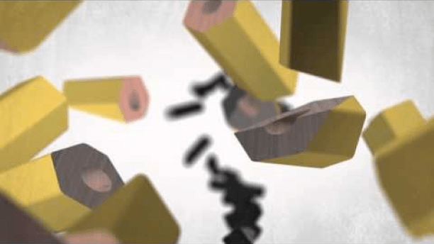

# Trade and Specialization

  -  **Adam Smith** in ***Wealth of Nations***, written in 1776, writes
     about the **benefits of specialization**.
    
      -  One man draws out the wire, another straights it, a third cuts
         it, a fourth points it, a fifth grinds it at the top for
         receiving the head; to make the head requires two or three
         distinct operations; to put it on, is a particular business,
         to whiten the pins is another; it is even a trade by itself to
         put them into paper; and the important business of making a
         pin is, in this mannar, divided into about eighteen **distinct
         operations**… Those ten persons, therefore, could make among
         them upwards of **48,000 pins in a day**. But if they had all
         wrought **separtely and independently**… they certainly could
         not each of them have made **twenty**, perhaps **not one pin**
         in a day.

  -  Modern example: [I, Pencil: The
     Movie](https://www.youtube.com/watch?v=IYO3tOqDISE)

  

#  

# Market Economy vs. Command Economy

  -  In a **market economy**, production and consumption decisions are
     the result of **decentralized** decisions by individuals and
     firms.

  -  In a **command economy**, industry is **publicly owned** and the
     **government makes decisions** on the allocation of goods and
     services.

  -  Most economies are **mixed**. Specialization and trade are what
     makes countries prosper.

 

# Absolute Advantage

  -  A coutry or individual is simply **better** than another country
     or individual in **producing a particular product**.

  

 

# Comparative Advantage

  -  A country or individual has a **LOWER opportunity cost** than
     another country or individual in **producing a particular
     product**.

  ![Economists use the term comparative advantage when describing the
  opportu- nity costs faced by two producers. The producer who gives up
  less of other goods to produce Good X has the smaller opportunity cost
  of producing Good X and is said to have a comparative advantage in
  producing it. In our example, Frank has a lower opportunity cost of
  producing potatoes than Rose: An ounce of potatoes costs Frank only
  1/4 ounce of meat, but it costs Rose 1/2 ounce of meat. Conversely,
  Rose has a lower opportunity cost of producing meat than Frank: An
  ounce of meat costs Rose 2 ounces of potatoes, but it costs Frank 4
  ounces of potatoes. Thus, Frank has a comparative advantage in growing
  potatoes, and Rose has a comparative advantage in producing meat.
  Although it is possible for one person to have an absolute advantage
  in both goods (as Rose does in our example), it is impossible for one
  person to have a comparative advantage in both goods. Because the
  opportunity cost of one good is the inverse of the opportunity cost of
  the other, if a person's opportunity cost of good is relatively high,
  the opportunity cost of the other good must be rela- tively low.
  Comparative advantage reflects the relative opportunity cost. Unless
  two people have the same opportunity cost, one person will have a
  comparative advantage in one good, and the other person will have a
  comparative advantage in the other good. ](./media/image14.png)

  -  Examples 1

  

  -  Examples 2

  

  -  Examples 3

  

#  

# Comparative Advantage & PPF Graph

  -  Flatter slope will have comparative advantage in the x-axis good.

  -  Steeper slope will have comparative advantage in the y-axis good.

  

 