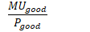
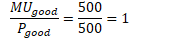
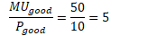
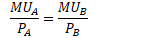

# Utility vs. Marginal Utility

  -  Utility
    
      -  **arbitrary** measure of benefit one receives from an activity
         (measured in utils)

  -  Marginal Utility
    
      -  **change** in total utility generated by consuming **one
         additional unit** of that good or service
    
      -  Air, for example, is necessary for survival but tends to have
         little value in terms of marginal utility.
    
      -  Diamonds, on the other hand, provides lots of marginal utility
         for many consumer.

 

# Marginal Utility Per Dollar

  -  The **marginal utility per dollar** spent on a good considers
     budge constrains

  -  Formula:
    
      -  

  -  We are constrained by a **budget**.

  -  The role of **scarcity** comes into play when making consumer
     choices.

  -  Example:
    
      -  We prefer a vacation to Hawaii over a movie, but we must
         consider the cost of each decision.
    
      -  If Hawaii's marginal utility is 500 but costs $500, and a
         movie's marginal utility is 50 but costs $10, what do we
         choose?
    
      -  Marginal Utility Per Dollar for
  Hawaii:

  

  -  Marginal Utility Per Dollar for
  movie:

  

  -  Since 5 \> 1, choose movie

 

# Diminishing Marginal Utility

  -  As a person **increases consumption**, there is a **decline** in
     the **marginal utility** from consuming each additional unit of
     that product.

  -  You get less "bang for your buck"

  -  Applies to most, if not all, products at a certain point.

  -  All You Can Eat restaurant can stay in business because of this
     principle.

 

# Optimal Consumption Bundle

  -  Marginal utility **per dollar** must be **equal** for both
     products

  -  Formula:
    
      -  

  -  Consumers instinctively follow this rule.

  -  Within a limited budget, we are required to make choices based on
     **what we value.**

  -  Keep on selecting the item that has the **HIGHER marginal utility
     per dollar**.

  -  Due to diminishing marginal utility, that value begin to **fall
     until equals** the marginal utility per dollar for the **other
     item**.

  -  Example 1

  

  -  Example 2

  

  -  Example 3

  

  -  Example 4

  
