1.1 - Intro to Economics

Monday, January 9, 2017

8:09 PM

 

# What is Economics

  -  The study of how people seek to satisfy their need and **wants**
     by making **choices**.

  -  Scarcity
    
      -  definition: the concept of having unlimited **wants** vs.
         having limited **resources**

 

# Macroeconomics vs. Microeconomics

  -  Macroeconomics
    
      -  involves economic problems encountered by the nation as a
         whole

  -  Microeconomics
    
      -  concerned with the economic problems faced by individual
         unites within the overall economy

 

# Four Factors of Production (Resources)

  -  Land
    
      -  definition: **natural** resources that are used to make goods
         and services

  -  Labor
    
      -  definition: the effort that **people** devote for a paid task

  -  Capital
    
      -  definition: any human-made resource used to **create** other
         goods and services
    
      -  Physical capital: tools and buildings
    
      -  Human capital: skills and knowledge through education and
         experience

  -  Entrepreneurship
    
      -  definition: a person who uses the three factors of production
         to create goods and services

 

# Needs vs. Wants

  -  Need - There is **no** other alternative

  -  **We do not NEED anything\!**

  -  Economics is about placing value on the things that you WANT and
     making CHOICES based on these wants.

  

 

# Every Choice Has a Cost

  -  **Nothing is free.**

  -  When you make a choice, the **best** alternative you gave up as a
     result is known as the **opportunity cost.**

  -  All the possible things that you give up would referred to a
     **trade-off**

  -  **Every choice**, however large or small, will incur an
     opportunity cost.

  
  
   

# Positive Economics vs. Normative Economics

  -  Positive Economics
    
      -  branch of economics analysis that **describes** the way the
         economy **actually works**

  -  Normative Economics
    
      -  branch of economic analysis that **interjects** subjective
         claims on how the economy **should work**

  -  Positive statement:
    
      -  **If** a new tax is implemented, the state **will** collect $1
         million in new revenue.
    
      -  **If** the government provides a safety net for citizens,
         income taxes **will** be increased.
    
      -  **If** you spend 15 hours studying AP Microeconomics, you
         **will** get a 5 on Microeconomics.

  -  Normative statement:
    
      -  The government **should** raise taxes on higher income
         families **in order to** raise more revenue.
    
      -  The government **should** provide a safety net for those in
         society that are incapable of thinking care of themselves
    
      -  You **should** get a 5 on the AP Microeconomics Exam.

 

# Marginal Analysis

  -  definition: deciding whether to do or use one **additional** unit
     of some **resource**

  -  Most decision are not "**all or nothing**" propositions

  -  Involves deciding whether or not to consume the next unit

  ![marginal change a small incremental adjustment to a plan of action
  Rational people know that decisions in life are rarely black and white
  but usu- ally involve shades of gray. At dinnertime, the question you
  face is not "Should I fast or eat like a pig?" More likely, you will
  be asking yourself "Should I take that extra spoonful of mashed
  potatoes?" When exams roll around, your decision is not between
  blowing them off and studying twenty-four hours a day but whether to
  spend an extra hour reviewing your notes instead of watching TV.
  Economists use the term marginal change to describe a small
  incremental adjustment to an existing plan of action. Keep in mind
  that margin means "edge," so marginal changes are adjustments around
  the edges of what you are doing. Rational people often make decisions
  by comparing marginal benefits and marginal costs.
  ](./media/image3.png)

 

# Economic Profit

  -  Economic Profit = Accounting Profit - Opportunity Cost

  

 

 

1.2 - Production Possibilities Frontier

Monday, January 9, 2017

9:32 PM

 

# Production Possibilities Frontier

  -  **Graph** that shows the combinations of amounts of **two items**
     that could be produced using the **same resources**

  -  All points on the graph are points of **efficiency**

  -  If you don't use all resources, then you have points of
     **underutilization** ( or **inefficiency**)

  -  PPF Graph show alternative ways to use resources but does not show
     the **best** way because that is a **normative issue**.

  -  Famous "Guns or Butter" Analogy
    
      -  Government could use its resources to produce "guns" or
         military goods.
    
      -  Government could use its resources to produce "butter" or
         domestic goods.
    
      -  It highlights the **trade-offs** an economy faces in using
         **scare resources**.

  
  
  ![are plotted with gun production measured on the vertical axis and
  butter produc- tion along the horizontal axiso 25 20 15 10 5 5 20 25
  30 15 35 BUTTER 40 Fig. 201 Production Possibilities Frontier The
  economy has the option of producing any combination of guns and butter
  along the frontier, At Point B most of the economy's resources are
  devoted to butter production, Only three guns are produced, At Point F
  gun production is predomi- nante Still, the economy is using its
  resources fully and efficiently at both pointso A normative analysis
  is required to determine which point is preferredo On efficiency
  grounds all the points along the frontier are equal, Points inside the
  frontier (Point I) are possible alsoa However, if the economy is
  operating at a point inside the frontier, resources are not being used
  fully or effi- cientlye Consider Point I, where 10 pounds of butter
  and six guns are being pro- duced per yeare By the definition of the
  production possibilities frontier we know that when the economy
  produces 10 pounds of butter, 12 guns could be produced if resources
  were used fully and efficiently (Point E). Point I represents a
  combina- tion of guns and butter that does not require full or
  efficient resource utilization, The economy could do better by
  producing some combination of the two goods that lies on the frontier.
  Points outside the production possibilities frontier (Point J) are
  unobtainable. Point J represents a combination of 25 pounds of butter
  and nine guns per yearo By the def- inition of the production
  possibilities frontier we know that if 25 pounds of butter are
  produced, only three guns can be produced (Point B) if resources are
  used fully and efficiently Therefore, points outside the frontier
  cannot be attained at this time, ](./media/image6.png)
  
   

# Shift in the Production Porribilities Frontier

  -  Points outside the PPF may be attained at some future date because
     the frontier may shift so that points like J lie along the new
     frontier.

  -  The frontier can also shift **inward** representing a change for
     the **worse**.

  -  **Factors** that cause the PPF to shift:
    
      -  changes in the amount **resources** in the economy
    
      -  change in **technology** and **productivity**

#  

# Increasing Opportunity Cost

  -  **More and more** resources are required to produce the **same**
     amount of a product

  -  Curve for this type of PPF graph will be **concave**.

  
  
   

# Constant Opportunity Cost

  -  **Same** resources are required to produce a certain amount of a
     product

  -  Product Possibilities frontier will be a **downward-sloping
     line**.

 

# Opportunity cost and PPF graph

 

 

1.3 - Comparative Advantage & Trade

Monday, January 9, 2017

10:08 PM

 

# Trade and Specialization

  -  **Adam Smith** in ***Wealth of Nations***, written in 1776, writes
     about the **benefits of specialization**.
    
      -  One man draws out the wire, another straights it, a third cuts
         it, a fourth points it, a fifth grinds it at the top for
         receiving the head; to make the head requires two or three
         distinct operations; to put it on, is a particular business,
         to whiten the pins is another; it is even a trade by itself to
         put them into paper; and the important business of making a
         pin is, in this mannar, divided into about eighteen **distinct
         operations**… Those ten persons, therefore, could make among
         them upwards of **48,000 pins in a day**. But if they had all
         wrought **separtely and independently**… they certainly could
         not each of them have made **twenty**, perhaps **not one pin**
         in a day.

  -  Modern example: [I, Pencil: The
     Movie](https://www.youtube.com/watch?v=IYO3tOqDISE)

  

#  

# Market Economy vs. Command Economy

  -  In a **market economy**, production and consumption decisions are
     the result of **decentralized** decisions by individuals and
     firms.

  -  In a **command economy**, industry is **publicly owned** and the
     **government makes decisions** on the allocation of goods and
     services.

  -  Most economies are **mixed**. Specialization and trade are what
     makes countries prosper.

 

# Absolute Advantage

  -  A coutry or individual is simply **better** than another country
     or individual in **producing a particular product**.

  

 

# Comparative Advantage

  -  A country or individual has a **LOWER opportunity cost** than
     another country or individual in **producing a particular
     product**.

  ![Economists use the term comparative advantage when describing the
  opportu- nity costs faced by two producers. The producer who gives up
  less of other goods to produce Good X has the smaller opportunity cost
  of producing Good X and is said to have a comparative advantage in
  producing it. In our example, Frank has a lower opportunity cost of
  producing potatoes than Rose: An ounce of potatoes costs Frank only
  1/4 ounce of meat, but it costs Rose 1/2 ounce of meat. Conversely,
  Rose has a lower opportunity cost of producing meat than Frank: An
  ounce of meat costs Rose 2 ounces of potatoes, but it costs Frank 4
  ounces of potatoes. Thus, Frank has a comparative advantage in growing
  potatoes, and Rose has a comparative advantage in producing meat.
  Although it is possible for one person to have an absolute advantage
  in both goods (as Rose does in our example), it is impossible for one
  person to have a comparative advantage in both goods. Because the
  opportunity cost of one good is the inverse of the opportunity cost of
  the other, if a person's opportunity cost of good is relatively high,
  the opportunity cost of the other good must be rela- tively low.
  Comparative advantage reflects the relative opportunity cost. Unless
  two people have the same opportunity cost, one person will have a
  comparative advantage in one good, and the other person will have a
  comparative advantage in the other good. ](./media/image14.png)

  -  Examples 1

  

  -  Examples 2

  

  -  Examples 3

  

#  

# Comparative Advantage & PPF Graph

  -  Flatter slope will have comparative advantage in the x-axis good.

  -  Steeper slope will have comparative advantage in the y-axis good.

  

 

 

1.4 - Utility Maximization

Monday, January 9, 2017

11:43 PM

 

# Utility vs. Marginal Utility

  -  Utility
    
      -  **arbitrary** measure of benefit one receives from an activity
         (measured in utils)

  -  Marginal Utility
    
      -  **change** in total utility generated by consuming **one
         additional unit** of that good or service
    
      -  Air, for example, is necessary for survival but tends to have
         little value in terms of marginal utility.
    
      -  Diamonds, on the other hand, provides lots of marginal utility
         for many consumer.

 

# Marginal Utility Per Dollar

  -  The **marginal utility per dollar** spent on a good considers
     budge
         constrains

  -  Formula:
    
      -  

  -  We are constrained by a **budget**.

  -  The role of **scarcity** comes into play when making consumer
     choices.

  -  Example:
    
      -  We prefer a vacation to Hawaii over a movie, but we must
         consider the cost of each decision.
    
      -  If Hawaii's marginal utility is 500 but costs $500, and a
         movie's marginal utility is 50 but costs $10, what do we
         choose?
    
      -  Marginal Utility Per Dollar for
  Hawaii:

  

  -  Marginal Utility Per Dollar for
  movie:

  

  -  Since 5 \> 1, choose movie

 

# Diminishing Marginal Utility

  -  As a person **increases consumption**, there is a **decline** in
     the **marginal utility** from consuming each additional unit of
     that product.

  -  You get less "bang for your buck"

  -  Applies to most, if not all, products at a certain point.

  -  All You Can Eat restaurant can stay in business because of this
     principle.

 

# Optimal Consumption Bundle

  -  Marginal utility **per dollar** must be **equal** for both
     products

  -  Formula:
    
      -  

  -  Consumers instinctively follow this rule.

  -  Within a limited budget, we are required to make choices based on
     **what we value.**

  -  Keep on selecting the item that has the **HIGHER marginal utility
     per dollar**.

  -  Due to diminishing marginal utility, that value begin to **fall
     until equals** the marginal utility per dollar for the **other
     item**.

  -  Example 1

  

  -  Example 2

  

  -  Example 3

  

  -  Example 4

  

 

 

2.1 - Price & Quantity

Tuesday, January 10, 2017

6:05 PM

 

# Supply and Demand

  -  Supply and demand model
    
      -  a model of how a **competitive market** functions

  -  The demand curve

  -  The supply curve

  -  The **determinants** of demand and supply

  -  The **equilibrium** price and quantity

 

# Demand Schedule and Demand Curve

  -  The law of demand
    
      -  A **higher** price leads to a **lower** quantity demaned
    
      -  A **lower** price leads to a **higher** quantity demanded

  -  Demand schedule vs. demand curve
    
      -  A demand **schedule** is a **table** that shows the quantity
         demanded at each price.
    
      -  A demand **curve** is a **graph** that shows the quantity
         demanded at each price

  -  Demand vs. quantity
demanded
    
      - 

| demand            | the relationship between **a range of prices** and the **quantities demanded** at those prices, as illustrated by a demand curve or a demand schedule. |
| ----------------- | ------------------------------------------------------------------------------------------------------------------------------------------------------ |
| quantity demanded | only **a certain point** on the demand curve or **one quantity** on the demand schedule                                                                |

  -  **Demand** refers to the **curve**, and **quantity demanded**
     refers to a **specific point** on the curve.

  -  If price increases, what happens?
    
      -  No change in **demand **
    
      -  Decrease in **quantity demanded**

  -  Graphical Comparison

  

  -  Demand curve
    
      -  **Horizontal** axis: **Quantity Demanded**
    
      -  **Vertical** axis:
  **Price**

  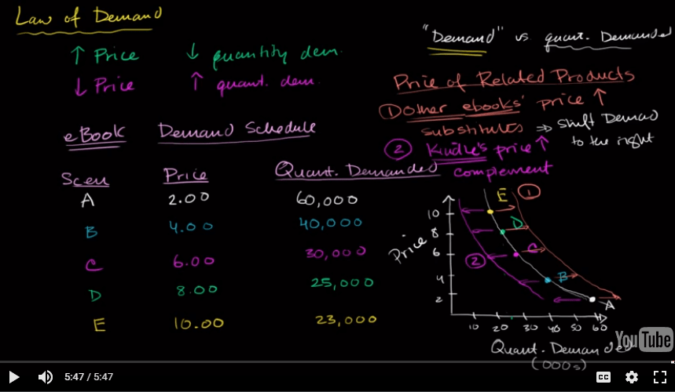

 

# Shift of the Demand Curve

  -  Changes in the price of related goods
    
      -  Substitutes (**positive** correlation)
        
          -  **fall in the price** of one goods makes consumers **less
             willing** to buy the other good
    
      -  Complements (**negative** correlation)
        
          -  **fall in the price** of one of the goods makes consumers
             **more willing** to buy the other good
    
      -  How to remember
        
          -  Kids are **positive** when having a **substitute** teacher
        
          -  We lived in a cynical world. If someone gives you a
             **complement**, the true intention might be **negative**.

  -  Changes in income
    
      -  **Normal** goods
        
          -  rise in income **increases** demand
        
          -  ie. computers, Disneyland, steak
    
      -  **Inferior** goods
        
          -  rise in income **decreases** demand
        
          -  ie. macaroni & cheese, top ramen
    
      -  Normal goods vs. inferior goods

  ![Why do we say "most goods," not "all goods"? Most goods are normal
  goods— the demand for them increases when consumer income rises.
  However, the demand for some products falls when income rises. Goods
  for which demand decreases when income rises are known as inferior
  goods. Usually an inferior good is one that is considered less
  desirable than more expensive alternatives—such as a bus ride versus a
  taxi ride. When they can afford to, people stop buying an inferior
  good and switch their consumption to the preferred, more expensive
  alternative. So when a good is inferior, a rise in income shifts the
  demand curve to the left. And, not surprisingly, a fall in income
  shifts the demand curve to the right. ](./media/image29.png)

  -  Changes in tastes
    
      -  Why do people want what they want?
    
      -  Changes due to fad, beliefs, cultural shifts are all clumped
         together under **preferences.**

  -  Changes in expectations
    
      -  If you expect **more income** in the future, demand for
         certain goods (ie. car or refrigerator) might **increase**
    
      -  If expectation of a future **price drop** of items exist, then
         the demand for these items **drop** today, almost like a
         self-fulfilling
  prophecy.

  -  Graph

  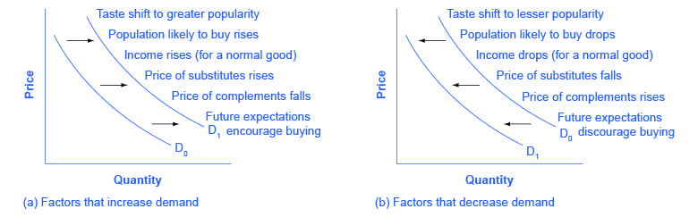

  -  Summary

  ![Factors That Shift Demand Changes in the prices of related goods or
  services If A and g are substitutes ... If A and g are complements .
  Changes in income If A is a normal good . If A is an inferior good .
  Changes in tastes Changes in expectations If A is a normal good . If A
  is an inferior good . . and the price of B rises, . . . and the price
  of B falls, ... . and the price of B rises, . . and the price of B
  falls, ... . and income rises, . . . . and income falls, . . . . and
  income rises, . . . . and income falls, . . . If tastes change in
  favor of A, . If tastes change against A, . If the price of A is
  expected to rise in the future, . If the price of A is expected to
  fall in the future, . . and income is expected to rise in the future,
  . . and income is expected to fall in the future, . . and income is
  expected to rise in the future, . . and income is expected to fall in
  the future, . . Changes in the number of consumers If the If the
  number of consumers of A rises, . . . number of consumers of A falls,
  . . demand for A increases. . demand for A decreases. . demand for A
  decreases. . demand for A increases. . demand for A increases. .
  demand for A decreases. . demand for A decreases. . demand for A
  increases. . demand for A increases. . demand for A decreases. .
  demand for A increases today. . demand for A decreases today. . demand
  for A may increase today. . demand for A may decrease today. . demand
  for A may decrease today. . demand for A may increase today. market
  demand for A increases. market demand for A decreases.
  ](./media/image31.png)

 

# Supply Schedule and Supply Curve

  -  The law of supply
    
      -  A **higher** price leads to a **higher** quantity supplied.
    
      -  A **lower** price leads to a **lower** quantity supplied.

  -  Supply schedule vs. supply curve
    
      -  A supply **schedule** is a **table** that shows the quantity
         supplied at each price.
    
      -  A supply **curve** is a **graph** that shows the quantity
         supplied at each price.

  -  Supply vs. quantity
supplied
    
      - 

| supply            | the relationship between **a range of prices** and the **quantities supplied** at those prices, as illustrated by a supply curve or a supply schedule. |
| ----------------- | ------------------------------------------------------------------------------------------------------------------------------------------------------ |
| quantity supplied | only **a certain point** on the supply curve or **one quantity** on the supply schedule                                                                |

  -  **Supply** refers to the **curve**, and **quantity supplied**
     refers to a **specific point** on the curve.

  -  If price increase, what happens to supply?
    
      -  **Nothing**
    
      -  This is a change in quantity supplied not supply

# Shifts of the Supply Curve

  -  Changes in input prices
    
      -  Input is a good used to **produce another** good
    
      -  ie. cheese in a cheese pizza

  -  Change in technology
    
      -  All the ways in which people can **turn more inputs into
         useful goods**
    
      -  For example, an improved strain of corn resistant to disease
         increase supply of corn.

  -  Change in expectations
    
      -  If **expectations** of a future price **increase** of items
         exist, then supplier will tend to **hoard** the item in order
         to make **more profit** in the future.

  -  Related goods
    
      -  If the price of other things I can produce goes up, then my
         supply of grapes, once again, would go down.

  

  -  Graph

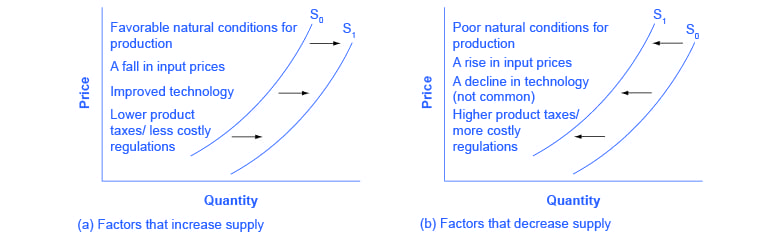

  -  Summary

  ![Factors That Shift Supply Changes in input prices If the price of an
  input used to produce A rises, . . . If the price of an input used to
  produce A falls, Changes in the prices of related goods or services If
  A and B are substitutes in production ... If A and B are complements
  in production . . . Changes in technology . and the price of B rises,
  . . . . and the price of B falls, . . and the price of B rises, . . .
  . and the price of B falls, . If the technology used to produce A
  improves, ... Changes in expectations If the price of A is expected to
  rise in the future, .. If the price of A is expected to fall in the
  future, . . . Changes in the number of producers If the number of
  producers of A rises, .. . If the number of producers of A falls, .
  supply of A decreases. supply of A increases. supply of A decreases.
  supply of A increases. supply of A increases. supply of A decreases.
  supply of A increases. supply of A decreases today. supply of A
  increases today. . market supply of A increases. . market supply of A
  decreases. ](./media/image34.png)

 

# Supply, Demand, and Equilibrium

  -  Equilibrium price
    
      -  price that **clears the market**

  -  Equilibrium quantity
    
      -  quantity of good bought and sold at **market-clearing price**

  -  Equilibrium
    
      -  where the supply and demand curves
  **intersect**

  -  Graph

  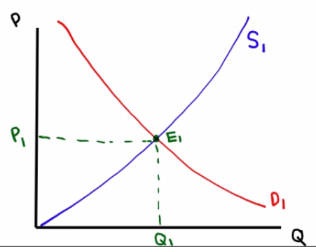
  
   

# Surplus & Shortage

  -  Surplus
    
      -  when quantity **supplied exceeds** quantity
         **demanded**
    
      -  
    
      -  

  -  Shortage
    
      -  when quantity **demanded exceeds** quantity **supplied
         **
    
      -  
    
      -  

  -  Graph

  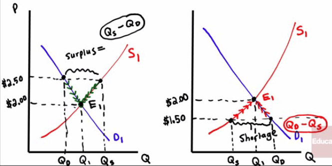

 

 

2.2 - Supply & Demand

Tuesday, January 10, 2017

7:55 PM

 

# Shifts of the Demand or Supply Curve

  -  **Demand** shift to the **right**
    
      -  **Increase** in equilibrium price
    
      -  **Increase** in equilibrium quantity

  -  **Demand** shift to the **left**
    
      -  **Decrease** in equilibrium price
    
      -  **Decrease** in equilibrium quantity

  -  **Supply** shift to the **right**
    
      -  **Decrease** in equilibrium **price**
    
      -  **Increase** in equilibrium **quantity**

  -  **Supply** shift to the **left**
    
      -  **Increase** in equilibrium **price**
    
      -  **Decrease** in equilibrium **quantity**

  -  Graph

![FIGURE 10 How an Increase in Demand Affects the Equilibrium An event
that raises quantity demanded at any given price shifts the demand curve
to the right. The equilibrium price and the equilibrium quantity both
rise. Here an abnormally hot summer causes buyers to demand more ice
cream. The demand curve shifts from D to D, , which causes the equilib-
rium price to rise from $2.00 to $2.50 and the equilibrium quantity to
rise from 7 to 10 cones. Price of Ice-cream 52.50 2.. resulting in a
higher 3. \_ anda higher quantity sold. . Hot weather increases tip
demard fu ice cream.. Supply New equilibrium Initial equilibrium
Quantity of Ice-cream Cones ](./media/image41.png)

![Price of 1. An increase in the price of Ice-cream sugar reduces the
supply of ice cream New $2.50 equilibrium 2.00 resulting in a higher
price of ice Initial equilibrium 3. ...andalower quantity' sold. FIGURE
11 How a Decrease in Supply Affects the Equilibrium An event that
reduces quantity sup- plied at any given price shifts the supply curve
to the left. The equilib- rium price rises, and the equilibrium quantity
falls. Here an increase in the price of sugar (an input) causes sellers
to supply less ice cream. The supply curve shifts from Sl to S2, which
causes the equilibrium price of ice cream to rise from $2.00 to $2.60
and the equilibrium quantity to fall from 7 to 4 cones. Demand Quantity
of Ice-cream Cones ](./media/image42.png)

  -  Examples

  
  
  

 

# Shifts of Both the Demand and Supply Curves

  -  Demand & supply shift to the **right**
    
      -  **Increase** in equilibrium **quantity**
    
      -  Equilibrium **price unsure**

  -  Demand & supply shift to the **left**
    
      -  Decrease in equilibrium **quantity**
    
      -  Equilibrium **price unsure**

  -  **Supply** shift to the **left** and **demand** shift to the
     **right**
    
      -  **Increase** in equilibrium **price**
    
      -  Equilibrium **quantity unsure**

  -  **Supply** shift to the **right** and **demand** shift to the
     **left**
    
      -  **Decrease** in equilibrium **price**
    
      -  Equilibrium **quantity unsure**

  -  Graph

![FIGURE 12 A Shift in Both Supply and QEQI Here we observe a
simultaneous increase in demand and decrease in supply. Two out- comes
are possible. In panel (a), the equilibrium price rises from PI to P2
and the equilib- rium quantity rises from QI to In panel (b), the
equilibrium price again rises from PI to P2 but the equilibrium quantity
falls from QI to g. Demand Price of Ice-Cream Large Cone increase in
demand (a) Price Rises, Quantity Rises New S2 equilibrium decrease Da su
Initial equilibrium Quantity of Ice-Cream Cones (b) Price Rises,
Quantity Falls Price of Ice-Cream Cone Small Increase In demand Initial
equilibrium New equilibrium S2 Large decrease ppb' In Su Quantity of
Ice-Cream Cones ](./media/image45.png)

  -  Summary
    
      -  Change in **same** direction: equilibrium **quantity** for
         sure
    
      -  Change in **opposite** direction: equilibrium **price** for
         sure

  -  Examples

  
  
  

 

# Changes in equilibrium

  

 

 

2.3 - Price Controls

Tuesday, January 10, 2017

8:30 PM

 

# Why Price Controls are Inefficient

  -  Price controls
    
      -  **legal restrictions** on how high or low a **market price**
         may go

  -  Price ceiling
    
      -  a **maximum** price **sellers** are allowed to **charge** for
         a good or service

  -  Price floor
    
      -  a **minimum** price **buyers** are required to **pay** for a
         good or service

  -  Whether the government tries to legislate price (up or down),
     there are predictable and unpleasant **side effects**.

 

# Effective Price Ceiling

  -  Effective price **ceilings** must be **below** equilibrium price

  -  Rent control
    
      -  government attempt in regulating price on apartments
    
      -  Predictable outcome of housing shortage and emergence of black
         markets

  -  Graph

![In panel (a), the government imposes a price ceiling of $4. Because
the price ceiling is above the equilibrium price of $3, the price
ceiling has no effect, and the market can reach the equilibrium of
supply and demand. In this equilibrium, quantity supplied and quantity
demanded both equal 100 cones. In panel (b), the government imposes a
price ceiling of $2. Because the price ceiling is below the equilibrium
price of $3, the market price equals $2. At this price, 125 cones are
demanded and only 75 are supplied, so there is a shortage of FIGURE 1 A
Market with a Price Ceiling 50 cones. Price of Ice-Cream Cone
Equilibrium pnce (a) A Price Ceiling That Is Not Binding Price of
Ice-Cream Cone Equilibrium price 53 (b) A Price Ceiling That Is Binding
Supply IOO Equilibrium quantity Supply Price ceiling Demand Quantity of
Ice-Cream Cones Shonage 75 Quantity supplied Quantity demanded Price
ceiling Demand Quantity of Ice-Cream Cones ](./media/image49.png)

   

# How a Price Ceiling Causes Inefficiency

  -  Inefficiently allocation to consumers
    
      -  Those who want an apartment the most **do not necessarily get
         it**.
    
      -  At $1000, someone who was willing to pay $2000 may not get the
         apartment when the price is low.

  -  Wasted resources
    
      -  Price ceilings on gas led to shortages and forced millions of
         American to spend hours **waiting** in lines at gas stations.
         **OPPORTUNITY COST\!**

  -  Inefficiently low quality
    
      -  Sellers have little incentive to improve the quality of their
         product.
    
      -  Landlords have a perverse incentive to only meet the bare,
         minimum requirements

 

# Effective Price Floor

  -  Effective price **floors** must be **above** the equilibrium
     price.

  -  Minimum wage
    
      -  government attempt in regulating the labor market in order to
         give workers a **"fair" wage**
    
      -  Predictable outcome of having surplus of labor (or
         unemployment)

  -  What happens when a price floor on butter is **set at $2.00** a
     pound when the **equilibrium is $1.50**
    
      -  Predictable, there is a **surplus** of butter
    
      -  Governments will stash away surplus, give away to schools,
         export at a loss, simply destroy the excess or pay farmers NOT
         to product at
  all.

  

  -  Graph

![FIGURE 5 How the Minimum Wage Affects Panel (a) shows a labor market
in which the wage adjusts to balance labor supply and labor demand.
Panel (b) shows the impact of a binding minimum wage. Because the
minimum wage is a price floor, it causes a surplus: The quantity of
labor supplied exceeds the quantity demanded. The result is
unemployment. the Labor Market Wage Equilibrium wage (a) A Free Labor
Market Equilibrium employment (b) A Labor Market with a Binding Minimum
Wage Labor supply Labor demand Quantity of Labor Wage Minimum wage Labor
surplus (unemployment) Quantity demanded Quantity supplied Labor supply
Labor demand Quantity of Labor ](./media/image51.png)

 

# How a Price Floor Causes Inefficiency

  -  Inefficiently Low Quantity
    
      -  Same impact as a price ceiling in having **less quantity** of
         goods bought and sold

  -  Wasted Resources
    
      -  Just like families unsuccessfully looking for apartments under
         a price ceiling, workers **won't find jobs** in a price floor.

  -  Inefficiently high quality
    
      -  Unable to compete for customers for lower prices, airlines
         provided lavish excesses consumers **didn't want**

 

# Ineffective price controls

  

 

 

 

2.4 - Price Elasticity of Demand

Tuesday, January 10, 2017

10:01 PM

 

# What is Elasticity of Demand

  -  Price elasticity of demand (PED or Ed)
    
      -  Measure used to show the **responsiveness**, or
         **elasticity**, of the quantity demanded of a good or service
         to a change in price.
    
      -  Devised by Alfred Marshall, using the **ceteris paribus** (all
         other things being equal) assumption, price elasticity shows
         by **how much quantity changes** as a result of a **change in
         price**. (Disregard the negative)
    
      -  Formula

  

  -  How to remember
    
      -  **Queen** is greater than the **Princess**

#  

# The Variety of Demand Curves 

![The price elasticity of demand determines whether the demand curve is
steep or flat. Note that all percentage changes are calculated using the
midpoint method 2.... 2.. 2.. 1 FIGURE The Price Elasticity of Demand
(a) Perfectly Inelastic Demand: Elasticity Equals 0 (b) Inelastic
Demand: Elasticity Is Less Than 1 Price $5 4 1. An Increase n price . 0
Price $5 4 Increase •n price 0 Demand IOO Price $5 4 Increase In pnce .
Quantity 90 IOO Demand Quantity leaves the quantity demanded unchanged.
.. leads to an 11% decrease in quantity demanded. (c) Unit Elastic
Demand: Elasticity Equals 1 Price $5 4 Increase In price 0 IOO Demand
Quantity .. leads to a 22% decrease in quantity demanded. 2.. (d)
Elastic Demand: Elasticity Is Greater Than 1 50 IOO Demand Quantity
Price $4 0 (e) Perfectly Elastic Demand: Elasticity Equals Infinity . At
any price above $4, quantity manded is zero. Demand . At exactly $4,
consumers will buy any quantity. Quantity .. leads to a 67% decrease in
quantity demanded. 3. At a price below $4, quantity demanded is
infinite. ](./media/image54.png)

#  

# Elastic Demand

  -  When **e \> 1**, demand is elastic, or the **percent change in
     quantity** is **greater** than the **percent change in price.**

  -  It means that the product is relatively **price-sensitive**

  -  ie. fast-food restaurants, fruits, haircuts

  -  Demand curve is relatively **flat**.

 

# Inelastic Demand

  -  When **e < 1**, demand is inelastic, or the **percent change in
     quantity** is **less** than the **percent change in price.**

  -  It means that the product is **not very sensitive** to a **change
     in price**

  -  ie. gasoline, insulin

  -  Demand curve is relatively **steep**.

 

# Price Elasticity of Demand and Total Revenue

  -  The total amount paid by buyers, and received as revenue by
     sellers, equals the area of the box under the demand curve.

  

  -  When demand is **inelastic (e < 1)**, price and total revenue
     move in the **same direction**:
    
      -  If the price increases, total revenue also increases.

  -  When demand is **elastic (e \> 1**), price and total revenue move
     in **opposite directions**:
    
      -  If the price increase, total revenue decreases.

  -  If demand is unit elastic (e = 1), total revenue remains constant
     when the price changes.

  

  -  Examples

  
  
  

 

# Midpioint Method to Find Elasticity

  -  Definition

  ![One way to avoid this problem is to use the midpoint method for
  calculating elas- ticities. The standard procedure for computing a
  percentage change is to divide the change by the initial level. By
  contrast, the midpoint method computes a per- centage change by
  dividing the change by the midpoint (or average) of the initial and
  final levels. For instance, $5 is the midpoint between $4 and $6.
  Therefore, ac- cording to the midpoint method, a change from $4 to $6
  is considered a 40 percent rise because (6 4) / 5 X 100 40. Similarly,
  a change from $6 to $4 is considered a 40 percent fall. Because the
  midpoint method gives the same answer regardless of the direc- tion of
  change, it is often used when calculating the price elasticity of
  demand between two points. In our example, the midpoint between point
  A and point B is: Midpoint: Price = $5 Quantity = 100 According to the
  midpoint method, when going from point A to point B, the price rises
  by 40 percent and the quantity falls by 40 percent. Similarly, when
  going from point B to point A, the price falls by 40 percent and the
  quantity rises by 40 percent. In both directions, the price elasticity
  of demand equals 1. The following formula expresses the midpoint
  method for calculating the price elasticity of demand between two
  points, denoted (Q, PI) and (Q, P2): Price elasticity of demand — - +
  PI)/2\] ](./media/image59.png)

  -  Comparison

  

 

# Factors That Determine Price Elasticity

  -  Whether close substitutes are available
    
      -  Tends to be **high** if consumers are willing to **replace**
         with substitutes.
    
      -  Tends to be **low** if there are **no close substitutes**

  -  Whether the good is **necessity** or a **luxury**
    
      -  Life-saving **medication** will be **inelastic** but things
         you can **live without** tend to be **elastic**

  -  Time
    
      -  PED tends to **increase over time**
    
      -  ie. demand for gas is more elastic as behavior changes

  -  Share of income spend on the good
    
      -  Elasticity of demand tends to be **low** when **prices are
         lower**
    
      -  Conversely, PED is **higher** when **prices are higher**

 

# Price Elasticity Along the Demand Curve

  -  Price and total revenue

| Inelastic | Price↑ | Total Revenue↑ |
| --------- | ------ | -------------- |
| Inelastic | Price↓ | Total Revenue↓ |
| elastic   | Price↑ | Total Revenue↓ |
| elastic   | Price↓ | Total Revenue↑ |

  -  Graph

![6-5 FIGURE Price $10 9 8 7 6 5 4 3 2 1 o Total revenue $25 24 21 16 9
The Price Elasticity of Demand Elastic Unit-elastic Changes Along the
Demand Curve Demand Schedule and Total Revenue for a Linear Demand Curve
1 Price $0 1 2 3 4 5 6 7 8 9 10 Quantity demanded 10 9 8 7 6 5 4 3 2
Total revenue $0 9 16 21 24 25 24 21 16 9 2 2 3 3 4 4 5 6 6 7 7 8 8
Inelastic 9 10 Quantity 9 10 Quantity The upper panel shows a demand
curve corre- sponding to the demand schedule in the table. The lower
panel shows how total revenue changes along that demand curve: at each
price and quantity combination, the height of the bar rep- resents the
total revenue generated. You can see that at a low price, raising the
price increases total revenue. So demand is inelastic at low prices. At
a high price, however, a rise in price reduces total revenue. So demand
is elastic at high prices. Demand is elastic: a higher price reduces
total revenue. Demand is inelastic: a higher phce increases total
revenue. ](./media/image61.png)

  -  Example

  

![Machine generated alternative text: The slope of a linear demand curve
is constant, but its elasticity is not. The demand schedule FIGURE 4 in
the table was used to calculate the price elasticity of demand by the
midpoint method. At points with a low price and high quantity, the
demand curve is inelastic. At points with a high Elasticity of a Linear
Demand 3.7 1.8 1.0 0.6 0.3 0.1 price and low quantity, the demand curve
is elastic. Price $7 6 4 3 2 0 Elasticity is smaller than 1. 2 4
Elasticity is larger than 1. 6 8 10 12 14 Quantity Curve Elasticity 13.0
Price $7 6 5 4 3 2 1 Quantity 2 4 6 8 10 12 14 Total Revenue (Price x
Quantity) $0 12 20 24 24 20 12 Percentage Change in Price 15 18 22 29 40
67 200 Percentage Change in Quantity 200 67 40 29 22 18 15 Description
Elastic Elastic Elastic Unit elastic Inelastic Inelastic Inelastic
](./media/image63.png)

 

 

2.5 - Income, Cross-Price & Supply Elasticities

Wednesday, January 11, 2017

1:40 PM

 

# Cross-price elasticity of demand (EA,B)

  -  Meaning
    
      -  Measure used to show the change in the **price** of **one
         good** affecs the **demand** for **another good**.

  -  Formula
    
      -  Percentage change in **Quantity Demanded** of **Good A**
         divided by **Percentage change** in **Price** of **Good
         B**
    
      -  

  

#  

# Substitutes 

  -  Definition
    
      -  If the coefficient is **positive**, then the two items are
         **substitutes.**
    
      -  \*Do **NOT** find the absolute value for cross-price
         elasticity\!

  -  EA,B and substitutes
    
      -  The **higher** the number, the **more perfect** the two items
         are as **substitutes.**
    
      -  The **lower** the number, the **less perfect** the two items
         are as **substitutes.**

  -  Price change and quantity demanded
    
      -  If the **price** of Good A **increases** , then the **quantity
         demanded** of Good B will **increase**.
    
      -  If the **price** of Good A **decreases**, then the **quantity
         demanded** of Good B will **decrease**.

  -  Example

  
  
   

# Complements

  -  Definition
    
      -  If the coefficient is **negative**, then the two items are
         **complements.**
    
      -  \*Do **NOT** find the absolute value for cross-price
         elasticity\!

  -  EA,B and substitutes
    
      -  The **more negative** the number, the **more perfect** the two
         items are as **complements.**
    
      -  The **less negative** the number, the **less perfect** the two
         items are as **complements.**

  -  Price change and quantity demanded
    
      -  If the **price** of Good A **increases** , then the **quantity
         demanded** of Good B will **decrease**.
    
      -  If the **price** of Good A **decreases**, then the **quantity
         demanded** of Good B will **increase**.

  -  Example

  
  
   

# Income Elasticity of Demand

  -  Meaning
    
      -  Measures how changes in **income** affect the **demand** for a
         good

  -  Normal good vs. Inferior good
    
      -  If the income elasticity of demand is **positive**, then it's
         a **normal** good.
    
      -  If the income elasticity of demand is **negative**, then it's
         a **inferior** good.

  -  Income-elastic vs. income-inelastic
    
      -  If the income elasticity of demand is **greater than 1**, then
         it is **income-elastic**
    
      -  If the income elasticity of demand is **less than 1**, then it
         is **income-inelastic**

  -  Formula
    
      -  Percentage change in **Quantity Demanded** Divided by
         Percentage change in
         **Income**
    
      -  

  -  Example 1
    
      -  Income elastic good:

  

  -  Example 2
    
      -  ceteris paribus: all other things being equal

  

  -  Example 3

  

 

# Price Elasticity of Supply

  -  Meaning
    
      -  Measure of responsiveness of the quantity of a good
         **supplied** to the **price** of that good

  -  Formula
    
      -  **Percentage** change in **quantity supplied** divided by the
         **percentage** change in
         **price**
    
      -  

  -  Availability of inputs affects elasticity
    
      -  Supply of pizza tends to be very elastic

  ![Panel (b) shows the supply curve for pizza. We suppose that it costs
  $12 to produce a pizza, including all opportunity costs. At any price
  below $12, it would be unprofitable to produce pizza and all the pizza
  parlors would go out of business. At a price of $12 or more, there are
  many producers who could operate pizza parlors. The ingredients—
  flour, tomatoes, cheese—are plentiful. And if necessary, more tomatoes
  could be grown, more milk could be produced to make mozzarella cheese,
  and so on. So by allowing profits, any price above $12 would elicit
  the supply of an extremely large quantity of pizzas. The implied
  supply curve is therefore a horizontal line at $12. Since even a tiny
  in- crease in the price would lead to an enormous increase in the
  quantity ](./media/image73.png)

  -  Supply of cell phone frequencies is zero. The input (radio
     spectrum) cannot be changed

  ![As in the case of demand, the extreme values of the price elasticity
  of supply have a simple graphical representation. Panel (a) of Figure
  48.1 shows the supply ofcell phone frequencies, the portion of the
  radio spectrum that is suitable for sending and receiv- ing cell phone
  signals. Governments own the right to sell the use of this part of the
  radio spectrum to cell phone operators inside their borders. But
  governments can't in- crease or decrease the number of cell phone
  frequencies they have to offer—for techni- cal reasons, the quantity
  of frequencies suitable for cell phone operation is fixed. So the
  supply curve for cell phone frequencies is a vertical line, which we
  have assumed is set at the quantity of 100 frequencies. As you move up
  and down that curve, the change in the quantity supplied by the
  government is zero, whatever the change in price. So panel (a)
  illustrates a case of perfectly inelastic supply, meaning that the
  price elasticity of supply is zero. ](./media/image74.png)

  -  Graph

![Price $5 4 1. An Increase In price Price $5 4 Increase In pnce FIGURE
5 The price elasticity of supply determines whether the supply curve is
steep or flat. Note that all percentage changes are calculated using the
midpoint method. The Price Elasticity of Supply 2... IOO 125 (a)
Perfectly Inelastic Supply: Elasticity Equals O Supply Quantity . leaves
the quantity supplied unchanged. Price $5 4 Increase In price (b)
Inelastic Supply: Elasticity Is Less Than 1 Supply IOO 110 Quantity
2.... leads to a 10% increase in quantity supplied. Price 55 4 Increase
In price (c) Unit Elastic Supply: Elasticity Equals 1 Supply Quantity ..
leads to a 22% increase in quantity supplied. (d) Elastic Supply:
Elasticity Is Greater Than 1 Price 200 Supply Quantity (e) Perfectly
Elastic Supply: Elasticity Equals Infinity 1. At any price above 54,
quantiW supplied is infinite. Supply . At exactly $4, producers will
pply any quantity Quantity 2.... leads to a 67% increase in quantity
supplied. 3. Ata price below 54, quantity supplied is zero.
](./media/image75.png)

#  

# Summary for Elasticity

  ![Namc Pricc clasticity of demand Perfectly inelastic demand Inelastic
  demand Unit-elastic demand Elastic demand Perfectly elastic demand
  Possiblc values Significance % change in quantity demanded (dropping
  thc minus sign) % change in price Betvveen 0 and 1 Exactly 1 Greater
  than 1 , less than Price has no effect on quantity demanded (vertical
  demand curve). A rise in price increases total revenue. Changes in
  price have no effect on total revenue. A rise in price redires total
  revenue. A rise in price causes quantity demanded to fall too. A fall
  in price leads to an infinite quantity demanded (horizontal demand
  curve). Cross-price clasticity of demand Complements Substitutes %
  change in quantib' of one good dcmandcd % change in price of another
  good Negative Positive Quantity demanded of one good falls when the
  price of another rises. Quantity demanded of one good rises when the
  price of another rises. Income elasticity of demand Inferior good
  Normal good, income-inelastic Normal good, income-elastic % change in
  quantib' dcmandcd % change in income Negative Positive, less than 1
  Greater than 1 Quantity demanded falls when income rises. Quantity
  demanded rises when income rises, but not as rapidly as income.
  Quantity demanded rises when income rises, and more rapidly than
  income. % change in quantib' supplied Pricc clasticity of supply
  Perfectly inelastic supply Perfectly elastic supply % change in price
  Greater than 0, less than Price has no effect on quantity supplied
  (vertical supply curve). Ordinary upward-sloping supply curve. Any
  fall in price causes quantity supplied to fall to 0. Any rise in price
  elicits an infinite quantity supplied (horizontal supply curve).
  ](./media/image76.png)

 

 

2.6 - Total Surplus, Deadweight Loss & World Trade

Wednesday, January 11, 2017

1:40 PM

# Consumer Surplus

  -  Meaning
    
      -  the difference between the buyer's **willingness to pay**
         versus what he **actually pays**

  -  Graph
    
      -  On a supply and demand graph, the area of consumers surplus
         (CS) is **below** the **demand curve** but **above** the
         **equilibrium price**

![Machine generated alternative text: figure 49.3 Consumer Surplus The
demand curve for computers is smooth be- cause there are many potential
buyers. At a price of $1 ,500, 1 million computers are de- manded. The
consumer surplus at this price is equal to the shaded area: the area
below the demand curve but above the price. This is the total net gain
to consumers generated from buying and consuming computers when the
price is $1 ,500. Price of computer Consumer surplus $1,500 Price 1
million Quantity of computers ](./media/image77.png)

  -  Example 1

  

  -  Example 2

  

#  

# Producer Surplus

  -  Meaning
    
      -  the difference between the price a sellers **pays** for and
         what he was actually **willing to sell for**

  -  Graph
    
      -  On a supply and demand graph, the producer surplus is
         **above** the **supply curve** but **below** the **equilibrium
         price**.

  -  Example 1

  
  
  

  -  Example 2

  

 

# Total Surplus

  -  Meaning
    
      -  the **sum** of consumer and producer **surplus**

  -  Graph
    
      -  the area **between** the supply and demand **curves** up to
         the **equilibrium quantity**

  

 

# Effects of Taxes on Surplus

  -  How does a tax affect hotel owners?
    
      -  An excise tax on hotel owners will shift the **supply** curve
         to the **left**
    
      -  The equilibrium **price** will be **higher** and the
         equilibrium **quantity** will be **lower**

  

  -  How does a tax effect hotel guests
    
      -  An excise tax on hotel guests will shift the **demand** curve
         to the **left**
    
      -  The equilibrium **price** will be **higher** and the
         equilibrium **quantity** will be **lower**
    
      -  The tax incidence in both cases are
  **identical**

  

  -  How the imposition of a tax will decrease consumer and producer
     surplus

  

![A Tax Reduces Consumer and Producer Surplus Before the tax, the
equilibrium price and quantity are Pgand respectively. After an excise
tax of T per unit is imposed, the price to consumers rises to Pcand
consumer surplus falls by the sum of the dark blue rectangle, labeled A,
and the light blue triangle, labeled B. The tax also causes the price to
producers to fall to Pp;producer surplus falls by the sum of the dark
red rectangle, labeled C, and the light red triangle, lab4ed E The
government receives revenue from the tax, QTX T, which is given by the
sum of the areas A and C Areas B and Frepresent the losses to consumer
and pro- ducer surplus that are not collected by the govern- mentas
revenue; they are the deadweight loss to S)Ciety of the tax. Excise tax
= T Price Fall in consumer surplus due to tax Fall in producer surplus
due to tax Quantity ](./media/image89.png)

  -  Deadweight loss

![figure 50.12 The Deadweight Loss of a Tax A tax leads to a deadweight
loss because it cre- ates inefficienw: some mutually beneficial trans-
actions never take place because of the tax, namely the transactions OF
— QT. The yellow area here represents the value of the deadweight
loss: it is the total surplus that would have been gained from the 0€—
QTtransactions. If the tax had not discouraged transactions—had the
number of transactions remained at Of—no deadweight loss muld have been
incurred. Price Excise tax = T Deadweight loss Quantity
](./media/image90.png)

 

# International Trade

  -  Autarky
    
      -  the quality of being **self-sufficient** with **no imports or
         exports**, a **closed** economy

  -  Free trade and Tariffs
    
      -  Free trade **increases total surplus**
    
      -  **Tariffs** serve to **reduce** allocative **efficiency**

 

# Importing Countries

  -  The **World Price** (Pw) will be **below** the autarky
     price and **total surplus** will **increase**

  -  Domestic **consumers gain**, domestic **producers lose**, but the
     **net gain** is **positive**

  -  **Buyers** are **better off** (consumer surplus rises from A to A
     + B + D)

  -  **Sellers** are **worse off** (producer surplus falls from B + C
     to C)

  -  **Total surplus rises** by an amount equal to area D

  -  Trade **raises the economic well-being** of the country as a
     whole.

 

# Exporting Countries

  -  The **World Price** (Pw) will be **above** the autarky
     price and **total surplus** will **increase**

  -  Domestic **consumers lose**, domestic **producers gain**, but the
     **net gain** is **positive**

  -  **Sellers** are **better off** (producer surplus rises from C to B
     + C + D)

  -  **Buyers** are **worse off** (consumer surplus falls from A + B to
     A)

  -  **Total surplus rises** by an amount equal to area D

  -  Trade **raises the economic well-being** of the country as a
     whole.

 

# The Effects of a Tariff

  -  Tariff
    
      -  a government **tax** on **imports or exports**

  -  Example 1

  

  -  Example 2

![FIGURE 4 The Effects of a Tariff Consumer Surplus Producer Surplus
Government Revenue Total Surplus A tariff reduces the quantity of
imports and moves a market closer to the equilibrium that would exist
without trade. Total surplus falls by an amount equal to area D + F.
These two triangles represent the deadweight loss from the tariff.
Before Tariff None After Tariff Change The area D + F shows the fall in
total surplus and represents the deadweight loss of the tariff. Price of
Textiles Price with tariff Price without tariff Domestic supply
Equilibrium without trade c Imports with tariff Imports without tariff
Tariff Domestic demand World price Quantity of Textiles
](./media/image94.png)

 

 

2.7 - Production Function & Firm Costs

Wednesday, January 11, 2017

3:58 PM

 

# Long Run vs. Short Run

  -  Production function
    
      -  The **quantity** of **output** a firm produces depends on the
         **quantity** of **inputs**
    
      -  This relationship is known as the firm's **production
         function**

  -  Inputs and outputs
    
      -  **Fixed input** is an input whose quantity is **fixed for a
         period of time** and **cannot be varied** (ie. Land)
    
      -  **Variable** input is an input whose quantity **can vary over
         a short period** of time (ie. Labor)

  -  Long run vs. short run
    
      -  In the **long run**, there are **no fixed inputs**. All costs
         are **variable**
    
      -  In the **short run**, **at least one** input will be **fixed**

 

# Marginal Product of Labor (MPL)

  -  Definition
    
      -  change in **quantity** of output produced by one
         **additional** unit of
         **labor**

  -  Formula
    
      -  

  -  Graph
    
      -  Downward sloping
    
      -  Quantity of Labor on the x-axis
    
      -  MPL of labor on the y-axis

  -  Example 1

 

  -  The table shows the **production function**, the relationship
     between the quantity of the **variable input** (labor, measured in
     number of workers) and the quantity of **output** (wheat, measured
     in bushels) for a given quantity of the fixed input.

  -  It also shows the **marginal product of labor** on George and
     Martha's farm.

  -  The total product curve shows the production function graphically.

  -  It **slopes** upward because **more wheat is produced** as **more
     workers are employed**.

  -  It also becomes **flatter** because the **marginal product of
     labor declines** as more and more workers are employed.

  

  -  The marginal product of labor curve plots each worker's **marginal
     product**, the **increase** in the **quantity** of output
     generated by each **additional worker**.

  -  The **change in the quantity of output** is measured on the
     **vertical** axis and the **number of workers employed** on the
     **horizontal** axis.

  -  The first worker employed generates an increase in output of 19
     bushels, the second worker generates an increase of 17 bushels,
     and so on.

  -  The curve **slopes downward** due to the **diminishing** returns
     to labor

 

# Different Types of Marginal Returns

  -  **Increasing** marginal returns
    
      -  The MPL **increases** as you hire more workers

  -  **Diminishing** marginal returns
    
      -  The MPL **decreases** but the total **output increases**

  -  **Negative** marginal returns
    
      -  The MPL **decreases as well as** the total **output**

  -  Graph

  

#  

# Was Thomas Malthus Correct?

  -  In his book, *An Essay On the Principle of Population*, Thomas
     Malthus predicted that, based on the **principle of diminishing
     marginal returns**, we would have to brace ourselves for a
     **widespread starvation** of the masses.

  -  Thomas Carlyle coined the phrase "dismal science" - the term has
     caught on to describe **economics** as a **gloomy subject**

  -  Was Malthus right?

  -  No, he did not account for the increase in **TECHNOLOGY**\!

 

# Fixed, Variable and Total Cost

  -  Fixed cost
    
      -  cost that does **not depend** on the **quantity of output
         produced** (ie. franchising fee)

  -  Variable cost
    
      -  cost that **depends** on the **quantity of output produced**
         (ie. bread, cheese, part-time workers)

  -  Total cost
    
      -  **Sum** of fixed and variable
         cost
    
      -  

  -  Graph

  

  -  The total cost curve **slopes upward** because the **number of
     workers employed**, and hence total cost, increases as the
     quantity of output increases.

  -  The curve gets **steeper** as output increases due to
     **diminishing** returns to **labor**.

 

# Average Cost

  -  Average total cost
    
      -  total cost **per unit of
         output**
    
      -  

  -  Average fixed cost
    
      -  fixed cost **per unit of
         output**
    
      -  

  -  Average variable cost
    
      -  variable cost **per unit of
         output**
    
      -  

 

# Marginal Cost

  -  Meaning
    
      -  **change** in **total cost** generated by one **additional**
         unit of **output**
    
      -  **change** in **total cost** divided by **change** in quantity
         of
         **output**

  -  Formula
    
      -  

 

# Relationship Between ATC and MC Curves

  -  At the **minimum-cost outpu**t, **average total cost** is equal to
     **marginal cost** - ALWAYS\!

  -  At **output less** than the **minimum**-cost output, **MC** is
     **less** than **ATC** and the ATC is **rising**

  -  At **output greater** than the **minimum**-cost output, **MC** is
     **greater** than **ATC** and ATC is **rising**

  -  Ideal Graph

  

  -  MC: marginal cost

  -  ATC: average total cost

  -  AVC: average variable cost

  -  AFC: average fixed cost

<!-- end list -->

  -  Typical Graph

  

  -  Many firms experience **increasing** marginal product **before
     diminishing** marginal product.

  -  As a result, they have cost curves shaped like those in this
     figure.

 

# True or False Questions

  -  ATC is always greater than AVC by a constant amount
    
      -  Answer: False
    
      -  Reason: The distance between ATC and AVC is AFC

  -  If a firm shuts down in the short run, its profits will equal zero
    
      -  Answer: False
    
      -  Reason: Fixed cost is a cost that you will incur even if you
         shut down
    
      -  Equations:
        
          -  Total cost = Fixed cost + Variable cost
        
          -  Profit = Total revenue - Total cost
    
      -  Price vs. average variable cost
        
          -  If P \> AVC, stay in business
        
          -  If P < AVC, then shutdown

 

 

2.8 - Long-Run Costs & Economies of Scale

Wednesday, January 11, 2017

5:35 PM

 

# Short-Run vs. Long-Run Costs

  -  Business must make decisions on whether to spend money **now**
     (**fixed**) or spend money **later** (**variable**)

  -  If a firm plans on producing a **high** amount of output, it might
     make sense to have a **high fixed cost**

  -  Conversely, if a firm plans on producing a **small** amount of
     output, it might make sense to have a **low fixed cost**

  -  Choosing the optimal level of fixed cost requires a lot of
     planning

  ![Cost of case At low output levels, low fixed cost yields lower
  average total cost. $250 200 150 100 50 78.00 75.00 81.60 90.00 99.43
  At high output levels, high fixed cost yields lower average total
  cost. Low fixed cost O 1 2 3 4 - S108) 5 6 High fixed cost 7 8 9 10
  Quantity of salsa (cases) Low fixed cost (FC — High fixed cost (FC =
  $216) Quantity of salsa (cases) 1 2 4 5 6 7 8 9 10 High variable cost
  $12 48 108 192 300 432 588 768 972 1,200 Total cost $120 156 216 300
  408 540 696 876 1,080 1,308 Average total cost of case ATCI $120.00
  1.  109.50 120.00 130.80 Low variable cost $6 24 54 96 150 216 294 384
  486 600 Total cost $222 240 270 312 366 432 510 600 702 816 Average
  total cost of case $222.00 120.00 90.00 78.00 73.20 72.00 72.86 75.00
  78.00 81.60 ](./media/image109.png)

 

# Long-Run Average Total Cost (LRATC)

  -  Meaning
    
      -  the relationship between **output** and **average total cost**
         when fixed cost has been chosen to **minimize** average total
         cost for **each level of output**
    
      -  If there are **many possible choices** of fixed cost, the
         long-run average total cost curve will have the familiar,
         **smooth** U shape.

  -  Graph

  ![Cost of case Economies of scale Diseconomies ofscale سس سكسر ATC6
  ATCg \]RATC 3 Quantity of salsa (cases) ](./media/image110.png)

  -  **Short-run** and **long-run** average total cost curves
     **differ** because a firm can **choose** its fixed cost in the
     **long run**.

  -  If Selena has chosen the level of fixed cost that minimizes
     short-run average total cost at an output of **6** cases, and
     actually produces 6 cases, then she will be at point **C** on
     LRATC and ATC6.

  -  But if she produces only **3** cases, then she will move to point
     **B**.

  -  If she expects to produce only 3 cases for **a long time**, in the
     long run she will reduce her fixed cost and move to point **A** on
     ATC3.

  -  Likewise, if she produces **9** cases (putting her at point Y) and
     expects to continue this **for a long time**, she will increase
     her fixed cost in the long run and move to point **X**

<!-- end list -->

  -  Example

  

#  

# Returns to Scale

  -  **Economies** of scale
    
      -  when long-run average total cost **declines** as input
         **increases**
    
      -  **ATC decreases** as **Q increases**

  -  **Diseconomies** of scale
    
      -  when long-run average total cost **increases** as output
         **increases**
    
      -  **ATC increases** as **Q increases**

  -  Graph

  

#  

# Sources of Economies of Scale

  -  Increased specialization that larger output levels allow
    
      -  a **larger scale** of operation means that workers are very
         **specialized** individuals

  -  Large initial set-up cost
    
      -  in auto manufacturing, electricity generating or petroleum
         refining, there exist **high fixed costs** to enter the
         industry

  -  Network externalities
    
      -  the effect that **one user** of a good or service has on the
         **value** of that product to **other people**
    
      -  When network effect it present, the value of a product or
         service if dependent on **the number of others using it** (ie.
         Telephone, Facebook, Twitter, eBay)

 

# Sunk Cost

  -  Definition
    
      -  cost that should be **ignored** when making a decision
    
      -  A cost that has **already happened** that **cannot be
         recovered**

  -  As the old saying goes, "There's no use crying over spilled milk"

  -  Example
    
      -  You go to an All You Can Eat Brazilian BBQ Restaurant, pay $40
         after eating a salad and you are full.
    
      -  What's the rational thing to do in order to get your money's
         worth?
    
      -  **WALK OUT\! SUNK COST\!**
    
      -  Marginal Benefit \> Marginal Cost: Keep doing
    
      -  Marginal Cost \> Marginal Benefit: Leave\!

 

# Summary of Costs

![Mathematical term Short run Short run and long run Long run
Measurement fixed cost Average fixed cost Variable cost Average variable
cost Total cost Average total cost (average cost) Marginal cost Long-run
average total cost Definition Cost that does not depend on the quantity
of output produced Fixed cost per unit of output Cost that depends on
the quantity of output produced Variable cost per unit of output The sum
of fixed cost (short run) and variable cost Total cost per unit of
output The change in total cost generated by producing one more unit of
output Average total cost when fixed cost has been chosen to minimize
average total cost for each level of out)L1t FC AFC vc AVC FC/Q VC/Q n
(short run) ATC= TC/Q MC=ATC/AQ \[RATC ](./media/image113.png)

 

 

3.1 - Perfect Competition

Thursday, January 12, 2017

9:23 AM

# Types of Market Structure

  -  Perfect Competition
    
      -  **many firms** each sell an **identical** product

  -  Monopoly
    
      -  a **single** firm sells a **single**, **undifferentiated**
         product

  -  Oligopoly
    
      -  a **few** firms (usually 2-4) selling either **identical** or
         an **undifferentiated** product (ie. steel or cigarettes)

  -  Monopolistic Competition
    
      -  **many** firms each sell **differentiated** products

 

# Short-run industry supply curve

  -  Definition
    
      -  relationship between the **price** of a good and the **total
         output of the industry** as a whole

  -  When the market price equals or exceed the **shut-down price**,
     firms will continue to **produce** at the point which the **price
     equals marginal cost**

  -  At any price above the **AVC**, the short-run individual supply
     curve is the firm's **marginal cost (MC)** curve

  -  The short-run industry supply curve, S, is the industry curve.

  -  **Below** the **shut-down price** of $10, **no** producer wants to
     **produce** in the short run.

  -  **Above** $10, the short-run industry supply curve **slopes
     upward**, as each producer **increases output** as **price
     increases**.

  -  It interescts the demand curve, D, at point **EMKT**,
     the point of short-run **market equilibrium**, correspongding to a
     market price of $18 and a quantity of 5000 trees.

#  

# Long-run industry supply curve

  -  Meaning
    
      -  shows how the **quantity supplied** responds to the **price**
         once producers **enter** or **exit** the industry

  -  **Profits** cause more firms to **enter**, which **shifts** the
     supply curve to the right, resulting in **lower prices** and
     **higher industry output**.

  -  However, **individual output** by firms **decreases** as does
     **profit until** there is **no economic profit**.

![FIGURE 12-6 Price of tree $18 16 14 The Long-Run Market Equilibrium
(a) Market (b) Individual Firm MKT 5,000 7,500 MKT' 10,000 Quantity of
trees Price, cost of tree $18 16 14.40 Break- 14 pnce o 30 c 40 45 MC z
50 ATC 60 Point EMKT0f panel (a) shows the initial short-run market
equilibrium. Each of the 100 existing producers makes an economic
profit, illustrated in panel (b) by the green rectangle labeled A, the
profit of an existing firm. Profits induce entry by additional
producers, shifting the short-run industry supply curve outward from Sl
to S2 in panel (a), resulting in a new short-run equilibrium at point
DMKT, at a lower market price of $16 and higher industry output.
Existing firms reduce output Quantity of trees and profit falls to the
area given by the striped rectangle labeled B in panel (b). Entry
continues to shift out the short- run industry supply curve, as price
falls and industry output increases yet again. Entry of new firms ceases
at point CMKT on supply curve Sa in panel (a). Here market price is
equal to the break-even price; existing producers make zero economic
profits, and there is no incentive for entry or exit. So CMKTis also a
long-run market equilibrium. ](./media/image117.png)

  -  Profit = Total Revenue - Total Cost = Price \* Quantity - Average
     Total Cost \* Quantity

 

# The Effect of an Increase in Demand

  -  An **increase** in the **demand** for a product causes the
     **equilibrium price** and **quantity** to **increase** in the
     market.

  -  An **increase** in **demand** raises **price** and **profit**,
     which causes **more suppliers** to enter the market

  -  Higher industry output from new entrants drives **price** and
     **profit** back **down** to its **original** equilibrium

![(a) Existing Firm Response to Price, cost $18 14 Price (b) Short-Run
and Long-Run Market Response to Increase in Demand Long-run industry
supply curve, LRS (c) Existing Firm Response to Increase in Demand An
increase in demand rmses pnce and profit. x Price, cost New Entrants
Higher industry output from new entrants dhves price and profit back
down. MC ATC Quantity MKT MKT QxQr •ZMkT D Qz Quantity MC ATC Quantity
Increase in output from new entrants Panel (b) shows how an industry
adjusts in the short and long run to an increase in demand; panels (a)
and (c) show the corresponding adjustments by an existing firm.
Initially the market is at point XMKT in panel (b), a short-run and
long-run equilibrium at a price of $14 and industry output of Qx. An
existing firm makes zero economic profit, operating at point X in panel
(a) at minimum average total cost. Demand increases as DI shifts
rightward to D2 in panel (b), raising the market price to $18. Existing
firms increase their output, and industry output moves along the
short-run industry supply curve Sl to a short-run equilibrium at YMKT.
Correspondingly, the existing firm in panel (a) moves from point X to
point Y. But at a price of $18 existing firms are profitable. As shown
in panel (b), in the long run new entrants arrive and the short-run
industry supply curve shifts rightward, from Sl to S2. There is a new
equilibrium at point ZMKT, at a lower price of $14 and higher industry
output of Qz. An existing firm responds by moving from Y to Z in panel
(c), returning to its initial output level and zero economic profit.
Production by new entrants accounts for the total increase in industry
output, Qz— Qx. Like XMKT, ZMKTis also a short-run and long-run
equilibrium: with existing firms earning zero economic profit, there is
no incentive for any firms to enter or exit the industry. The horizontal
line passing through XMKT and ZMKT, LRS, is the long-run industry supply
curve: at the break-even price of $14, producers will produce any amount
that consumers demand in the long run. ](./media/image119.png)

   

#  

# Perfect Competition

  -  Price-taking firm
    
      -  the actions of the **firm** has **no impact** on the **market
         price** of the product

  -  Price-taking consumer
    
      -  what **consumers** do have **no bearing** on the **price** of
         the product that is purchased

  -  Perfectly competitive market
    
      -  all participants are referred to as **price takers**, taking
         whatever the markets gives them

  -  Three characteristics of perfect competition
    
      -  Many firms. **No** individual firm can have a
         disproportionately **large market share**
    
      -  Item sold is a **commodity**, or a product that is the
         **same** no matter who sells or buys it
    
      -  Free entry and exit. If there's **profit**, firms **enter**.
         If there's **loss**, firms **exit**.

  -  Optimal output rule
    
      -  **producing** the quantity of output at which the **market
         price** is **equal** to the **marginal cost** of the last unit
         produced

  -  Equation
    
      -  Marginal Cost = Marginal Revenue = Price = Average Revenue =
         Demand
    
      -  How to remember: Mc= Mr. Pard

  -  small q for quantity of a firm

#  

# Perfect Competition in Long-Run Equilibrium

  -  Long-run competitive equilibrium
    
      -  All firms in an industry are maximizing profit, no firm has an
         incentive to enter or exit, and price is such that quantity
         supplied equals quantity demanded

  -  Conditions
    
      -  There is **no economic profit**
    
      -  **No** firms **enter** or **leave**

  -  The **market** is always **right**

  -  **Label all points correctly\!**

 

# Perfect Competition and Short-Run Market Price

  -  Making Short-Run Profit
    
      -  MR = P = AR = D is **above** the ATC curve
    
      -  Make sure the **ATC** and **MC intersect** at the **minimum
         ATC**
    
      -  The **market** is always **right**\!
    
      -  Economic Profit shaded in
  green

  

  -  Incurring Short-Run Loss
    
      -  MR = P = AR = D is **below** the ATC curve
    
      -  Make sure the **ATC** and **MC intersect** at the **minimum
         ATC**
    
      -  The **market** is always **right\!**
    
      -  Economic Loss shaded in
  red

  

  -  Summary

  
  
   

# Summary of Profitability and Production

  -  Long-run (Profitability)

  -  Short-run (Production)

 

 

3.2 - Monopoly

Thursday, January 12, 2017

11:41 AM

 

# Characteristics of Monopoly

  -  Meaning
    
      -  Monopolists is the **only producer** of a good with **no**
         close **substitutes**

  -  Tens to have at least one of these four barriers to entry
    
      -  Control of a **scare** resource of **input**
        
          -  Cecil Rhodes made De Beers what it is by controlling most
             of the world's diamond mines.
    
      -  Economies of **scale**
        
          -  large firms tend to have **cost advantages** in markets
             characterized by economies of scale, or a **natural
             monopoly**
    
      -  **Technological** superiority
        
          -  short-term advantage for companies although **network
             externalities** are very crucial as well
    
      -  Government monopolies
        
          -  **patent** (monopoly of invention)
        
          -  **copyright** (monopoly of literary or artwork)

 

# Monopoly and Price Discrimination 

  -  Price discrimination (3rd degree)
    
      -  policy of charging **different prices** to different consumers
         for the **same good**
    
      -  ie. movie tickets, rebates, airline flights

  -  Perfect price discrimination (1st degree)
    
      -  takes place when a monopolist charges each consumer his or her
         willingness to pay the **maximum** that the consumer is
         **willing** to **pay**
    
      -  **No consumer surplus**

![Machine generated alternative text: (a) Price Discrimination with Two
Different Prices (b) Price Discrimination with Three Different Prices
price, cost S 忆 ConsumerS 饷 a high 历 怖 ng 捍 g55 pay 0 pnces 5 Consumers
饷 a 怖 ng 捍 g55 pay D Quantity price, cost Sales \[ 0 捍 5u07g 巧 饷 a
high Il g55 pay Sa 5 饷 a medium W 0 捍 pay Profit 饷 three prices \[ OllSU
捍 JUS 饷 a 亿 “ 伍 ngn 5 pay D Quantity （ 0 Perfect Price Discrimination
price, cost e with 咖 pH 酌 5 \[ rim 了 na D Quantity Panel (a) shows a
monopolist that charges two different prices; its profit is shown by the
shaded area. Panel (b) shows a monopolist that charges three different
prices; its profit ， too, is shown by the shaded area. It is able
capture more 耐 the consumer surplus and increase its profit. That is, by
increasing the number 耐 different prices charged, the monopolist
captures more 耐 the consumer surplus and makes a larger profit. Panel
(c) shows the case 耐 perfect price discrmination ， where a monopolist
charges each consumer his or her willingness 10 pay; the monopolist ， s
profit is given by the shaded triangle. ](./media/image129.png)

 

# Decreasing Marginal Revenue

  -  The increase in production by a monopolist has two **opposing**
     effects on revenue
    
      -  Quantity effect
        
          -  One more unit is sold, **increasing total revenue** by the
             price at which the unit is sold
    
      -  Price effect
        
          -  In order to sell the last unit, the monopolist must cut
             market price on **all** unites sold. This **decreases
             total revenue**

  -  What is the relationship between Demand curve and MR curve in a
     monopoly?
    
      -  MR curve is **below** the Demand curve and **steeper** than
         the Demand curve.
    
      -  Because the **price** on all units sold must **fall** if the
         monopoly **increases production**

  -  Example

  
  
  

 

# Monopoly and Profit

  -  Profit = TR - TC = (P \* Q) - (ATC \* Q)

  -  Monopoly Making a Profit

  ![Machine generated alternative text: price, cost, marginal reve n u e
  Monopo ， profit 丆 CM MC D Quantity In this case ， the marginal cost
  curve has a "swoosh" shape and the average total cost curve is
  U-shaped. The monopolist maximizes profit by producing the level Of ou
  ut at which MR= MC ， given point generating quantity Q". It finds its
  monopo price ， PM, from the point on fre demand curve directly above
  point point B here The æerage total cost Of QM is shown 卸 point C.
  Profit is given by the area of the shaded rectangle
  ](./media/image132.png)
  
  

  -  Monopoly Incurring a Loss

  

 

# Monopoly vs. Perfect Competition

  -  **P = MR = MC** at the **perfectly competitive** firm's
     profit-maximizing quantity of output

  -  **P \> MR = MC** at the **monopolist's** profit-maximizing
     quantity of output

  -  Monopoly charges a **higher price**, produces a **lower quantity**
     and earns a **profit**

  -  **Not Allocatively Efficient**
    
      -  profit
    
      -  deadweight loss
    
      -  There does not exist maximum consumer and producer surplus

  

# Reading a Monopoly Graph

  -  There is **one** stadium in Parkville. The stadium's demand and
     cost curves are shown below. The stadium currently relies on an
     **admission charge** for its revenue.

  

  -  Using the labeling of the graph above, identify the **price** and
     **quantity** that **maximize profit**
    
      -  Price: P5
    
      -  Quantity: Q2

  -  Using the labeling of the graph above, identify the **price** and
     **quantity** that **maximized** total **revenue**
    
      -  When MR intersects the x-axis
    
      -  Price: P3
    
      -  Quantity: Q4

  -  Using the labeling of the graph above, identify the **price** and
     **quantity** that **maximizes attendance** while still **breaking
     even**
    
      -  When demand curve intersects ATC curve
    
      -  Price: P2
    
      -  Quantity: Q5

  -  Assuming the existence of an **opportunity cost**, at P2, indicate
     whether stadium's **accounting profits** would be **positive**,
     **negative**, or **zero**. Explain why.
    
      -  **Economic Profit = Total Revenue - Total Cost** = 0
    
      -  **Economic Profit = Accounting Profit - Opportunity Cost** = 0
    
      -  Accounting Profit = Opportunity Cost
    
      -  Answer: positive

  -  When the attendance is Q1, is the **demand inelastic**,
     **elastic** or **unitary elastic**? Explain
    
      -  Answer: Elastic
    
      -  Explanation: **Marginal Cost** is **positive** or the price is
         on the **left side** of the demand curve
    
      -  A monopolist will always **produce** on the **elastic**
         portion of the **demand curve**

  

![6-5 FIGURE Price $10 9 8 7 6 5 4 3 2 1 o Total revenue $25 24 21 16 9
The Price Elasticity of Demand Elastic Unit-elastic Changes Along the
Demand Curve Demand Schedule and Total Revenue for a Linear Demand Curve
1 Price $0 1 2 3 4 5 6 7 8 9 10 Quantity demanded 10 9 8 7 6 5 4 3 2
Total revenue $0 9 16 21 24 25 24 21 16 9 2 2 3 3 4 4 5 6 6 7 7 8 8
Inelastic 9 10 Quantity 9 10 Quantity The upper panel shows a demand
curve corre- sponding to the demand schedule in the table. The lower
panel shows how total revenue changes along that demand curve: at each
price and quantity combination, the height of the bar rep- resents the
total revenue generated. You can see that at a low price, raising the
price increases total revenue. So demand is inelastic at low prices. At
a high price, however, a rise in price reduces total revenue. So demand
is elastic at high prices. Demand is elastic: a higher price reduces
total revenue. Demand is inelastic: a higher phce increases total
revenue. ](./media/image61.png)

 

 

3.3 - Monopoly & Public Policy

Thursday, January 12, 2017

3:36 PM

 

# Welfare Effects of Monopoly

  -  Monopoly vs. Perfect Competition (Surplus)
    
      -  Assume a **downward** sloping demand curve for both monopoly
         and prefect competition with a **constant MC** as well as
         **ATC**
    
      -  In a monopoly, the **marginal revenue** will be **below** the
         **demand curve**.
    
      -  Consumer **surplus** is **reduced** and **deadweight** loss
         (DWL) is **created**
    
      -  Graph

  

  -  Summary
    
      -  By holding output level **below** the level at which
         **marginal cost** is **equal** to the **market price**, a
         monopolist **increases profits** but **decreases consumer
         surplus**
    
      -  Mutually beneficial transactions do not occur, but a
         monopolist is (**naturally**) looking out for its own
         interests.
    
      -  **Perfectly competitive** firms also profit-maximize, but they
         produce where **P = MC**, which is also **MR = MC**
    
      -  Monopolists produce at **MR = MC**, but **P \> MC**
    
      -  This creates **deadweight loss** or DWL

 

# Public Ownership of Monopolies

  -  Many countries opt for **public ownership** of **natural
     monopolies** (economies of scale)

  -  In theory, the government can set prices based on **efficiency (P
     = MC)** rather than **profit maximization (MR = MC)**

  -  In practice, publicly owned firms have **less incentives** to
     **keep costs down** or **offer high quality**

  -  Electricity, local phone service, water and gas are examples of
     regulated monopolies

  -  Should the government regulate cable TV?

 

# Unregulated vs. Regulated Natural Monopoly

  -  Assume a demand curve for both situations with a demand
     intersecting ATC on downward-sloping portion

  -  **Unregulated** monopoly charges **MR = MC** (econ profit)

  -  **Regulated** monopoly charges (normal profit)

![Machine generated alternative text: FIGURE 13 ． 9 Unregulated and
Regulated Natural Monopoly (a) Total Surplus with a n Unregu lated (b)
Total Surplus with a Regulated Natural Monopolist Price, cost, marginal
revenue Natural Monopolist Consumer su 5 MR Price, cost, marginal
revenue MC D Quantity Consumer surplus MR D Quantity This figure shows
the case Of a natural monopolist 、 In panel (a), if the monopolist is
allowed to charge PM, it makes a profit, shown by the green area;
consumer surplus IS shown by the blue area. If it is regulated and must
charge the lower price PR, output increases from QM to QR and consumer
surplus increases. Panel (b) shows what happens when the monopolist must
charge a price equal 10 average total cost, the price PR. Output expands
to QR and consumer surplus IS now the entire blL 」 e area. The
monopolist makes ze ro profit. This is the greatest total surpli 」 s
possible when the monopolist is allowed to at least break even, making
PR the best regulated price 、 ](./media/image139.png)

#  

# Monopoly Practice Problem

  

  -  Assume an **unregulated** monopoly.
    
      -  The monopolist's quantity produced
        
          -  where MR = MC, at point c
        
          -  Answer: Q1
    
      -  The monopolist's price
        
          -  above point c, at point a
        
          -  Answer: P3
    
      -  The economic profit of the monopolist
        
          -  between ac and the y-axis
        
          -  Answer: acP1P3
    
      -  The area of deadweight loss
        
          -  between ac and demand
        
          -  Answer: acf

  -  Assume the monopolist can **perfectly price discriminate**
    
      -  The quantity produced
        
          -  where MR = MC = D, at point f
        
          -  Answer: Q3
    
      -  The total **revenue** of the monopolist
        
          -  asking for revenue, not profit
        
          -  Answer: P4fQ3O

  -  Assume a monopolist is **regulated** to maximize total surplus
    
      -  The socially efficient quantity
        
          -  **socially efficient** = **allocatively efficient** = when
             **P equals MC** = maximum of consumer surplus and producer
             surplus
        
          -  Answer: Q3
    
      -  The consumer surplus at the socially efficient quantity
        
          -  Answer: P4P1f
    
      -  Is the monopolist facing **regulation** earning a **positive**
         economic profit, earning **zero** economic profit, or
         incurring a **loss**? Explain your answer.
        
          -  at point f, where price = marginal cost = average total
             cost
        
          -  Accounting profit = TR - TC = Q\* (P - ATC) = 0
    
      -  Is point f in the **elastic**, **inelastic**, or **unit
         elastic** portion of the demand curve? Explain.
        
          -  **MR \> 0, elastic**
        
          -  **MR < 0, inelastic**
        
          -  **MR = 0 , unit elastic**

#  

# More Monopoly Practice Problem

  -  Zachrail, the only provider of train services between two cities,
     is currently incuring economic losses
    
      -  Show Zachrail's loss-minimizing price and quantity
        
          -  **loss-minimizing = profit-maximizing **
        
          -  the point on demand curve above the point where MR = MC
    
      -  Show the area of economic loss
        
          -  the point on ATC curve above the point where MR = MC
    
      -  Identify the allocatively efficient quantity
        
          -  the point where D = MC

  

  -  If Zachrail raised the **price** above the profit-maximizing
     price, would total **revenue increase**, **decrease** or **not
     change**? Explain.
    
      -  **If elastic, P↑, TR↓**
    
      -  **If elastic, P↓, TR↑**
    
      -  **If inelastic, P↑, TR↑**
    
      -  **If inelastic, P↓, TR↓**

  -  Would a per-unit **tax** or per-unit **subsidy** be advisable in
     this situation if the goal is to produce at the **allocatively
     efficient** point? Explain why.
    
      -  Answer: Per-unit subsidy
    
      -  Explanation: lead towards allocatively efficient
  point

  

  -  Assume instead that a lump-sum subsidy is provided to Zachrail. In
     the short run, will **deadweight loss** increase, decrease of not
     change? Will Zachrail's **economic losses** increase, decrease or
     not change?
    
      -  **Lump-sum subsidy** lowers FC, which **lowers** the **ATC**
    
      -  Answer: the deadweight loss will not be changed, the losses
         will decrease

  

 

 

3.4 - Oligopoly & Game Theory

Thursday, January 12, 2017

5:25 PM

 

# Characteristics of an Oligopoly

  -  Characterized by **interdependence**, a relationship in which the
     outcome of each firm **depends on** the **actions** of the
     **others**

  -  There are a "**few**" sellers in the market with **significant
     control** of **pricing**

  -  If there are only **two** sellers, it's **duopoly**

  -  Firms in an oligopoly have an incentive to **collude**, which is
     the act of "**cooperating**" or "**not cheating**" in order to
     **increase joint profits**

  -  **Cartel** is a group of producers that agree to **restrict
     output** in order to **increase prices** and **profits**

#  

# Game Theory

  -  The study of **behavior** in situations of **interdependence** is
     knowns as **game theory**

  -  We will be examining a two-player model
    
      -  the x-player and the y-player **(x,y)**

  -  In our pay off matrix, there will only be **two** possible
     **choices**
    
      -  High/Low
    
      -  Confess/Not Confess
    
      -  Early/Late

  -  **Two firms** are playing a "game" in which profits are
     **dependent** on other firms' **actions**

  -  **Applications** in economics, military strategy, politics

  -  **John Nash**, a mathematician, won the **Nobel Prize** in
     **economics** for his work

  -  **Nash equilibrium** is the result when each player chooses the
     action that **maximizes** his or her **payoff**, given the actions
     of other players

 

# Prisoner's Dilemma

  -  **Dominant strategy** means that you will choose the **same option
     regardless** of what your **opponents** does

  -  Prisoner's dilemma means that there exists a **collusive outcome**
     that will **benefit both** players but they will have a **dominant
     strategy** which will yield to the Nash Equilibrium of the
     **lowest** combined **profit** possible

  -  Example 1 (classic)

  -  Two firms, ADM and Ajinomoto, must decide how much lysine to
     produce.

  -  The profits of the two firms are interdependent: Each firm's
     profit depends not only on its own decision but also on the
     other's decision.

  -  Both firms will be **better** **off** if they **both** choose the
     **lower output**

  -  But it is in each firm's **individual** **interest** to choose the
     **higher output**.

<!-- end list -->

  -  Example 2 (One Dominant, One Not)

  

  - 

|          | Allen                | Ed   |
| -------- | -------------------- | ---- |
| If early | Early                | Late |
| If late  | Late                 | Late |
|          | No dominant strategy | Late |

  -  Nash equilibrium: D

<!-- end list -->

  -  Overcoming prisoner's dilemma
    
      -  **Strategic behavior** is when a firm attempts to
         **influence** the **future behavior** of **other** firms.
    
      -  **Tit for tat** strategy involves playing **cooperatively** at
         **first** and then **adjusting** accordingly afterwards.
    
      -  Firms in an oligopoly that do not **explicitly form** a cartel
         can engage in "**tacit collusion**" by limiting **production**
         and **raising prices** without any written agreements
    
      -  **Collusion**, in any firm, is much more likely to take place
         when there are **few firms**
    
      -  With more and **more firms**, there exists **less incentive**
         for a firm to "**cheat**"

  -  Example 3

  

|                  | Hello                | H & IPM   |
| ---------------- | -------------------- | --------- |
| If advertise     | Not advertise        | Advertise |
| If not advertise | Advertise            | Advertise |
|                  | No dominant strategy | Advertise |

  -  Does Hello Market have a dominant strategy?
    
      -  No

  -  Does H & IPM have a dominant strategy?
    
      -  Yes, to advertise

  -  At the Nash Equilibrium, what is H & IPM's daily profit? What is
     Hello Market's daily profit?
    
      -  Choose B
    
      -  H & IPM's daily profit: $480
    
      -  Hello Market's daily profit: $350

  -  Suppose the cost of advertising is $50 per day, redraw the matrix
     to include advertising costs for each firm

  

 

 

3.5 - Monopolistic Competition

Thursday, January 12, 2017

8:09 PM

 

# Characteristics of Monopolistic Competition

  -  **Large number** of **competing** firms
    
      -  Vendors in a big food court at the mall
    
      -  Gas stations along a major highway

  -  Differentiated Products
    
      -  **Similar** but **not identical** products
    
      -  Various types of chocolate candy: Twix, Snickers, M\&Ms…

  -  Free entry and exit in the long run
    
      -  If there are opportunities for **profit**, firms can **enter**
    
      -  Similarly, if there **is** loss companies will **exist**
    
      -  Unlike perfect competition, there's **pricing power**
    
      -  Unlike monopoly, there's **competition**
    
      -  Unlike oligopoly, there are **many firms**

 

# Graph

  -  Profitable firm in monopolistic competition
    
      -  Graph **similar** to a **monopoly** earning economic profit
    
      -  **Demand** curve is slightly **more elastic** in monopolistic
         competition than in monopoly

  

  -  Unprofitable firm in monopolistic competition
    
      -  Graph **similar** to a **monopoly** incurring economic loss
    
      -  **Demand** curve is slightly **more elastic** in monopolistic
         competition than in monopoly

  

 

# Long-Run Zero-Profit Equilibrium

  -  If **profitable**, firm **entry** will occur and individual firm
     **demand** will shift **left**

  

  -  If **unprofitable**, firm **exit** will occur and individual firm
     **demand** will shift **right**

  

  -  In long-run, demand curve will be tangent to its ATC at its
     profit-maximizing point

  

 

# Comparing Perfect & Monopolistic Competition

  -  Both make **zero economic profit**

  -  Perfect competition operates at both **minimum ATC** and where **P
     = MC**.

  -  Both **productively** and **allocatively efficient**

  -  Monopolistic competition operates to the **left** of minimum-cost
     output and has **excess
  capacity**

  
  
  
  
  
  
   

# Product Differentiation & Advertising

  -  How firms differentiate their products
    
      -  Differentiation by **style** or **type**
    
      -  Differentiation by **location**
    
      -  Differentiation by **quality**

  -  Ford vs. General Motors
    
      -  Henry Ford famously quipped that customers could the Model T
         in "any color, so long as it's black"
    
      -  Alfred Sloan challenged this perfectly competitive view of
         automobiles
    
      -  **Even** though **more expensive**, consumers **preferred**
         the range of **styles** and GM became the dominant car brand
         during the 20th century

 

# Monopolistic Competition Example

  -  Assume a city **eliminates** the license fee (**fixed cost**) for
     all firms in a monopolistically competitive industry.
    
      -  How is **output** affected?
        
          -  Not affected
        
          -  Because marginal cost stays the same.
    
      -  How is **economic profit** affected?
        
          -  FC↓, TC↓, ATC↓
        
          -  can make economic profit
        
          -  Firms enter, demand increases, and drives out profit

 

 

4.1 - Factor Markets

Friday, January 13, 2017

11:10 PM

 

# Economy's Factors of Production

  -  Land
    
      -  resources that are God-given from **nature**

  -  Labor
    
      -  **work** done by **human beings**

  -  Capital
    
      -  Physical capital: consists of **manufactured productive
         resources** like equipment, buildings or tools
    
      -  Human capital: **skills** and **knowledge** a worker gets from
         education

  -  Entrepreneurship
    
      -  often referred to as the "4th Factor of Production," they
         combine the three resources to make innovative profits by
         **taking risk**

 

# Derived Demand

  -  Definition
    
      -  demand from a **factor** is dericed fomr **firm's output**.

  -  Examples
    
      -  If the demand for flight increase, then the demand for airline
         pilots will also increase
    
      -  After Hurricane Katrina, the demand for houses increased, thus
         increasing the demand for construction
  workers.

  -  Graph

  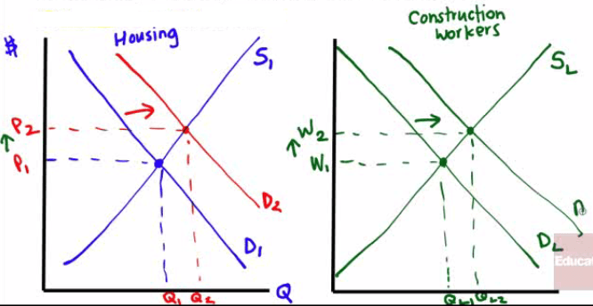

#  

# Total Product vs. Marginal Product

  -  Total product shows the total quantity of output produced, which
     will eventually **increase** at a **decreasing rate**

  -  Marginal product of labor will **decrease** as you hire more
     workers due to **diminishing marginal returns**

  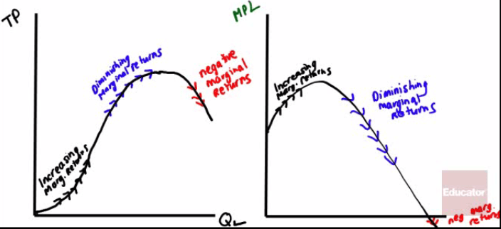
  
  

 

# Value of the Marginal Product

  -  Meaning
    
      -  The value of the marginal product of a factor is the **value**
         of the **additional output** generated by employing **one
         more** unit of that **factor**.

  VMPL = Value of the Marginal Product of Labor
  
  MRP = Marginal Revenue Product

  -  Formula
    
      -  VMPL = **P \* MPL**
    
      -  MRP = P \* MPL

  -  Hiring decision rule
    
      -  Hire the extra worker if VMPL \>W
    
      -  **VMPL = W** at the profit-maximizing level of employment
    
      -  Example
        
          -  If the 5th worker produces 7 radios in the one day which
             sell for $10 each and his daily wage rate equals $10,
             should you hire the worker?
        
          -  VMPL = P \* MPL = 10 \* 7 = 70 < W = 100

  -  Curve

  -  This curve shows how the **value of marginal product of labor**
     depends on the **number of workers** employed.

  -  It slopes **downward** because of diminishing returns to labor in
     production

  -  To maximize profit, you should choose the level of employment at
     which the value of the **marginal product of labor** is equal to
     the **market wage** rate

 

# Shifts of the Factor Demand Curve

  -  Changes in the price of goods
    
      -  If the price of wheat, increases, what happens to the VMPL of
         wheat?

  

  -  Change in supply of other factors
    
      -  If the workers decrease their productivity due to a loos of
         land, what happens to the VMPL?

  

  -  Changes in Technology
    
      -  The usual impact of technological process will shift the MPL
         (and thus VMPL) to the
  right

  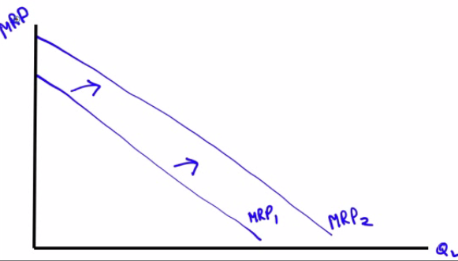
  
   

# Factor Market Example

  
  
  Assume that Samantha's Shirt Company sells shirts at $15 and pays a
  wage of $85 a day. Assume labor is the only output.

  -  Draw a correctly labeled graph of SSC's current supply curve for
     unskilled labor
    
      -  **Put QL on the x-axis, and W on the y-axis**
    
      -  Perfectively competitive labor
  market

  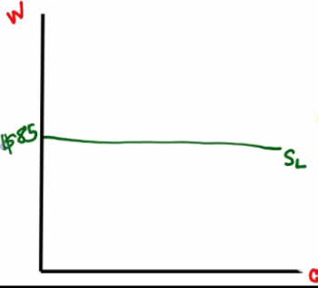

  -  What is SSC's profit maximizing level?

| QL  | Q  | MPL | P  | MRP/VMPL | W  |
| -------------- | -- | --- | -- | -------- | -- |
| 0              | 0  |     |    |          |    |
| 1              | 30 | 30  | 15 | 450      | 85 |
| 2              | 50 | 20  | 15 | 300      | 85 |
| 3              | 60 | 10  | 15 | 150      | 85 |
| 4              | 65 | 5   | 15 | 75       | 85 |
| 5              | 68 | 3   | 15 | 45       | 85 |
| 6              | 70 | 2   | 15 | 30       | 85 |

  -  When QL = 3, **MRP/VMPL \> W**

  -  When QL = 4, **MRP/VMPL < W**

  -  Answer: **Produce 60 shirts** and hire 3 workers

<!-- end list -->

  -  Suppose SSC **loses technology** that **decrease** the
     **productivity** of its unskilled workers. How will the new
     technology affect the quantity of unskilled labor SSC hires?
    
      -  The MRP decreases, because MPL has decreased.
    
      -  The quantity of Labor will decrease

  -  How will the new technology affect the wage paid to SSC's
     unskilled workers
    
      -  Wage is unaffected because wage is perfectly elastic or
         constant

  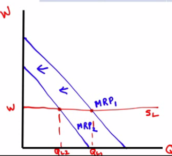

 

# Another Factor Market Example

  
  
  Sus & Jib is a profit-maximizing pin-making firm that can sell pins at
  a price of $20 each. Sus & Jib can hire workers at a market wage of
  $120 per day per worker

  -  In what market structure does this company sell its products?
    
      -  **perfect competition** because **price** is the **same** and
         **no differentiation**.

  -  In what market structure do the laborers work in?
    
      -  **perfect competition** because **wage** rate is **constant **

  -  Calculate the value of the marginal product of labor of the third
     worker
    
      -  MRP = (45 - 30) \* 30 = 15 \* 20 = 300

  -  What is the profit-maximizing output level?

| QL  | Q  | MPL | P  | MRP/VMPL | W   |
| -------------- | -- | --- | -- | -------- | --- |
| 0              | 0  |     |    |          |     |
| 1              | 10 | 10  | 20 | 200      | 120 |
| 2              | 30 | 20  | 20 | 400      | 120 |
| 3              | 45 | 15  | 20 | 300      | 120 |
| 4              | 55 | 10  | 20 | 200      | 120 |
| 5              | 58 | 3   | 20 | 60       | 120 |
| 6              | 59 | 1   | 20 | 30       | 120 |

  -  Profit-maximizing output level is 55-58 pins with 4-5 workers

 

 

4.2 - Labor Supply & Cost Minimization

Sunday, January 15, 2017

12:00 AM

 

# Work vs. Leisure

  -  In the labor market, the roles of firms and households are
     reversed
    
      -  Labor is **supplies** by **households** and **demanded** by
         **firms**

  -  Assume that an individual is capable of working as little or as
     many hours as possible

  -  Individual Labor Supply Curve
    
      -  the relationship between the **wage rate** and the **number of
         labor supplied** by the worker
    
      -  If the **substitution effect** dominates, the curve slopes
         upward

  

  -  If the **income effect** dominates, the quantity of labor supplies
     goes down

  
  
   

# Backward-Bending Labor Supply Curve

  -  Is a backward-bending labor supply curve possible?

  -  At **high wage rates**, yes\!

  -  At the end of the 19th century, the average work week was 70 hours
     and few people retired at age 65

  -  Today the typical workweek is between 35-40 hours as people
     substitute income for leisure

  
  
   

# Shift of the Labor Supply Curve

  -  Changes in **Preferences** and **Social Norms**
    
      -  In the US since the 1960s a large number of women entered the
         workforce

  -  Changes in **Population**

  -  Changes in **Opportunities**
    
      -  In the 1960s, as opportunities for women increased, the supply
         of teachers decreased, raising the equilibrium wage of all
         reaming
  teachers

  

  -  Changes in **Wealth**
    
      -  In 1979, 71% of the American teenagers (16-19) were in the
         summer workforce. In 1989, it dropped to 63%. By 2009 the drop
         was down to 33%
    
      -  As household wealth increases, teenagers tend to consume more
         leisure (ie. additional study, games)

 

# Determining the Optimal Input Mix

  -  **Substitutes** and **Complements** in Factor Markets
    
      -  **Capital** and **Labor** can be **substitutes** in banking
    
      -  You can substitute ATM machines for tellers
    
      -  Office workers and computers can be complements

  -  **Cost Minimization**
    
      -  Optimal Input Mix is where MPL/Wage = MPK/Rental Rate
    
      -  I**f MPL/Wage \> MPK/Rental Rate**, then hire the **human**
         worker
    
      -  If **MPK/Rental Rate \> MPL/Wage**, then the **machines**
         win\! use more capital

  -  Situation is very similar to the Utility Maximization rule of
     MUA/PA=MUB/PB, except
     in the context of factor market rather than consumer behavior

 

# Capital vs. Labor

  

  -  What is the MPL of the 4th worker?
    
      -  140 - 120 = 20

  -  What is the MPL per dollar of the 5th worker if the wage rate per
     hour is $5
    
      -  (155 - 140) / 5 = 3

  -  How many workers would the business hire if it hired every worker
     for whom the marginal product per dollar is greater than or equal
     to 1 expo maker per dollar?

| QL | Q   | MPL | MPL/W |
| ------------- | --- | --- | ----- |
| 0             | 0   |     |       |
| 1             | 40  | 40  | 8     |
| 2             | 90  | 50  | 10    |
| 3             | 120 | 30  | 6     |
| 4             | 140 | 20  | 4     |
| 5             | 155 | 15  | 3     |
| 6             | 160 | 5   | 1     |
| 7             | 162 | 2   | 0.4   |

  -  6 workers, 160 expo markers

<!-- end list -->

  -  If the marginal product per dollar spent on labor is 1 expo marker
     per dollar, the marginal product of the last capital hired is 100
     expo markers per dollar and the rental rate is $50 per day, is the
     firm minimizing its cost?
    
      -  No, employ more capital and less
         labor
    
      -  

 

# Theories of Income Distribution

  -  Marginal Productivity and Wage Inequality
    
      -  **Compensating differentials**
        
          -  Across different jobs, wages are often higher or lower
             depending on a jobs "pleasant" factor
    
      -  **Differences in talent**
        
          -  Lebron James is paid higher than most basketball players
             because he has a higher level of ability than they do
    
      -  **Quantity of human capital**
        
          -  Those who invest in education tend to have higher wages
             than those that do not

  -  Market Power
    
      -  Unions, or organizations that try to raise wages and working
         conditions, tend to **increase the equilibrium** price of
         labor via "**collective bargaining**"

  -  Efficiency wage
    
      -  Type of incentive scheme used by workers to **encourage hard
         work** and **reduce turnover**
    
      -  Employers will pay **above** the **equilibrium wage** or a
         **premium** above the "normal" wage rate in order to encourage
         **staying** with a company

  -  Discrimination
    
      -  Racial or Gender discrimination is **NOT** a **natural**
         consequence of market competition
    
      -  In fact, companies can **benefit** by exploiting
         **discrimination**
    
      -  Branch Rickey, in signing Jackie Robinson to play for Dodgers,
         got a huge bargain economically because no other
         African-American baseball players were playing in the major
         leagues

 

# Factor Market Example

  -  Assume Park's Place Pencils employs a fixed number of employees
     and rents a machine for a variable number of hours from a
     perfectly competitive market.

  -  Using correctly labeled **side-by-side** graphs of the factor
     market of machines and the Park's Place Pencils, find the
     **equilibrium** rental **price** of machines in the factor market,
     and Park's Place **equilibrium** rental **quantity** of
  machines

  

  -  Assume that the popularity of pencils increases, **increasing**
     the **demand** for **pencils**

  -  What will happen to each of the following?
    
      -  Marginal product curve for machine-hours
        
          -  stays the same
        
          -  MRP = P \* MPL
        
          -  P↑, MRP↑, MPL -
    
      -  Marginal revenue product curve for machine-hours
        
          -  Increases because price increases
        
          -  MRP = P \* MPL

  -  J. Daniel Park, CEO of Park's Place Pencils is employing the
     cost-minimizing combination of inputs. The marginal product of
     labor is 60 pencils per worker hour and the wage rate is $15 per
     hour. The marginal product of the machine is 100 widgets per
     machine-hour. What is the hourly rental price of a
         machine
    
      -  
    
      -  
    
      -  

 

 

5.1 - Positive & Negative Externalities

Sunday, January 15, 2017

5:49 PM

 

# The Economics of Pollution

  -  Is it a **legitimate goal** to have **zero pollution** in society?
    
      -  Pollution, just like most things in economics, is a "**how
         much**" question that requires **benefit**/**cost** analysis

  -  Marginal social cost of pollution
    
      -  **additional cost** imposed on society created by **a unit of
         pollution**
    
      -  ie. acid rain harms crops and forests

  -  Marginal social benefit of pollution
    
      -  **additional benefit** to society from **a unit of pollution**
    
      -  ie. pollution avoidance incurs an opportunity cost and is
         expensive

  -  Socially optimal quantity of pollution
    
      -  point at which marginal social cost (MSC) equals the marginal
         social benefit (MSB)
    
      -  **MSB = MSC**

 

# Socially Optimal Quantity of Pollution

  -  **Upward**-sloping **MSC** curve

  -  **Downward**-sloping **MSB** curve

  -  **Intersection** of MSC and MSB is socially **optimal** point

  -  Market-determined quantity of pollution is where MSB is x-axis

  -  Not allocatively efficient: Q too high, Price too low

  

  -  In the **absence** of **government intervention**, the quantity of
     pollution will be **QMKT**, the level at which the
     marginal social benefit of pollution is zero.

  -  This is an inefficiently high quantity of pollution: the marginal
     social cost, $400, greatly exceeds the marginal social benefit $0.

  -  An optimal Pigouvian **tax** of $200, the value of the marginal
     social cost of pollution when it equals the marginal social
     benefit of pollution, can move the market to the socially
     **optimal** quantity of pollution, **QOPT**

 

# Negative Externality vs. Positive Externality

  -  Negative externality
    
      -  a decision that a firm or **individual** makes that imposes a
         **cost** to "**society**" as a whole (ie. the decision to
         pollute)
    
      -  Impact is **similar** to that of a **supply** shift to the
         **left** on a supply and demand graph
    
      -  Market price too low, Market Quantity too high

  
  
  

  -  Positive externality
    
      -  a decision that an **individual** or firm makes that yields
         **positive benefits** to **society** (ie. the decision to
         attend college and become a productive citizen)
    
      -  Impact is **similar** to that of a **demand** shift to the
         **right** on a supply and demand graph
    
      -  Market price too low, market quantity too low

  
  
  

 

# Government Solution

  -  By what means would the government be able to **correct a nagative
     externality**?
    
      -  Tax

  

  -  By what means would the government be able to **encourage a
     positive externality**?
    
      -  Subsidy

  

 

# Private (or Coase) Solution

  -  Coase Theorem
    
      -  Even in the presence of externalities, an economy can be
         **efficient** (assuming low transaction costs) by
         **internalizing** the **externalities**

  -  Example
    
      -  Let's say that Jeff and Chris are neighbors in Chino Hills and
         that Jeff enjoys throwing loud parties wile Chris does not
    
      -  Chris does not enjoy the music but Jeff has a legal right to
         play loud music, so Chris can play Jeff a payment **equal to
         the external cost he imposes on him**
    
      -  Or, if Jeff does not have a legal right to play loud music,
         Jeff can pay Chris an amount **equal to the cost the music
         imposes on Chris**

  -  Pigouvian taxes
    
      -  named after economist A.C. Pigou, these taxes were designed to
         **reduce external costs**

  -  Negative Externality Example
    
      -  Formula
        
          -  **MSC = MPC + MEC**
        
          -  MSC: Marginal Social Cost
        
          -  MPC: Marginal Private Cost
        
          -  MEC: Marginal External Cost
    
      -  Smoking cigarettes is considered a **negative externality**
    
      -  An optimal Pigouvian tax charges where **MSC = D**, so that
         **less quantity** is consumed at a higher price

  

  -  Positive Externality Example
    
      -  Formula
        
          -  **MSB = MPB + MEB**
        
          -  MSB: Marginal Social Benefit
        
          -  MPB: Marginal Private Benefit
        
          -  MEB: Marginal External Benefit
    
      -  Getting a flu shot not only benefits you but also reduces the
         number the number of others getting the flu by as much as 1.5
    
      -  Getting a flu shot is considered a **positive externality**
    
      -  An optimal Pigouvian subsidy intersects where **MSB = S**.
         Lower prices **encourages consumption**

  
  
   

# Practice Question

  -  Draw a correctly labeled graph of the market for dog barking
     contests that is **perfectly competitive**. If neighbors are
     disturbed by dog barking, draw the marginal social cost curve,
     labeled **MSC**. Label the marginal social benefit curve, labeled
     **MSB**, and shade in the deadweight loss or **DWL**, if any.

  

  -  Draw a correctly labeled graph of the market for dog barking
     contests that is **perfectly competitive**. If neighbors now
     **enjoy** dog barking, is the market **equilibrium greater**,
     **less** than or **equal** to the socially optimal quantity? If
     the government **bans** dog barking, will the **deadweight loss
     increase**, **decrease**, or remain **unchanged**?
    
      -  Market equilibrium is less than optimal
    
      -  Deadweight loss will
  increase

  

  -  Assume that the market for paper bags is **perfectly competitive**
     and that they create a **negative externality**. Draw a graph that
     includes the **MPC** and **MSC**, as well as the **market
     quantity**, Qm. Label the **allocatively efficient
     quantity** as Qs and shade the area of **deadweight
     loss** and label as DWL. If a **lump-sum tax** is imposed, what
     happens to DWL?
    
      -  Allocatively efficient: MSC = MSB

  

  -  The DWL stays the same

 

 

5.2 - Public vs. Private Goods

Sunday, January 15, 2017

8:00 PM

 

# Characteristics of Goods

  -  Rival (in consumption)
    
      -  good that **cannot** be consumed by **more than one person**
         at a time
    
      -  ie. hamburger

  -  Nonrival (in consumption)
    
      -  good that can be **consumed jointly** by groups of people
    
      -  ie. lecture

  -  Excludable
    
      -  suppliers can **prevent non-payers from consuming** the good

  -  Nonexcludable
    
      -  suppliers **cannot prevent** those who did **not pay** for an
         item **from enjoying** the **benefits** of the good

 

# Four Types of Goods

 

# Private Goods

  -  **Rival and excludable**

  -  **Excludability** is **crucial** because if a supplier could not
     discriminate who gets their particular item or not, he or she
     would have **no incentive to produce**

  -  There would exist a **free-rider** problem in which no rational
     consumer would choose to pay for a good or service if provided (or
     nonexcludable)

  -  If items are nonrival, then an **inefficiently low quantity** of
     items are **consumed**

  -  Most items (cars, food, phones, pencils, jeans, stapler, markers,
     etc) are private goods in which the market functions properly

 

# Public Goods

  -  **Nonrival and nonexcludable**

  -  Suffer from the **free-rider problem** because private firms
     generally produce **inefficiently low quantities**

  -  Public radio, for example, or scientific research sometimes rely
     on **private donations**

  -  In the UK, a license fee (~$230 in 2010) is charged to television
     owners but is made excludable by using "television detection vans"

  -  Most people agree that the government should provide national
     defense, the legal system, fire protection, etc.

 

# Common Resources

  -  **Rival and nonexcludable**

  -  Since you can't stop me from consuming the good and more by me
     means less of the good for you, there's an **incentive to
     overuse**

  -  Tragedy of the commons -- depletion of a shared resource by
     individuals acting rationally according to each one's **self
     interest**, though **contrary** to the **group's long-term best
     interest** -- Negative externality

  -  Example: Fish in
  river

  
  
   

# Artificially Scare Resources

  -  **Nonrival and excludable**

  -  **Marginal cost** to society watching pay-per-view is **zero**

  -  Yet cable companies prevent those who haven't paid from watching

  -  Computer software and audio files share this same characteristic

  -  This is **allocatively inefficient** since the P is greater than
     the MC, but producers will have **no incentive to produc**e a
     product **unless profit** is generated

 

# Healthcare and Government 

  -  Should the **government** get involved in **healthcare**?

  -  This is a **normative question**, but it is useful for both
     proponents and opponents of nationalized healthcare to consider
     the following two questions
    
      -  Is it rival or nonrival?
        
          -  Rival
    
      -  Is it excludable or nonexcludable?
        
          -  Nonexcludable
    
      -  So healthcare is **common resource**

 

 

5.3 - Income Inequality & Income Distribution

Sunday, January 15, 2017

8:47 PM

 

# The problem of Poverty

  -  Definition of poverty is an **arbitrary task**

  -  In the United States, the **poverty threshold** is the minimum
     income required to purchase the necessities of life

  -  Those that fall below this threshold would be considered poor

  -  In 2009 for an adult living alone the figure was at $10,956; for
     two adults and two children, it was at $21,756

  -  Poverty rates fell steeply in the 1960s down to between 10-15% in
     the 1970s. But, despite increased prosperity, the numbers have
     stayed relatively stagnant

 

# Who are the Poor?

  -  In 2009 (according to the US Census Bureau), 43.5 million
     Americans were in poverty, or roughly 4.3% of the population, or
     **1 in 7** people

  -  25.9% of **African-Americans** and 25.3% of **Hispanics** were
     considered poor. 9.4% of non-Hispanic whites below the poverty
     threshold

  -  **Female-headed** households had a poverty rate of 32.5% while
     married couples had a relatively smaller poverty rate of 5.8%

  -  Many part-time workers consist of a category analysts refer to as
     the **working poor**, usually because part-time work does not
     include **health benefits**, **retirement** or **paid vacation**

 

# What Causes Poverty

  -  Lack of **education** is the primary culprit in poverty

  -  In 1979 the average hourly wage of a man with a college education
     was 36% higher than a man with a high school diploma

  -  In 2009 this "college premium" was at 81% -- employers prefer
     workers with more human capital (which going to college usually
     signals to firms)

  -  **Racial and gender discrimination** can be seen as causes

  -  Sometimes, **bad luck** (wage-earner loses job of falls ill) might
     be the reason for poverty

 

# Economic Inequality

  -  In 2008, the average US household income was $60,000

  -  More precisely, the mean income was $68,424 while the median
     income was $50,303

  -  The **ultra-high** salaries of the few (Bill Gates and Mark
     Zuckerberg) will make the **mean greater** than the **median**

  -  Income is unequally distributed as data from the U.S. Census
     Bureau shows

  

 

# Gini Coefficient

  -  The most widely used **measure of inequality**, it's a number that
     summarizes a country's level of inequality

  -  High level of inequality (such as Brazil) would be 0.6 whereas in
     Sweden the number is at 0.25

  -  The **US** has a relatively **high Gini** coefficient for such a
     wealthy country. In 2009, the number was at 0.468

  -  **High Gini levels** appear in **Africa** and **South America**

 

# Lorenz Curve

  -  a graph on which the cumulative percentage of total national
     income (or some other variable) is plotted against the cumulative
     percentage of the corresponding population (ranked in increasing
     size of share).

  -  The extent to which the curve sags below a straight diagonal line
     indicates the degree of inequality of distribution.

  

 

# Three Types of Taxes

  -  **Proportional Tax**
    
      -  "**flat**" tax that takes a percentage of income regardless of
         the amount of income (ie. Hong Kong)

  -  **Regressive Tax **
    
      -  tax rate **decreases** as the amount subject to taxation
         increases that imposes a **greater burden** on the **poor**
         than the rich (ie. payroll taxes or cigarette taxes)

  -  **Progressive Tax**
    
      -  tax rate that **goes up** as income increases. Most conutries
         (including the US) have **increasingly higher tax** brackets
         for the **wealthy**

 

# Means-Tested Programs

  -  Welfare refers to **money** given to those that fall **below** the
     **poverty threshold**

  -  In the US, Temporary Aid for Needy Families (TANF) assists
     families with children for a limited period of time

  -  Replace the more controversial Aid to Families with Dependent
     Children (AFDC) which created perverse incentives for the poor

  -  Supplemental Security Income help disabled individuals and
     Supplemental Nutrition Assistance Program help low-income families
     with food

  -  Negative income tax -- program that creates incentive for low-wage
     earners to make more money (Earned Income Tax Credit)

  -  Food Stamps and Medicaid

 

# Social Security and Unemployment

  -  Largest US welfare program is Social Security

  -  Retirement income for elderly, disable and provides "survivor
     benefits"

  -  Wages subject to tax up maximum amount ($106,800 in 2010)

  -  Unemployment insurance pays 35% of salary until a new job is found
     for a period of time (extended during recessions)

  -  Financed through a tax on employers

  -  **Trade-offs** exist between **efficiency** and **equity**, which
     is ultimately a normative issue

 

 

Sample Questions

2017年2月6日 星期一

上午 8:57

 

# Question 5

  ![6-5 FIGURE Price $10 9 8 7 6 5 4 3 2 1 o Total revenue $25 24 21 16
  9 The Price Elasticity of Demand Elastic Unit-elastic Changes Along
  the Demand Curve Demand Schedule and Total Revenue for a Linear Demand
  Curve 1 Price $0 1 2 3 4 5 6 7 8 9 10 Quantity demanded 10 9 8 7 6 5 4
  3 2 Total revenue $0 9 16 21 24 25 24 21 16 9 2 2 3 3 4 4 5 6 6 7 7 8
  8 Inelastic 9 10 Quantity 9 10 Quantity The upper panel shows a demand
  curve corre- sponding to the demand schedule in the table. The lower
  panel shows how total revenue changes along that demand curve: at each
  price and quantity combination, the height of the bar rep- resents the
  total revenue generated. You can see that at a low price, raising the
  price increases total revenue. So demand is inelastic at low prices.
  At a high price, however, a rise in price reduces total revenue. So
  demand is elastic at high prices. Demand is elastic: a higher price
  reduces total revenue. Demand is inelastic: a higher phce increases
  total revenue. ](./media/image61.png)

  -  The **total revenue** (total cost) remains the **same** when
     **demand** is **unit-elastic**

# Question 8

  -  Average variable costs are increasing when marginal costs are
     higher than average variable costs

  

# Question 10

  -  If **price** falls **less** than **AVC**, then you should **shut
     down** the company.

  -  Long-run (Profitability)

  

  -  Short-run (Production)

  

# Question 14

  

# Question 15

  -  Both **consumers** and **producers bear** a part of the total tax
     **burden**.

# Question 17

  -  Economic Profit = Accounting Profit - Opportunity Cost

  -  In a perfectly competitive industry, the Economic Profit = 0.

  -  So, Account Profit = Opportunity Cost

 

 

1995 Multiple Choice

2017年2月6日 星期一

上午 10:44

# Question 3

  -  The intention of the government in creating the **price floor** is
     to **assist** the **producers** of the good.

  ![In panel (a), the government imposes a price ceiling of $4. Because
  the price ceiling is above the equilibrium price of $3, the price
  ceiling has no effect, and the market can reach the equilibrium of
  supply and demand. In this equilibrium, quantity supplied and quantity
  demanded both equal 100 cones. In panel (b), the government imposes a
  price ceiling of $2. Because the price ceiling is below the
  equilibrium price of $3, the market price equals $2. At this price,
  125 cones are demanded and only 75 are supplied, so there is a
  shortage of FIGURE 1 A Market with a Price Ceiling 50 cones. Price of
  Ice-Cream Cone Equilibrium pnce (a) A Price Ceiling That Is Not
  Binding Price of Ice-Cream Cone Equilibrium price 53 (b) A Price
  Ceiling That Is Binding Supply IOO Equilibrium quantity Supply Price
  ceiling Demand Quantity of Ice-Cream Cones Shonage 75 Quantity
  supplied Quantity demanded Price ceiling Demand Quantity of Ice-Cream
  Cones ](./media/image49.png)

# Question 5

  -  Consumer surplus: the difference between the buyer's **willingness
     to pay** versus what he **actually pays**

# Question 15

  -  The source of inequality
    
      -  Discrimination in employment
    
      -  Differences in personal motivation
    
      -  Differences in educational level attained
    
      -  Differences in abilities

  -  Progressive income taxes are a way to correct income inequality

# Question 38

  ![Concepts and Measures of Cost FC/Q AVC- VC/Q Short run Short run and
  long run Long run Measurement Fixed cost Average fixed cost Variable
  cost Average variable cost Total cost Average total cost (average
  cost) Marginal cost Long-run average total cost Definition Cost that
  does not depend on the quantity of output produced Fixed cost per unit
  of output Cost that depends on the quantity of output produced
  Variable cost per unit of output The sum of fixed cost (short run) and
  variable cost Total cost per unit of output The change in total cost
  generated by producing one more unit of output Average total cost when
  fixed cost has been chosen to minimize average total cost for each
  level of output Mathematical term FC vc TC- FC (short run) ATC- TC/Q
  MC = ATC/AQ LRATC ](./media/image194.png)

  -  There are **economies of scale** when long-run average total cost
     **declines** as output **increases**.

  -  There are **diseconomies of scale** when long-run average total
     cost **increases** as output **increases**.

  -  There are **increasing returns to scale** when **output increases
     more** than in proportion to an increase in all **inputs**.

  -  There are **decreasing returns to scale** when **output increases
     less** than in proportion to an increase in all **inputs**.

  -  There are **constant returns to** **scale** when **output
     increases directly** in proportion to an increase in all
     **inputs**.

# Question 57

  -  **No economic profit** in the long run for **Perfect Competition**
     and **Monopolistic Competition**

  ![Product Market Characteristics 1. Numbers of Sellers 2. Availability
  of Substitutes 3. Degree of Elasticity 4. Similarity of Products 5.
  Pricing Policy/ Strategy High value 6. Barriers to Entry/Exit 7.
  Efficiency/\* Rent-Seeking 8. Eco. Profits\* 9. P, MC\* 10. p MR Many
  (they are pricetakers from the market). One product type available
  (fully substitutable) available from atl sellers. Perfectly elastic.
  Homogeneous products from all sellers. No pricing policy or strategy.
  Price at market price, price- takers. No barriers to entry/exit.
  Efficient. Each seller prices at cost. No rents. Only transfer
  earnings. Zero economic profits. Price = Minimum AC. Ideal sociai
  pricing P = MC p = MR Fewer than perfect competition, more than
  oligopoly/ monopoly (some price-makers). Imperfect substitutions.
  Imperfect elasticity. Depends on degree of innovation. Heterogeneous.
  Mostly non-price competition; some independent pricing. Weak barriers
  to entry/exit. Inefficiency, excess capacity since P = AC (but not at
  minimum). p = AC; tendency for LR zero economic profits. P \> MC
  idop\&ly Few sellers who have some control of market share;
  interdependence. Fewer substitutes available = market pricing power.
  Varies. Greater elasticity at high prices. Lower elasticity at lower
  prices. Some markets— homogeneous for specialty products. Other
  markets heterogeneous products. Much interdepen- dence in pricing.
  Some evidence of monopoly pricing • poli Formidable barriers to
  entry/exit. Monopoly pricing power leads to waste/inefficiency. Some
  economies of scale. Tendency for existence of LR economic profits, p
  \> MC One seller for whom there are no close substitutes. No close
  substitutes available. Generally inelastic but still elastic at higher
  prices. FolEows from \#1—3 above. Heterogeneous since there are no
  close substitutes. Monopoly pricing power. High value to ratio: P-MC
  Complete barriers to entry by definition. Dead-weight loss of monop-
  oly (loss to society beyond monopoly profits and reduced consumer
  surplus). Empirical evi- dence of LR economic profits. P \> MC Long
  run tendencies at equilibrium. ](./media/image195.png)

# Question 58

  -  MRP = P \* MPL

  -  MRP: Marginal Revenue Product

  -  MPL: Marginal Product of Labor

 

 

2000 Multiple Choice

2017年5月2日 星期二

下午10:05

 

# Question 7

  
  
  

  -  A firm will **always produce** where **MR = MC**, therefore the
     firm will produce Q1 units of output.

  -  The firm will produce the **efficient** level of output since it
     is producing where **P = MC = minimum ATC**.

  -  The firm is achieving both allocative and productive efficiency.

  -  The firm will earn a **normal profit** (**0 economic profit**)
     since **P = ATC**.

  -  This also tells us that total revenue equals total costs when the
     firm produces Q1 units of output.

  -  The firm will not increase production in the long run since it is
     already in equilibrium.

# Question 10

  -  For a monopolist at the profit-maximizing output level, the demand
     curve will not intersect the supply curve

  

# Question 17

  

  -  

  -  **Trade** is one way for a country to **expand** its **PPC** curve
     since specialization through trade allows for greater efficiency.

  -  Other than trade, a country would have to discover a **new supply
     of resources** or **technological advancement** to shift its
     current PPC curve.

# Question 21

  

  -  As the **price** of a good **increases**, consumers are going to
     turn to **substitutes** because the higher price **reduces** the
     consumers’ **purchasing power**.

# Question 25

  -  A firm should always **produce** where **MR = MC**.

  -  In this situation, the firm is currently producing where MR < MC
     since $12 < $16.

  -  The firm should decrease output until its MC = $12 and it should
     keep producing because at that price, **P \> AVC** since $12 \>
     $8.

  

  -  Breakeven vs. Shut down

  
  
  

  -  Long-run (Profitability)

  

  -  Short-run (Production)

  

# Question 29

  -  Economic rent is a surplus payment.

  -  If supply is perfectly elastic, there will never be any economic
     rent.

 

  
  
  ![The supply of land is a vertical line. The quantity of land in a
  particular location is fixed. Suppose, for example, that the price of
  a one-acre parcel of land is zero. At a price of zero, there is still
  one acre of land; quantity is unaffected by price. If the price were
  to rise, there would still be only one acre in the parcel. That means
  that the price of the parcel exceeds the minimum price—zero—at which
  the land would be available. The amount by which any price exceeds the
  minimum price necessary to make a resource available is called
  economic rent. The concept of economic rent can be applied to any
  factor of production that is in fixed supply above a certain price. In
  this sense, much of the salary received by Judge Judy constitutes
  economic rent. At a low enough salary, she might choose to leave the
  television industry. How low would depend on what she could earn in a
  best alternative occupation. If she earns $45 million per year now but
  could earn $200,000 in a best alternative occupation, then $44.8
  million of her salary is economic rent. Most of her current earnings
  are in the form of economic rent, because her salary substantially
  exceeds the minimum price necessary to keep her supplying her
  resources to current purposes. ](./media/image206.png)

  -  Economic Rent and Opportunity Cost

  

# Question 43

  

# Question 44

  

  -  The **profit-maximizing** rule states that the **MRP/P** of each
     resource unit must equal **1**.

  -  In order for that to occur, the price of labor must be $60 and the
     price of capital must be $100 so that each ratio is equal to 1.

# Question 60

  

  -  Remember, one of the main reasons why we have **public goods** is
     due to the **free-rider problem**.

  -  When you can’t exclude everyone from using a good or paying for
     its benefits, less than the efficient level will be provided if a
     **private firm** is producing that good simply because they need
     to **cover** their **costs**.

  -  A privately produced good may provide additional benefits to
     others who aren’t paying for the good, yet since the firm doesn’t
     reap those benefits, they choose to **produce less than** the
     **efficient** amount.

 

 

2005 Multiple Choice

2017年4月27日 星期四

上午12:23

 

# Question 33

  

# Question 41

  -  The price will remain unchanged even if the demand for the good
     increases in the long run.

  ![Short-Run and Long-Run AØustments to an Increase in Demand Figure
  9.12 Panel (a) Market 52 Panel (b) One Firm B' $2.30 1.70 - $2.30 c
  MR2 ATC MRI DI Bushels of oats per period q, 02 Bushels of oats per
  period The initial equilibrium price and output are determined in the
  market for oats by the intersection of demand and supply at point A in
  Panel (a). An increase in the market demand for oats, from DI to in
  Panel (a), shifts the equilibrium solution to point B. The price
  increases in the short run from $1.70 per bushel to $2.30. Industry
  output rises to Q2. For a single firm, the increase in price raises
  marginal revenue from MRI to MR2,• the firm responds in the short run
  by increasing its output to (12. It earns an economic profit given by
  the shaded rectangle. In the long run, the opportunity for profit
  attracts new firms. In a constant-cost industry, the short-run supply
  curve shifts to S2,• market equilibrium now moves to point C in Panel
  (a). The market price falls back to $1.70. The firm's demand curve
  returns to MRI, and its output falls back to the original level, ql.
  Industry output has risen to Q3 because there are more firms.
  ](./media/image212.png)

# Question 51

  
  
  

# Question 55

  

 

 

2008 Free Response

2017年5月6日 星期六

下午3:18

 

# Question 1 (b)

  -  Lump-sum subsidy will not change MC or MR, so it has no impact on
     the output.

  
  
  

# Question 2 (a)

  -  Marginal utility
    
      -  The extra satisfaction received from consuming an additional
         unit of a good or service.

# Question 2 (c)

  ![The price elasticity of demand determines whether the demand curve
  is steep or flat. Note that all percentage changes are calculated
  using the midpoint method 2.... 2.. 2.. 1 FIGURE The Price Elasticity
  of Demand (a) Perfectly Inelastic Demand: Elasticity Equals 0 (b)
  Inelastic Demand: Elasticity Is Less Than 1 Price $5 4 1. An Increase
  n price . 0 Price $5 4 Increase •n price 0 Demand IOO Price $5 4
  Increase In pnce . Quantity 90 IOO Demand Quantity leaves the quantity
  demanded unchanged. .. leads to an 11% decrease in quantity demanded.
  (c) Unit Elastic Demand: Elasticity Equals 1 Price $5 4 Increase In
  price 0 IOO Demand Quantity .. leads to a 22% decrease in quantity
  demanded. 2.. (d) Elastic Demand: Elasticity Is Greater Than 1 50 IOO
  Demand Quantity Price $4 0 (e) Perfectly Elastic Demand: Elasticity
  Equals Infinity . At any price above $4, quantity manded is zero.
  Demand . At exactly $4, consumers will buy any quantity. Quantity ..
  leads to a 67% decrease in quantity demanded. 3. At a price below $4,
  quantity demanded is infinite. ](./media/image54.png)

 

 

2008 Free Response (Form B)

2017年5月6日 星期六

下午3:18

 

# Question 1 (f)

  -  Just cover opportunity costs --\> Normal profit --\> P = ATC

  ![Definitions: accounting versus normal profit Accounting profit = TR
  — explicit costs Normal profit is the level of profit which is
  sufficient to keep the resources employed (rather than transfer them
  to something else). If you have to calculate it, it is the opportunity
  cost. E.g. running your own business may earn you E20,000 but you may
  have given up a job paying you E25,000. so you have given up 25,000
  for 20,000\! = E25,OOO Normal profit = Opportunity cost
  https://www.youtube.com/watch?v=FqttpKZZz70
  http://openqecko.com/economics/profit/ Video on economic cost,
  economic profit ](./media/image218.png)
  
  

# Question 2 (a)

  -  Deadweight loss should be the area between MSB and MPB, not MSC
     and MPB

  
  
  
  
  

# Question 3 (f)

  -  The increase in the price of hats raises the marginal revenue
     product, hence the demand for labor

 

 

2009 Free Response

2017年5月6日 星期六

下午3:18

 

# Question 1 (d)

  

# Question 2 (d)

  -  Owing to the tax, the market is no longer allocatively efficient
     because total surplus decreases / the tax creates a dead-weight
     loss.

 

 

2009 Free Response (Form B)

2017年5月6日 星期六

下午3:18

 

# Question 1 (a)

  -  Graph for a monopolistically competitive company
    
      -  Since the company have excess capacity, it operates to the
         left of minimum-cost output

  

# Question 1 (c)

  -  In the long-run, economic profits will fall to zero for a
     monopolistically competitive company.

  
  
  

# Question 1 (e)

  -  In the long run, will the company be operating in a region where
     economies of scale exist? Explain.
    
      -  One point is earned for stating yes.
    
      -  One point is earned for explaining that the firm produces a
         quantity of output in the declining portion of its long-run
         ATC.

  

 

 

2010 Multiple Choice

Wednesday, April 12, 2017

3:26 PM

 

# Question 2

  -  **Command economies** have **no private property** and **no
     individual property rights**.

  ![FREE MARKET ECONOMY VERSUS COMMAND ECONOMY Free market economy is
  controlled by private owners Government has little influence over the
  economic activities Market is based on the division of labors Price of
  goods and services is set by the supply and demand Ownership of land
  and resources are with individuals or firms Demand decides the
  quantity of output Income distribution is not similar Command economy
  is controlled by the government Government has its full control over
  all the economic activities No division of labor is involved Prices
  are determined by the government decision makers Land and other
  resources are owned by the government Government decides the quantity
  of output Fairly equal income distribution practices Pediaa.com
  ](./media/image228.png)

# Question 5

  ![Factors That Shift Supply Changes in input prices If the price of an
  input used to produce A rises, . . . If the price of an input used to
  produce A falls, Changes in the prices of related goods or services If
  A and B are substitutes in production ... If A and B are complements
  in production . . . Changes in technology . and the price of B rises,
  . . . . and the price of B falls, . . and the price of B rises, . . .
  . and the price of B falls, . If the technology used to produce A
  improves, ... Changes in expectations If the price of A is expected to
  rise in the future, .. If the price of A is expected to fall in the
  future, . . . Changes in the number of producers If the number of
  producers of A rises, .. . If the number of producers of A falls, .
  supply of A decreases. supply of A increases. supply of A decreases.
  supply of A increases. supply of A increases. supply of A decreases.
  supply of A increases. supply of A decreases today. supply of A
  increases today. . market supply of A increases. . market supply of A
  decreases. ](./media/image34.png)

# Question 6

  

# Question 12

  -  Long-run (Profitability)

  

  -  Short-run (Production)

  

# Question 19

  

  -  In microeconomics, the **long run** is the conceptual time period
     in which there are no fixed factors of production, so that there
     are no constraints preventing changing the output level by
     changing the capital stock or by entering or leaving an industry.

  -  The long run contrasts with the **short run**, in which some
     factors are variable and **others are fixed**, constraining entry
     or exit from an industry.

  -  In macroeconomics, the long run is the period when the **general
     price level, contractual wage rates, and expectations** adjust
     fully to the state of the economy, in contrast to the short run
     when these variables may not fully adjust.

# Question 26

  ![Introduction to Game Theory Game theory is the branch of decision
  theory concerned with interdependent decisions. The problems of
  interest involve multiple participants, each of whom has individual
  objectives related to a common system or shared resources. Because
  game theory arose from the analysis of competitive scenarios, the
  problems are called games and the participants are called players. But
  these techniques apply to more than just sport, and are not even
  limited to competitive situations. In short, game theory deals with
  any problem in which each player's strategy depends on what the other
  players do. Situations arise frequently, in all walks of life. A few
  examples in which game theory could come in handy include: Friends
  choosing where to go have dinner Parents trying to get children to
  behave Commuters deciding how to go to work Businesses competing in a
  market Diplomats negotiating a treaty Gamblers betting in a card game
  ](./media/image230.png)

# Question 27

  ![Monopolistic Competition Long-Run Equilibrium 1 MR = MC
  thismatter.com Quantity 2 Capacity 3 Note that where MC rises above MR
  , the firm would incur greater costs than it would receive in
  additional revenue, which is why the firm maximizes its profit by
  producing only that quantity where MR = MC , and charging the price at
  f. 2 Market Price = Marginal Cost = Allocative Efficiency 3 Productive
  Efficiency = Minimum ATC Excess Capacity = Quantity Produced at
  Minimum profit (MR = MC . ATC - Quantity that yields the greatest
  ](./media/image231.png)
  
  

# Question 40

  
  
  
  
  

# Question 44

  

# Question 47

  

  -  The bow-out shape occurs because economic resources are **not
     perfectly adaptable** to the production of different goods and,
     thus, the opportunity cost of producing a good will increase as
     more and more resources are allocated to the production of that
     good.

# Question 50

  -  If the monopolist decreases its price, both total revenue and
     profits will decrease

  ![6-5 FIGURE Price $10 9 8 7 6 5 4 3 2 1 o Total revenue $25 24 21 16
  9 The Price Elasticity of Demand Elastic Unit-elastic Changes Along
  the Demand Curve Demand Schedule and Total Revenue for a Linear Demand
  Curve 1 Price $0 1 2 3 4 5 6 7 8 9 10 Quantity demanded 10 9 8 7 6 5 4
  3 2 Total revenue $0 9 16 21 24 25 24 21 16 9 2 2 3 3 4 4 5 6 6 7 7 8
  8 Inelastic 9 10 Quantity 9 10 Quantity The upper panel shows a demand
  curve corre- sponding to the demand schedule in the table. The lower
  panel shows how total revenue changes along that demand curve: at each
  price and quantity combination, the height of the bar rep- resents the
  total revenue generated. You can see that at a low price, raising the
  price increases total revenue. So demand is inelastic at low prices.
  At a high price, however, a rise in price reduces total revenue. So
  demand is elastic at high prices. Demand is elastic: a higher price
  reduces total revenue. Demand is inelastic: a higher phce increases
  total revenue. ](./media/image61.png)
  
  

# Question 53

  ![How does Monopolistic Competition differ from Perfect Competition?
  Number of producers (sellers in the market) Types of goods and
  services available for consumers Does the firm have control over their
  own prices? Is branding / marketing important? Are entry barriers
  zero, low or high? Perfect Competition Many Homogeneous NO — price
  takers NO Zero barriers Does this market structure lead to allocative
  yes: Price = MC efficiency in the long run? Does this market structure
  lead to yes - min LRAC productive efficiency in the long run?
  Monopolistic Competition Many Differentiated Yes — some pricing power
  Yes — key non-price competition Low barriers Not quite (P\>MC) No —
  higher LRAC ](./media/image238.png)

# Question 59

  

 

 

2010 Free Response

2017年5月6日 星期六

下午3:19

 

# Question 2 (a)

  -  Factor market for machines and company
    
      -  Graph MRP as a downward-sloping line in the company side.

  

# Question 2 (b)

  -  The marginal produce curve will not change no matter how the
     demand of the product changes.

  ![Derived Demand of Labor: MPL, MRP, MRC Demand for labor is directly
  tied to 2 factors: labor productivity and price of the output labor
  produces MRP = MPL x p Additional output produced from additional
  worker Increase with technology \[training • If MPL+ = MRP (DE) MRC:
  cost of hiring an additional worker output Price of the good firm is
  producing— determined in the product market Increase with an increase
  demand for the good • MRP (DE) In perfectly competitive labor market
  MRC is constant (horizontal SL curve) For monopsonist MRC is greater
  than sc , MRC increases as Q increases ](./media/image241.png)

# Question 3 (c)

  -  There is no deadweight loss if the government is imposing a
     per-unit tax to correct for negative externality.

 

 

2010 Free Response (Form B)

2017年5月6日 星期六

下午3:19

 

# Question 1 (a)

  -  Profit-maximizing point

  

# Question 1 (c)

  -  Economic profit = Total revenue - Explicit costs - Implicit costs.

  -  If the firm earns zero economic profit, the accounting profit is
     positive.

# Question 1 (f)

  -  Suppose the long-run average total cost is strictly downward
     sloping. Would it be efficient to build a second bridge? Explain.
    
      -  One point is earned for stating that building a second bridge
         would be inefficient and for explaining that, because there
         are economies of scale, building a second bridge would raise
         the average total cost.

# Question 2 (b)

  -  The law of diminishing returns
    
      -  As more and more units of a variable input are added to a
         fixed input, the output increases at a decreasing rate.

  

  -  Diminishing returns occur because of the **overuse** of the
     **fixed input**.

# Question 3 (a)

  -  Elasticity and tax

  
  
  
  
   

 

 

2011 Free Response

Tuesday, April 18, 2017

1:10 AM

 

# Question 1 (a)

  -  Profit per unit = Demand(Price) - ATC

# Question 1 (d)

  

  -  Formula

  

  -  How to remember
    
      -  **Queen** is greater than the **Princess**

  ![The price elasticity of demand determines whether the demand curve
  is steep or flat. Note that all percentage changes are calculated
  using the midpoint method 2.... 2.. 2.. 1 FIGURE The Price Elasticity
  of Demand (a) Perfectly Inelastic Demand: Elasticity Equals 0 (b)
  Inelastic Demand: Elasticity Is Less Than 1 Price $5 4 1. An Increase
  n price . 0 Price $5 4 Increase •n price 0 Demand IOO Price $5 4
  Increase In pnce . Quantity 90 IOO Demand Quantity leaves the quantity
  demanded unchanged. .. leads to an 11% decrease in quantity demanded.
  (c) Unit Elastic Demand: Elasticity Equals 1 Price $5 4 Increase In
  price 0 IOO Demand Quantity .. leads to a 22% decrease in quantity
  demanded. 2.. (d) Elastic Demand: Elasticity Is Greater Than 1 50 IOO
  Demand Quantity Price $4 0 (e) Perfectly Elastic Demand: Elasticity
  Equals Infinity . At any price above $4, quantity manded is zero.
  Demand . At exactly $4, consumers will buy any quantity. Quantity ..
  leads to a 67% decrease in quantity demanded. 3. At a price below $4,
  quantity demanded is infinite. ](./media/image54.png)

# Question 1 (e)

  -  Accounting Profit ≥ Economic Profit

  
  
  
  
  

# Question 1 (f)

  -  Profit = Revenue - Cost

# Question 2 (a)

  -  Graph for a typical firm should include
    
      -  Marginal Cost
    
      -  Marginal Revenue
    
      -  Demand(Price)
    
      -  Average Total Cost

  -  Profit = (Price - ATC)\* Quantity

  

# Question 2 (c)

  -  A typical labor supply and demand graph should include
    
      -  Marginal Factor Cost: Horizontal
    
      -  Marginal Revenue Product (Marginal Product of Labor): Downward
         sloping
    
      -  x-axis: Quantity of Labor
    
      -  y-axis: Wage Rate

  

# Question 3 (a)

  -  Negative Social Externality

  

  -  Positive Social Externality

  

# Question 3 (b)

  -  A lump-sum tax will not change the deadweight loss, since the MC
     will not change

 

 

2011 Free Response (Form B)

Tuesday, April 18, 2017

1:10 AM

 

# Question 1 (a)

  -  Graph for the market and a typical firm

  

  -  Graph for a typical firm should include
    
      -  Marginal Cost
    
      -  Marginal Revenue
    
      -  Demand (Price)
    
      -  Average Total Cost

# Question 1 (d)

  -  Long-Run Average Total Cost
    
      -  **Short-run** and **long-run** average total cost curves
         **differ** because a firm can **choose** its fixed cost in the
         **long run**.
    
      -  If a firm plans on producing a **high** amount of output, it
         might make sense to have a **high fixed cost**
    
      -  Conversely, if a firm plans on producing a **small** amount of
         output, it might make sense to have a **low fixed cost**

  ![Cost of case Economies of scale Diseconomies ofscale سس سكسر ATC6
  ATCg \]RATC 3 Quantity of salsa (cases) ](./media/image110.png)

# Question 2 (a)

  -  Positive Social Externality

  

# Question 2 (b)

  -  The price ceiling will increase the deadweight loss, because
     providers will decrease the quantity.

# Question 3 (c)

  -  the MFC curve (or the supply curve for labor) becomes horizontal
     at the minimum wage up to the quantity of minimum wage

  

 

 

2012 Multiple Choice

Thursday, January 19, 2017

10:15 PM

# Question 2

  

  -  Concave-to-the-origin production possibilities frontiers are due
     to the law of increasing costs

# Question 8

  -  Economic profits = (Demand - ATC) \* Quantity

  
  
  

# Question 10

  ![(a) Existing Firm Response to Price, cost $18 14 Price (b) Short-Run
  and Long-Run Market Response to Increase in Demand Long-run industry
  supply curve, LRS (c) Existing Firm Response to Increase in Demand An
  increase in demand rmses pnce and profit. x Price, cost New Entrants
  Higher industry output from new entrants dhves price and profit back
  down. MC ATC Quantity MKT MKT QxQr •ZMkT D Qz Quantity MC ATC Quantity
  Increase in output from new entrants Panel (b) shows how an industry
  adjusts in the short and long run to an increase in demand; panels (a)
  and (c) show the corresponding adjustments by an existing firm.
  Initially the market is at point XMKT in panel (b), a short-run and
  long-run equilibrium at a price of $14 and industry output of Qx. An
  existing firm makes zero economic profit, operating at point X in
  panel (a) at minimum average total cost. Demand increases as DI shifts
  rightward to D2 in panel (b), raising the market price to $18.
  Existing firms increase their output, and industry output moves along
  the short-run industry supply curve Sl to a short-run equilibrium at
  YMKT. Correspondingly, the existing firm in panel (a) moves from point
  X to point Y. But at a price of $18 existing firms are profitable. As
  shown in panel (b), in the long run new entrants arrive and the
  short-run industry supply curve shifts rightward, from Sl to S2. There
  is a new equilibrium at point ZMKT, at a lower price of $14 and higher
  industry output of Qz. An existing firm responds by moving from Y to Z
  in panel (c), returning to its initial output level and zero economic
  profit. Production by new entrants accounts for the total increase in
  industry output, Qz— Qx. Like XMKT, ZMKTis also a short-run and
  long-run equilibrium: with existing firms earning zero economic
  profit, there is no incentive for any firms to enter or exit the
  industry. The horizontal line passing through XMKT and ZMKT, LRS, is
  the long-run industry supply curve: at the break-even price of $14,
  producers will produce any amount that consumers demand in the long
  run. ](./media/image119.png)

  -  An increase in demand will cause no change in the long-run
     equilibrium price for a constant-cost perfectly competitive
     industry.

# Question 21

  

  -  With the conditions of a natural monopoly, long-run average total
     cost decreases as output increases

# Question 25

  -  If the average variable cost of producing 5 units of a good is
     $100 and the average variable cost of producing 6 units is $150,
     then the marginal cost of increasing output from 5 to 6 units is
     \_\_\_\_\_.

  -  6 \* 150 - 5 \* 100 = 400

# Question 28

  -  economic profit
    
      -  The difference between the total revenue received by the firm
         from its sales and the total opportunity costs of all the
         resources used by the firm.

  -  accounting profit
    
      -  The total revenue minus costs, properly chargeable against
         goods sold.

# Question 34

  
  
  ![The price elasticity of demand determines whether the demand curve
  is steep or flat. Note that all percentage changes are calculated
  using the midpoint method 2.... 2.. 2.. 1 FIGURE The Price Elasticity
  of Demand (a) Perfectly Inelastic Demand: Elasticity Equals 0 (b)
  Inelastic Demand: Elasticity Is Less Than 1 Price $5 4 1. An Increase
  n price . 0 Price $5 4 Increase •n price 0 Demand IOO Price $5 4
  Increase In pnce . Quantity 90 IOO Demand Quantity leaves the quantity
  demanded unchanged. .. leads to an 11% decrease in quantity demanded.
  (c) Unit Elastic Demand: Elasticity Equals 1 Price $5 4 Increase In
  price 0 IOO Demand Quantity .. leads to a 22% decrease in quantity
  demanded. 2.. (d) Elastic Demand: Elasticity Is Greater Than 1 50 IOO
  Demand Quantity Price $4 0 (e) Perfectly Elastic Demand: Elasticity
  Equals Infinity . At any price above $4, quantity manded is zero.
  Demand . At exactly $4, consumers will buy any quantity. Quantity ..
  leads to a 67% decrease in quantity demanded. 3. At a price below $4,
  quantity demanded is infinite. ](./media/image54.png)

# Question 38

  -  MR = P = AR = D is above the ATC curve

  -  Make sure the ATC and MC intersect at the minimum ATC

  -  The market is always right\!

  -  Economic Profit shaded in green

  -  P \> minimum ATC, Firm profitable.

  -  Entry into industry in the long
  run.

  

# Question 42

  -  If the demand for labor is relatively inelastic, an increase in
     the effective minimum wage will have less of an impact on
     employment

# Question 43

  ![Machine generated alternative text: Cost minimization or least COSt
  combination Of resources for a give n I eve 1 Of output The basic
  concept here is that the firm will find the least cost com- bination
  of 0 resources when the marginal physical product (MPPL) of one
  resource, labor, per its marginal factor (MFCL) is equal to the
  marginal phys- ical product (MPPK) of another resource, capital （ K)
  per marginal factor cost (MFCK) MPPL MPPK MFCL MFCK or where PL an d
  PK a re constant factor COStS in perfectly competitive resource
  marketso MPPL MPPK You may find a few questions on this cost
  minimization on the exam 。 The important thing to note is that the 仍
  are equal, not necessarily the mar- ginal physical products, In Other
  WO rds ， cost minimization is ach i eve d for a give n output when the
  extra product produced by labor per its cost is equal to the ext r a
  product produced by capital per its cost. NO Other combination Of
  inputs, labor and capital, Will produce any improvement in resource
  efficiency. ](./media/image258.png)

# Question 46

  -  The opportunity cost of …
    
      -  … going to college for a year is not just the tuition, books,
         and fees, but also the foregone wages
    
      -  … seeing a movie is not just the price of the ticket, but the
         value of time you spend in the theater

# Question 47

  -  Scarcity exists when the amount of the good or resources offered
     is less than what users would want if it were given away free.

  -  Free or nonscare goods such as natural resources: oxygen and sun's
     rays are available in
  abundance

# Question 51

  

  -  The demand curve for a normal good is downward sloping because the
     income and substitution effects move the quantity demanded in the
     same direction.

  -  Income effect:
    
      -  The money saved can be used for buying another commodities.
         This can be termed as Additional Income
    
      -  E.g. when the income increases, individuals buy expensive
         products instead of inferior products

  -  Substitution effect:
    
      -  It's an effect which is caused by rise in prices that induces
         a consumer to buy a relatively lower-priced good and less of a
         higher-prices one.
    
      -  This is forced to occur due to fall in income or rise in
         prices

# Question 54

  ![Product Market Characteristics 1. Numbers of Sellers 2. Availability
  of Substitutes 3. Degree of Elasticity 4. Similarity of Products 5.
  Pricing Policy/ Strategy High value 6. Barriers to Entry/Exit 7.
  Efficiency/\* Rent-Seeking 8. Eco. Profits\* 9. P, MC\* 10. p MR Many
  (they are pricetakers from the market). One product type available
  (fully substitutable) available from atl sellers. Perfectly elastic.
  Homogeneous products from all sellers. No pricing policy or strategy.
  Price at market price, price- takers. No barriers to entry/exit.
  Efficient. Each seller prices at cost. No rents. Only transfer
  earnings. Zero economic profits. Price = Minimum AC. Ideal sociai
  pricing P = MC p = MR Fewer than perfect competition, more than
  oligopoly/ monopoly (some price-makers). Imperfect substitutions.
  Imperfect elasticity. Depends on degree of innovation. Heterogeneous.
  Mostly non-price competition; some independent pricing. Weak barriers
  to entry/exit. Inefficiency, excess capacity since P = AC (but not at
  minimum). p = AC; tendency for LR zero economic profits. P \> MC
  idop\&ly Few sellers who have some control of market share;
  interdependence. Fewer substitutes available = market pricing power.
  Varies. Greater elasticity at high prices. Lower elasticity at lower
  prices. Some markets— homogeneous for specialty products. Other
  markets heterogeneous products. Much interdepen- dence in pricing.
  Some evidence of monopoly pricing • poli Formidable barriers to
  entry/exit. Monopoly pricing power leads to waste/inefficiency. Some
  economies of scale. Tendency for existence of LR economic profits, p
  \> MC One seller for whom there are no close substitutes. No close
  substitutes available. Generally inelastic but still elastic at higher
  prices. FolEows from \#1—3 above. Heterogeneous since there are no
  close substitutes. Monopoly pricing power. High value to ratio: P-MC
  Complete barriers to entry by definition. Dead-weight loss of monop-
  oly (loss to society beyond monopoly profits and reduced consumer
  surplus). Empirical evi- dence of LR economic profits. P \> MC Long
  run tendencies at equilibrium. ](./media/image195.png)
  
  

# Question 57

  -  Advertising is frequently used by monopolistic competition to
    
      -  Increase demand
    
      -  Reduce demand
  elasticity

  

 

 

2012 Free Response

2017年4月20日 星期四

下午10:11

 

# Question 1 (a)

  

  -  Profit-maximizing point: MC = MR

  -  Allocatively efficient point: MC = D (Price)

# Question 1 (b)

  

# Question 1 (d)

  -  Graph for monopoly

  

  -  Deadweight loss depends on MC and D

  -  Lump-sum subsidy will not change the deadweight loss, because the
     profit-maximizing is still the same

# Question 2 (d)

  
  
  

# Question 3 (c)

  -  Graph for tariff

  

  -  In order to maximizes the sum of consumer and producer surplus,
     per-unit tariff should be 0.

 

 

2013 Free Response

2017年4月20日 星期四

下午10:11

 

# Question 3 (b)

  -  Private Cost = Supply

  -  Private Value = Demand

  -  Negative Externalities: Social Cost = Private Cost (Supply) +
     External Cost

  

  -  Positive Externalities: Social Value = Private Value (Demand) +
     External Benifit

  

 

 

2014 Multiple Choice

2017年5月6日 星期六

下午1:54

 

# Question 4

  -  Substitution Effect and Income Effect

  
  
  ![If the price of a good increases, then there will be two different
  effects - known as the income and substitution effect. If a good
  increases in price. 1 . The good is relatively more expensive than
  alternative goods and people can switch to other goods. (substitution
  effect) 2. The increase in price reduces disposable income and this
  lower income may reduce demand. (income effect) The substitution
  effect states that an increase in the price of a good will encourage
  consumers to buy alternative goods. The substitution effect measures
  how much the higher price encourages consumers to use other goods,
  assuming the same level of income. The income effect looks at how the
  price change effects consumer income. If price rises, it effectively
  cuts disposable income and there will be lower demand. For example: •
  If the price of meat increases, then the higher price may encourage
  consumers to switch to alternative food sources, such as buying
  vegetables. • However, with the higher price of meat, it means that
  after buying some meat, they will have lower spare income. Therefore,
  consumers will buy less meat because of this income effect. If a good
  like a diamond increases, there will be little substitution effect
  because there are no alternatives to diamonds. However, a higher price
  of diamonds will lower demand because of the income effect.
  ](./media/image268.png)

# Question 24

  ![24. Which of the following statements correctly identifies a
  difference between perfect competition and monopolistic competition?
  (A) In perfect competition there are no barriers to entry, but there
  are strong barriers in monopolistic competition. (B) In perfect
  competition there are many firms, but in monopolistic competition
  there are onl a few firms. C) In perfect competition the firms all
  sell products that are exactly the same, but in monopolistic
  competition each firm sells a sli htl differentiated duct. (D) In
  perfect competition firms maximize profit by selling the quantity
  where marginal revenue equals marginal cost, but in monopolistic
  competition firms maximize profit by selling the quantity where
  marginal revenue exceeds marginal cost. (E) In perfect competition
  there are few consumers, but in monopolistic competition there are
  many consumers. ](./media/image269.png)
  
  ![How does Monopolistic Competition differ from Perfect Competition?
  Number of producers (sellers in the market) Types of goods and
  services available for consumers Does the firm have control over their
  own prices? Is branding / marketing important? Are entry barriers
  zero, low or high? Perfect Competition Many Homogeneous NO — price
  takers NO Zero barriers Does this market structure lead to allocative
  yes: Price = MC efficiency in the long run? Does this market structure
  lead to yes - min LRAC productive efficiency in the long run?
  Monopolistic Competition Many Differentiated Yes — some pricing power
  Yes — key non-price competition Low barriers Not quite (P\>MC) No —
  higher LRAC ](./media/image270.png)
  
  

# Question 26

  
  
  

# Question 28

  -  Marginal revenue product

  

  -  Marginal product

  

  -  Relationship between Marginal revenue product and Marginal product

  

# Question 41

  
  
  

# Question 42

  
  
  

# Question 56

  
  
  

  -  Monopolistic competition operates to the **left** of minimum-cost
     output and has **excess capacity**

 

 

2014 Free Response

2017年4月20日 星期四

下午10:11

 

# Question 1 (b)

  

# Question 2 (b)

  -  For a company in a perfectly competitive factor market, the
     marginal factor cost for the company equal to the equilibrium wage
     on the market because the company is a wage taker and the market
     sets the wage.

# Question 2 (c)

  -  The value of the marginal product of a factor is the **value** of
     the **additional output** generated by employing **one more** unit
     of that **factor**.
    
      -  VMPL = Value of the Marginal Product of Labor
    
      -  MRP = Marginal Revenue Product

  -  Hiring decision rule
    
      -  Hire the extra worker if VMPL \>W
    
      -  **VMPL = W** at the profit-maximizing level of employment

  

  -  This curve shows how the **value of marginal product of labor**
     depends on the **number of workers** employed.

  -  It slopes **downward** because of diminishing returns to labor in
     production

  -  To maximize profit, you should choose the level of employment at
     which the value of the **marginal product of labor** is equal to
     the **market wage** rate

# Question 3 (b)

  -  The after-tax price received by sellers: intersection of
     QT(Quantity produced after tax imposed) and S

  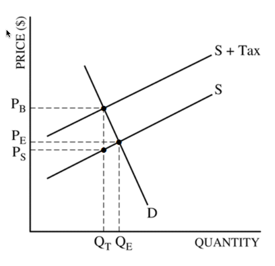

# Question 3 (d)

  -  The tax burden will fall more on buyers and less on sellers
     because the demand curve is more inelastic than the supply curve.

  
  
  
  
  

 

 

2015 Free Response

2017年4月24日 星期一

下午2:31

 

# Question 1 (b)

  -  Graph for a profit-maximizing firm in a perfectly competitive
     constant-cost industry earning positive economic profit
    
      -  Label Market and Firm above each graph

  

  -  AR = Price

  

# Question 1 (c)

  -  For a company in a perfectly competitive market
    
      -  Raising the price --\> Quantity falls to 0 --\> Total Revenue
         falls to 0
    
      -  Because the firm is a price taker / is facing a perfectly
         elastic demand / losses all of its customers / has no market
         power

# Question 1 (d)

  -  Lump sum subsidy has no effect on marginal revenue or marginal
     cost

  -  Only fixed costs will be affected.

  -  Positive profits lead to entry of new firms that will increase the
     industry supply.

# Question 3 (e)

  
  
  ![The price elasticity of demand determines whether the demand curve
  is steep or flat. Note that all percentage changes are calculated
  using the midpoint method 2.... 2.. 2.. 1 FIGURE The Price Elasticity
  of Demand (a) Perfectly Inelastic Demand: Elasticity Equals 0 (b)
  Inelastic Demand: Elasticity Is Less Than 1 Price $5 4 1. An Increase
  n price . 0 Price $5 4 Increase •n price 0 Demand IOO Price $5 4
  Increase In pnce . Quantity 90 IOO Demand Quantity leaves the quantity
  demanded unchanged. .. leads to an 11% decrease in quantity demanded.
  (c) Unit Elastic Demand: Elasticity Equals 1 Price $5 4 Increase In
  price 0 IOO Demand Quantity .. leads to a 22% decrease in quantity
  demanded. 2.. (d) Elastic Demand: Elasticity Is Greater Than 1 50 IOO
  Demand Quantity Price $4 0 (e) Perfectly Elastic Demand: Elasticity
  Equals Infinity . At any price above $4, quantity manded is zero.
  Demand . At exactly $4, consumers will buy any quantity. Quantity ..
  leads to a 67% decrease in quantity demanded. 3. At a price below $4,
  quantity demanded is infinite. ](./media/image54.png)

 

 

2016 Free Response

2017年4月24日 星期一

下午2:31

 

# Question 1 (a)

  -  Elastic Supply: **Percentage** change in quantity supplied exceeds
     the **percentage** change in price

  -  Elastic Supply: Price elasticity of supply is greater than one

# Question 1 (c)

  -  Perfectly elastic supply --\> horizontal supply curve

  

# Question 3 (a)

  -  Monopolistic Competitive Market
    
      -  downward sloping demand curve
    
      -  MR curve below the demand curve
    
      -  LRATC **tangent** to the demand curve

  
  
  

 

 

Practice Exam Multiple Choice

2017年4月24日 星期一

下午2:32

# Question 5

  

# Question 7

  -  MC = W/MPL

  
  
  

# Question 8

  -  Operate if Loss < Fixed Cost

  

  -  As demonstrated in the table, if the price is below average total
     cost but above average variable cost, losses are minimized by
     producing 50 units and incurring a loss of $3.50.

  -  If the firm shut down, it would still have to pay fixed cost of
     five.

  -  Since average variable costs at 50 units is 42 cents and the price
     is 45 cents, it covers the variable costs and contributes three
     cents on each unit toward the paying the fixed costs.

  -  Three cents times 50 units is $1.50 which is the amount the firm
     has **reduced** their **loss** by **producing instead of shutting
     down**.

# Question 9 

  -  In the long-run the profit for a monopolistically competitive frim
     is 0

  

# Question 11

  -  The Marginal Revenue of a firm in a perfectly competitive industry
     is constant

  

# Question 12

  -  **Cost Minimization**
    
      -  Optimal Input Mix is where MPL/Wage = MPK/Rental Rate
    
      -  I**f MPL/Wage \> MPK/Rental Rate**, then hire the **human**
         worker
    
      -  If **MPK/Rental Rate \> MPL/Wage**, then the **machines**
         win\! use more capital

# Question 15

  

# Question 18

  -  Price elasticity and tax share

  

# Question 19

  

# Question 24

  -  P = MC --\> Must be Perfectly Competitive

  ![Product Market Characteristics 1. Numbers of Sellers 2. Availability
  of Substitutes 3. Degree of Elasticity 4. Similarity of Products 5.
  Pricing Policy/ Strategy High value 6. Barriers to Entry/Exit 7.
  Efficiency/\* Rent-Seeking 8. Eco. Profits\* 9. P, MC\* 10. p MR Many
  (they are pricetakers from the market). One product type available
  (fully substitutable) available from atl sellers. Perfectly elastic.
  Homogeneous products from all sellers. No pricing policy or strategy.
  Price at market price, price- takers. No barriers to entry/exit.
  Efficient. Each seller prices at cost. No rents. Only transfer
  earnings. Zero economic profits. Price = Minimum AC. Ideal sociai
  pricing P = MC p = MR Fewer than perfect competition, more than
  oligopoly/ monopoly (some price-makers). Imperfect substitutions.
  Imperfect elasticity. Depends on degree of innovation. Heterogeneous.
  Mostly non-price competition; some independent pricing. Weak barriers
  to entry/exit. Inefficiency, excess capacity since P = AC (but not at
  minimum). p = AC; tendency for LR zero economic profits. P \> MC
  idop\&ly Few sellers who have some control of market share;
  interdependence. Fewer substitutes available = market pricing power.
  Varies. Greater elasticity at high prices. Lower elasticity at lower
  prices. Some markets— homogeneous for specialty products. Other
  markets heterogeneous products. Much interdepen- dence in pricing.
  Some evidence of monopoly pricing • poli Formidable barriers to
  entry/exit. Monopoly pricing power leads to waste/inefficiency. Some
  economies of scale. Tendency for existence of LR economic profits, p
  \> MC One seller for whom there are no close substitutes. No close
  substitutes available. Generally inelastic but still elastic at higher
  prices. FolEows from \#1—3 above. Heterogeneous since there are no
  close substitutes. Monopoly pricing power. High value to ratio: P-MC
  Complete barriers to entry by definition. Dead-weight loss of monop-
  oly (loss to society beyond monopoly profits and reduced consumer
  surplus). Empirical evi- dence of LR economic profits. P \> MC Long
  run tendencies at equilibrium. ](./media/image195.png)

# Question 26

  -  The Effect of an Increase in Demand
    
      -  An **increase** in the **demand** for a product causes the
         **equilibrium price** and **quantity** to **increase** in the
         market.
    
      -  An **increase** in **demand** raises **price** and **profit**,
         which causes **more suppliers** to enter the market
    
      -  Higher industry output from new entrants drives **price** and
         **profit** back **down** to its **original** equilibrium

  ![(a) Existing Firm Response to Price, cost $18 14 Price (b) Short-Run
  and Long-Run Market Response to Increase in Demand Long-run industry
  supply curve, LRS (c) Existing Firm Response to Increase in Demand An
  increase in demand rmses pnce and profit. x Price, cost New Entrants
  Higher industry output from new entrants dhves price and profit back
  down. MC ATC Quantity MKT MKT QxQr •ZMkT D Qz Quantity MC ATC Quantity
  Increase in output from new entrants Panel (b) shows how an industry
  adjusts in the short and long run to an increase in demand; panels (a)
  and (c) show the corresponding adjustments by an existing firm.
  Initially the market is at point XMKT in panel (b), a short-run and
  long-run equilibrium at a price of $14 and industry output of Qx. An
  existing firm makes zero economic profit, operating at point X in
  panel (a) at minimum average total cost. Demand increases as DI shifts
  rightward to D2 in panel (b), raising the market price to $18.
  Existing firms increase their output, and industry output moves along
  the short-run industry supply curve Sl to a short-run equilibrium at
  YMKT. Correspondingly, the existing firm in panel (a) moves from point
  X to point Y. But at a price of $18 existing firms are profitable. As
  shown in panel (b), in the long run new entrants arrive and the
  short-run industry supply curve shifts rightward, from Sl to S2. There
  is a new equilibrium at point ZMKT, at a lower price of $14 and higher
  industry output of Qz. An existing firm responds by moving from Y to Z
  in panel (c), returning to its initial output level and zero economic
  profit. Production by new entrants accounts for the total increase in
  industry output, Qz— Qx. Like XMKT, ZMKTis also a short-run and
  long-run equilibrium: with existing firms earning zero economic
  profit, there is no incentive for any firms to enter or exit the
  industry. The horizontal line passing through XMKT and ZMKT, LRS, is
  the long-run industry supply curve: at the break-even price of $14,
  producers will produce any amount that consumers demand in the long
  run. ](./media/image119.png)

# Question 28

  

# Question 37

  -  For a monopolistically competitive profit-maximizing firm, AR = P

  

# Question 38

  -  The short-run supply curve for a firm in a perfectly competitive
     industry is its marginal cost curve above the minimum point of its
     **average variable cost** curve

  -  In the short run the firm needs only to cover its **variable
     costs** (at Q1 below) – this is largely because covering variable
     cost ensures than an output can be produced in the future - if
     variable costs cannot be covered then no further output can be
     made.

  -  In addition, fixed costs have already been paid for prior to any
     marginal decision to supply, so do not enter into the firm’s short
     run calculations.

  

# Question 44

  

# Question 49

  
  
  

# Question 51

  -  A profit-maximizing **monopolist** selects its output level in the
     **elastic** region of its demand curve.

  

# Question 56

  

 

 

Barron Multiple Choice

Thursday, January 19, 2017

10:43 AM

 

# Question 1

  ![Natural gas sellers and natural gas buyers constitute a market a
  group of producers and consumers who exchange a good or service for
  payment. In this chapter, we'll focus on a particular type of market
  known as a competitive market. A competitive market is a market in
  which there are many buyers and sellers of the same good or service.
  More precisely, the key feature of a competitive market is that no
  individual's actions have a noticeable effect on the price at which
  the good or service is sold. It's important to understand, however,
  that this is not an accurate description of every market.
  ](./media/image304.png)

<table>
<thead>
<tr class="header">
<th>Market Type</th>
<th>Perfect Competition</th>
<th>Monopolistic Competition</th>
<th>Oligopoly</th>
<th>Monopoly</th>
</tr>
</thead>
<tbody>
<tr class="odd">
<td>Number of Firms</td>
<td>Numerous</td>
<td>Many</td>
<td>Few</td>
<td>One</td>
</tr>
<tr class="even">
<td>Nature of Product</td>
<td>
Same, or very similar products

Example: Produce
</td>
<td>
Different products (Might seem the same but are still different)

Example: Fast food restaurants
</td>
<td>
Can be similar or different

Example: Washing machines
</td>
<td>Unique in nature 
Example: Electricity</td>
</tr>
<tr class="odd">
<td>Implications for demand curve</td>
<td>
Horizontal:

This firm is a price taker and the demand curve is perfectly elastic
</td>
<td>
Downward Sloping:

Relatively Elastic
</td>
<td>
Downward Sloping:

Price curve is price-elastic.

Demand curve is directly affected by competition
</td>
<td>Downward sloping: 
Firms in this market have the most control over price</td>
</tr>
<tr class="even">
<td>Average size</td>
<td>Small</td>
<td>Small - Medium</td>
<td>Large</td>
<td>Very Large</td>
</tr>
<tr class="odd">
<td>Possible consumer demand</td>
<td>Demand is potentially unlimited. Demand will rely on what is available through supply</td>
<td>Demand will depend on what differentiation the competition provides</td>
<td>Consumers are in control of what and how to buy</td>
<td>Firms only produce when demand is elastic. If the product is not desirable demand will be low</td>
</tr>
<tr class="even">
<td>Profit making possibility</td>
<td>
In the short run, it's possible to make an economic profit.

In the long run it's impossible for this market type to earn an economic profit
</td>
<td>In the short run it is possible to make a profit however in the long run there will be zero economic profit</td>
<td>There is potential for moderate economic profit, however how much will depend on the competition and competitive advantage over these firms.</td>
<td>Because firms in this industry are usually a one-of, the profit making possibility is large</td>
</tr>
<tr class="odd">
<td>Government intervention</td>
<td>Very little limitations</td>
<td>Very little, regulations depend on industry (eg. Food permits)</td>
<td>Government will monitor to ensure that Cartels and Collusions aren't manipulating the market</td>
<td>The government can/will impose taxes specific to the industry or profits being made. If a monopoly refuses to pay these fee's they can be shut down by the government</td>
</tr>
<tr class="even">
<td>Specific trait to market</td>
<td>Buyers can easily switch between sellers with little to no difference in product and price</td>
<td>Brand loyalty aids the firm when prices are raised to increase revenue</td>
<td>Firms often form a collusion to stabilize markets and reduce risks. This can be highly illegal and is monitored by the government</td>
<td>Firms who operate as a Monopoly are one-of in their area. They have control of their market</td>
</tr>
</tbody>
</table>

# Question 10

  -  The MC curve intersects the ATC curve at the minimum point of the
     ATC curve

  

# Question 11

  -  When a new computerized system for a firm increases the marginal
     productivity of its workers, the marginal revenue product curve
     will shift to the right, causing the wage rate to increase.

  

# Question 14

  -  A consumer surplus is established as the difference between the
     total utility (satisfaction) received and the price paid by the
     consumer.

# Question 19

  -  Profits of an unregulated monopolist: difference between ATC (NOT
     MC) and D times the Quantity

  ![Machine generated alternative text: price, cost, marginal reve n u e
  Monopo ， profit 丆 CM MC D Quantity In this case ， the marginal cost
  curve has a "swoosh" shape and the average total cost curve is
  U-shaped. The monopolist maximizes profit by producing the level Of ou
  ut at which MR= MC ， given point generating quantity Q". It finds its
  monopo price ， PM, from the point on fre demand curve directly above
  point point B here The æerage total cost Of QM is shown 卸 point C.
  Profit is given by the area of the shaded rectangle
  ](./media/image132.png)

# Question 23

  -  If price < ATC, this would result in a loss

  

# Question 24

  -  The government announcement would result in an increase in demand
     for red grape juice. But the change will not be a change along a
     demand curve or a change in quantity demanded.

# Question 29

  -  Source of wage differentials
    
      -  Marginal Productivity and Wage Inequality
        
          -  Compensating differentials
        
          -  Differences in talent
        
          -  Quantity of human capital
    
      -  Market Power
    
      -  Efficiency wage
    
      -  Discrimination

# Question 38

  -  Monopolistic competition is characterized by lower output, higher
     price than competitive industries. Price is greater than MR and
     greater than
  MC

# Question 43

  

# Question 49

  

  -  If we pay these costs including the value of what could be earned
     elsewhere with the same resources, we would be paying a transfer
     earning (the value of alternative use of the resources of
     suppliers).

  -  The transfer earning is the minimum price we must pay, as
     consumers, in order to assure a continuing supply of goods and
     services.

  -  Rents are those payments that suppliers receive that are in excess
     of transfer earning or are in excess of what those suppliers could
     earn elsewhere.

  -  These rents cause a reallocation resources away from more
     productive use of resources.

# Question 54

  -  This refers to the interdependence characteristic of oligopoly.

  -  Price decreases are matched in the hope of maintaining or
     increasing market share.

  -  Price increases are not matched for fear of losing market share or
     having the possibility of gaining market share over the
     price-increasing rival

# Question 55

  -  collusive
    
      -  adj. acting together in secret toward a fraudulent or illegal
         end

  -  kinked demand curve
    
      -  This curve illustrates the interdependence of rivals under
         non-collusive oligopoly in which rivals match price decreases
         but do not match price increase of an oligopolist

  

  -  The major feature of the kinked demand curve is that it consists
     of two segments (one that indicates "following" and the other that
     "does not follow" the price changes of rivals)

# Question 56

  -  Elasticity tends to be greater in the long run since the firm will
     be able to adjust to changes in demand.

  -  The firm will have more options in availability of resources in
     order to substitute less expensive resources (inputs) for more
     expensive resources in the long
  run

# Question 58

  

 

 

Princeton Multiple Choice

Thursday, January 19, 2017

2:15 PM

 

# Question 3

  

# Question 4

  -  The law of diminishing marginal utility states that as you consume
     more and more of the same good during a given period, your
     enjoyment gained from each additional unit of the good decreases.
     This is why more unites of a good will be purchased if the price
     decreases and vice versa - the law of demand

  

# Question 6

  -  If economic profits = 0, then
    
      -  owners receive a payment equal to their opportunity costs
    
      -  no incentive for firms to either enter or leave this industry
    
      -  owners are earning the most that could be made elsewhere

  -  Zero economic profits are also called normal profits

  -  They are what all firms earn in the long run in a competitive
     industry

  -  They do not indicate any resource allocation errors.

# Question 8

  -  Because there are far more substitutes available for Sprite than
     there are for all types of soda pop, the demand for Sprite will be
     more elastic than the demand for all soda pop.

# Question 12

  -  In the absence of intervention, imperfect competition,
     externalities, public goods, and imperfect information all result
     in market
  failure.

  

# Question 14

  -  Firms with every type of market structure maximize profits by
     producing where MC=MR, if at all.

  -  Producing more will increase costs more than revenues

  -  Producing less will fail to take advantage of opportunities to
     sell additional unites when the additional revenue exceeds the
     additional
  cost

  

# Question 16

  -  The Sherman Act (1890)
    
      -  declared attempts to monopolize commerce or restrain trade
         among the states illegal

  -  The Clayton Act (1914)
    
      -  strengthened the Sherman Act by specifying that monopolistic
         behavior such as price discrimination, tying contracts, and
         unlimited mergers are illegal

  -  The Robinson-Patman Act (1936)
    
      -  prohibits price discrimination except when it is based on
         differences in cost, difference in marketability of product,
         or a good faith effort to meet competition

  -  The Celler-Kefauver Act (1950)
    
      -  authorized the government to ban vertical mergers (mergers of
         firms at various steps in the production process from raw
         materials to finished products) and conglomerate mergers
         (combinations of firms from unrelated industries) in addition
         to horizontal mergers (mergers of direct competitors)

# Question 20

  -  By adding supply curves horizontally, the quantities each firm
     will provide at each price are combined into a total quantity
     supplied y the market at each price.

  

# Question 21

  

  -  A competitive firm facing the demand and cost curve in the figure
     above should shut down immediately.

  -  The firm is not covering its average variable costs. Not only is
     it losing money, it is not earning enough to help pay for any of
     its fixed costs

# Question 27

  -  tuba n. the lowest brass wind instrument

  -  Because the demand for tuba makers is derived from the demand for
     tubas, when tuba demand goes down, tuba maker demand goes down and
     thus wages go down.

# Question 32

  

  -  The curvature of PPFs results from increasing opportunity costs
     arising from the use of resources that are less and less
     specialized for the production of a particular good.

  -  If the resources used to make the two goods are not specialized,
     opportunity costs are constant and the PPF is a straight line

# Question 37

  ![Namc Pricc clasticity of demand Perfectly inelastic demand Inelastic
  demand Unit-elastic demand Elastic demand Perfectly elastic demand
  Possiblc values Significance % change in quantity demanded (dropping
  thc minus sign) % change in price Betvveen 0 and 1 Exactly 1 Greater
  than 1 , less than Price has no effect on quantity demanded (vertical
  demand curve). A rise in price increases total revenue. Changes in
  price have no effect on total revenue. A rise in price redires total
  revenue. A rise in price causes quantity demanded to fall too. A fall
  in price leads to an infinite quantity demanded (horizontal demand
  curve). Cross-price clasticity of demand Complements Substitutes %
  change in quantib' of one good dcmandcd % change in price of another
  good Negative Positive Quantity demanded of one good falls when the
  price of another rises. Quantity demanded of one good rises when the
  price of another rises. Income elasticity of demand Inferior good
  Normal good, income-inelastic Normal good, income-elastic % change in
  quantib' dcmandcd % change in income Negative Positive, less than 1
  Greater than 1 Quantity demanded falls when income rises. Quantity
  demanded rises when income rises, but not as rapidly as income.
  Quantity demanded rises when income rises, and more rapidly than
  income. % change in quantib' supplied Pricc clasticity of supply
  Perfectly inelastic supply Perfectly elastic supply % change in price
  Greater than 0, less than Price has no effect on quantity supplied
  (vertical supply curve). Ordinary upward-sloping supply curve. Any
  fall in price causes quantity supplied to fall to 0. Any rise in price
  elicits an infinite quantity supplied (horizontal supply curve).
  ](./media/image76.png)

# Question 38

  -  Constant returns to scale
    
      -  output increases in proportion to the amounts of each of the
         inputs

  

# Question 39

  -  Dominant Strategies Equilibrium vs. Nash Equilibrium
    
      -  Dominant strategies are stable and self-enforcing
    
      -  However, in many games one or more players do not have a
         dominant strategy
    
      -  Nash equilibrium is a more general concept
    
      -  A Nash equilibrium is a set of strategies such that each
         player is doing the best it can, given the actions of its
         opponents.
    
      -  A dominant strategy equilibrium is a special case of a Nash
         equilibrium

# Question 42

  -  The demand for labor is determined by the marginal revenue product
     of labor, which is the product of the marginal product of labor
     and the marginal revenue from the output produced by the labor.
     Thus, if the mariginal product of labor decreases, so does the
     demand for labor.

  

# Question 45

  -  Because a monopoly holds 100 percent of the market share, the
     concentration ratio is 100.

# Question 50

  -  monopsony: (economics) a market in which goods or services are
     offered by several sellers but there is only one buyer

# Question 51

  -  A free rider problem arises when people try to benefit from a
     public good without paying for it.

  -  The government can avoid this by taxing everyone and providing the
     public good itself.

# Question 52

  

  -  Because monopolies lower the price in order to sell one more unit,
     the marginal revenue is not the price as indicated on the demand
     curve, but that price minus the lost earning on all of the
     previous units that are now selling at a lower price
