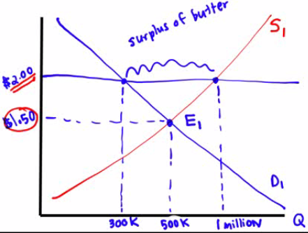

# Why Price Controls are Inefficient

  -  Price controls
    
      -  **legal restrictions** on how high or low a **market price**
         may go

  -  Price ceiling
    
      -  a **maximum** price **sellers** are allowed to **charge** for
         a good or service

  -  Price floor
    
      -  a **minimum** price **buyers** are required to **pay** for a
         good or service

  -  Whether the government tries to legislate price (up or down),
     there are predictable and unpleasant **side effects**.

 

# Effective Price Ceiling

  -  Effective price **ceilings** must be **below** equilibrium price

  -  Rent control
    
      -  government attempt in regulating price on apartments
    
      -  Predictable outcome of housing shortage and emergence of black
         markets

  -  Graph

![In panel (a), the government imposes a price ceiling of $4. Because
the price ceiling is above the equilibrium price of $3, the price
ceiling has no effect, and the market can reach the equilibrium of
supply and demand. In this equilibrium, quantity supplied and quantity
demanded both equal 100 cones. In panel (b), the government imposes a
price ceiling of $2. Because the price ceiling is below the equilibrium
price of $3, the market price equals $2. At this price, 125 cones are
demanded and only 75 are supplied, so there is a shortage of FIGURE 1 A
Market with a Price Ceiling 50 cones. Price of Ice-Cream Cone
Equilibrium pnce (a) A Price Ceiling That Is Not Binding Price of
Ice-Cream Cone Equilibrium price 53 (b) A Price Ceiling That Is Binding
Supply IOO Equilibrium quantity Supply Price ceiling Demand Quantity of
Ice-Cream Cones Shonage 75 Quantity supplied Quantity demanded Price
ceiling Demand Quantity of Ice-Cream Cones ](./media/image49.png)

   

# How a Price Ceiling Causes Inefficiency

  -  Inefficiently allocation to consumers
    
      -  Those who want an apartment the most **do not necessarily get
         it**.
    
      -  At $1000, someone who was willing to pay $2000 may not get the
         apartment when the price is low.

  -  Wasted resources
    
      -  Price ceilings on gas led to shortages and forced millions of
         American to spend hours **waiting** in lines at gas stations.
         **OPPORTUNITY COST\!**

  -  Inefficiently low quality
    
      -  Sellers have little incentive to improve the quality of their
         product.
    
      -  Landlords have a perverse incentive to only meet the bare,
         minimum requirements

 

# Effective Price Floor

  -  Effective price **floors** must be **above** the equilibrium
     price.

  -  Minimum wage
    
      -  government attempt in regulating the labor market in order to
         give workers a **"fair" wage**
    
      -  Predictable outcome of having surplus of labor (or
         unemployment)

  -  What happens when a price floor on butter is **set at $2.00** a
     pound when the **equilibrium is $1.50**
    
      -  Predictable, there is a **surplus** of butter
    
      -  Governments will stash away surplus, give away to schools,
         export at a loss, simply destroy the excess or pay farmers NOT
         to product at
  all.

  

  -  Graph

![FIGURE 5 How the Minimum Wage Affects Panel (a) shows a labor market
in which the wage adjusts to balance labor supply and labor demand.
Panel (b) shows the impact of a binding minimum wage. Because the
minimum wage is a price floor, it causes a surplus: The quantity of
labor supplied exceeds the quantity demanded. The result is
unemployment. the Labor Market Wage Equilibrium wage (a) A Free Labor
Market Equilibrium employment (b) A Labor Market with a Binding Minimum
Wage Labor supply Labor demand Quantity of Labor Wage Minimum wage Labor
surplus (unemployment) Quantity demanded Quantity supplied Labor supply
Labor demand Quantity of Labor ](./media/image51.png)

 

# How a Price Floor Causes Inefficiency

  -  Inefficiently Low Quantity
    
      -  Same impact as a price ceiling in having **less quantity** of
         goods bought and sold

  -  Wasted Resources
    
      -  Just like families unsuccessfully looking for apartments under
         a price ceiling, workers **won't find jobs** in a price floor.

  -  Inefficiently high quality
    
      -  Unable to compete for customers for lower prices, airlines
         provided lavish excesses consumers **didn't want**

 

# Ineffective price controls

  