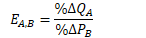
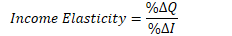

# Cross-price elasticity of demand (EA,B)

  -  Meaning
    
      -  Measure used to show the change in the **price** of **one
         good** affecs the **demand** for **another good**.

  -  Formula
    
      -  Percentage change in **Quantity Demanded** of **Good A**
         divided by **Percentage change** in **Price** of **Good
         B**
    
      -  

  

#  

# Substitutes 

  -  Definition
    
      -  If the coefficient is **positive**, then the two items are
         **substitutes.**
    
      -  \*Do **NOT** find the absolute value for cross-price
         elasticity\!

  -  EA,B and substitutes
    
      -  The **higher** the number, the **more perfect** the two items
         are as **substitutes.**
    
      -  The **lower** the number, the **less perfect** the two items
         are as **substitutes.**

  -  Price change and quantity demanded
    
      -  If the **price** of Good A **increases** , then the **quantity
         demanded** of Good B will **increase**.
    
      -  If the **price** of Good A **decreases**, then the **quantity
         demanded** of Good B will **decrease**.

  -  Example

  
  
   

# Complements

  -  Definition
    
      -  If the coefficient is **negative**, then the two items are
         **complements.**
    
      -  \*Do **NOT** find the absolute value for cross-price
         elasticity\!

  -  EA,B and substitutes
    
      -  The **more negative** the number, the **more perfect** the two
         items are as **complements.**
    
      -  The **less negative** the number, the **less perfect** the two
         items are as **complements.**

  -  Price change and quantity demanded
    
      -  If the **price** of Good A **increases** , then the **quantity
         demanded** of Good B will **decrease**.
    
      -  If the **price** of Good A **decreases**, then the **quantity
         demanded** of Good B will **increase**.

  -  Example

  
  
   

# Income Elasticity of Demand

  -  Meaning
    
      -  Measures how changes in **income** affect the **demand** for a
         good

  -  Normal good vs. Inferior good
    
      -  If the income elasticity of demand is **positive**, then it's
         a **normal** good.
    
      -  If the income elasticity of demand is **negative**, then it's
         a **inferior** good.

  -  Income-elastic vs. income-inelastic
    
      -  If the income elasticity of demand is **greater than 1**, then
         it is **income-elastic**
    
      -  If the income elasticity of demand is **less than 1**, then it
         is **income-inelastic**

  -  Formula
    
      -  Percentage change in **Quantity Demanded** Divided by
         Percentage change in
         **Income**
    
      -  

  -  Example 1
    
      -  Income elastic good:

  

  -  Example 2
    
      -  ceteris paribus: all other things being equal

  

  -  Example 3

  

 

# Price Elasticity of Supply

  -  Meaning
    
      -  Measure of responsiveness of the quantity of a good
         **supplied** to the **price** of that good

  -  Formula
    
      -  **Percentage** change in **quantity supplied** divided by the
         **percentage** change in
         **price**
    
      -  

  -  Availability of inputs affects elasticity
    
      -  Supply of pizza tends to be very elastic

  ![Panel (b) shows the supply curve for pizza. We suppose that it costs
  $12 to produce a pizza, including all opportunity costs. At any price
  below $12, it would be unprofitable to produce pizza and all the pizza
  parlors would go out of business. At a price of $12 or more, there are
  many producers who could operate pizza parlors. The ingredients—
  flour, tomatoes, cheese—are plentiful. And if necessary, more tomatoes
  could be grown, more milk could be produced to make mozzarella cheese,
  and so on. So by allowing profits, any price above $12 would elicit
  the supply of an extremely large quantity of pizzas. The implied
  supply curve is therefore a horizontal line at $12. Since even a tiny
  in- crease in the price would lead to an enormous increase in the
  quantity ](./media/image73.png)

  -  Supply of cell phone frequencies is zero. The input (radio
     spectrum) cannot be changed

  ![As in the case of demand, the extreme values of the price elasticity
  of supply have a simple graphical representation. Panel (a) of Figure
  48.1 shows the supply ofcell phone frequencies, the portion of the
  radio spectrum that is suitable for sending and receiv- ing cell phone
  signals. Governments own the right to sell the use of this part of the
  radio spectrum to cell phone operators inside their borders. But
  governments can't in- crease or decrease the number of cell phone
  frequencies they have to offer—for techni- cal reasons, the quantity
  of frequencies suitable for cell phone operation is fixed. So the
  supply curve for cell phone frequencies is a vertical line, which we
  have assumed is set at the quantity of 100 frequencies. As you move up
  and down that curve, the change in the quantity supplied by the
  government is zero, whatever the change in price. So panel (a)
  illustrates a case of perfectly inelastic supply, meaning that the
  price elasticity of supply is zero. ](./media/image74.png)

  -  Graph

![Price $5 4 1. An Increase In price Price $5 4 Increase In pnce FIGURE
5 The price elasticity of supply determines whether the supply curve is
steep or flat. Note that all percentage changes are calculated using the
midpoint method. The Price Elasticity of Supply 2... IOO 125 (a)
Perfectly Inelastic Supply: Elasticity Equals O Supply Quantity . leaves
the quantity supplied unchanged. Price $5 4 Increase In price (b)
Inelastic Supply: Elasticity Is Less Than 1 Supply IOO 110 Quantity
2.... leads to a 10% increase in quantity supplied. Price 55 4 Increase
In price (c) Unit Elastic Supply: Elasticity Equals 1 Supply Quantity ..
leads to a 22% increase in quantity supplied. (d) Elastic Supply:
Elasticity Is Greater Than 1 Price 200 Supply Quantity (e) Perfectly
Elastic Supply: Elasticity Equals Infinity 1. At any price above 54,
quantiW supplied is infinite. Supply . At exactly $4, producers will
pply any quantity Quantity 2.... leads to a 67% increase in quantity
supplied. 3. Ata price below 54, quantity supplied is zero.
](./media/image75.png)

#  

# Summary for Elasticity

  ![Namc Pricc clasticity of demand Perfectly inelastic demand Inelastic
  demand Unit-elastic demand Elastic demand Perfectly elastic demand
  Possiblc values Significance % change in quantity demanded (dropping
  thc minus sign) % change in price Betvveen 0 and 1 Exactly 1 Greater
  than 1 , less than Price has no effect on quantity demanded (vertical
  demand curve). A rise in price increases total revenue. Changes in
  price have no effect on total revenue. A rise in price redires total
  revenue. A rise in price causes quantity demanded to fall too. A fall
  in price leads to an infinite quantity demanded (horizontal demand
  curve). Cross-price clasticity of demand Complements Substitutes %
  change in quantib' of one good dcmandcd % change in price of another
  good Negative Positive Quantity demanded of one good falls when the
  price of another rises. Quantity demanded of one good rises when the
  price of another rises. Income elasticity of demand Inferior good
  Normal good, income-inelastic Normal good, income-elastic % change in
  quantib' dcmandcd % change in income Negative Positive, less than 1
  Greater than 1 Quantity demanded falls when income rises. Quantity
  demanded rises when income rises, but not as rapidly as income.
  Quantity demanded rises when income rises, and more rapidly than
  income. % change in quantib' supplied Pricc clasticity of supply
  Perfectly inelastic supply Perfectly elastic supply % change in price
  Greater than 0, less than Price has no effect on quantity supplied
  (vertical supply curve). Ordinary upward-sloping supply curve. Any
  fall in price causes quantity supplied to fall to 0. Any rise in price
  elicits an infinite quantity supplied (horizontal supply curve).
  ](./media/image76.png)