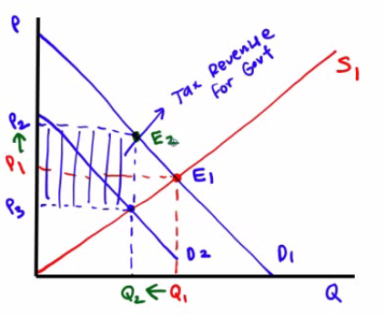
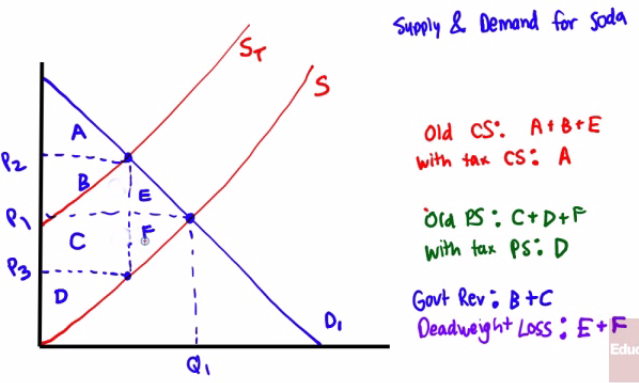

# Consumer Surplus

  -  Meaning
    
      -  the difference between the buyer's **willingness to pay**
         versus what he **actually pays**

  -  Graph
    
      -  On a supply and demand graph, the area of consumers surplus
         (CS) is **below** the **demand curve** but **above** the
         **equilibrium price**

![Machine generated alternative text: figure 49.3 Consumer Surplus The
demand curve for computers is smooth be- cause there are many potential
buyers. At a price of $1 ,500, 1 million computers are de- manded. The
consumer surplus at this price is equal to the shaded area: the area
below the demand curve but above the price. This is the total net gain
to consumers generated from buying and consuming computers when the
price is $1 ,500. Price of computer Consumer surplus $1,500 Price 1
million Quantity of computers ](./media/image77.png)

  -  Example 1

  

  -  Example 2

  

#  

# Producer Surplus

  -  Meaning
    
      -  the difference between the price a sellers **pays** for and
         what he was actually **willing to sell for**

  -  Graph
    
      -  On a supply and demand graph, the producer surplus is
         **above** the **supply curve** but **below** the **equilibrium
         price**.

  -  Example 1

  
  
  

  -  Example 2

  

 

# Total Surplus

  -  Meaning
    
      -  the **sum** of consumer and producer **surplus**

  -  Graph
    
      -  the area **between** the supply and demand **curves** up to
         the **equilibrium quantity**

  

 

# Effects of Taxes on Surplus

  -  How does a tax affect hotel owners?
    
      -  An excise tax on hotel owners will shift the **supply** curve
         to the **left**
    
      -  The equilibrium **price** will be **higher** and the
         equilibrium **quantity** will be **lower**

  

  -  How does a tax effect hotel guests
    
      -  An excise tax on hotel guests will shift the **demand** curve
         to the **left**
    
      -  The equilibrium **price** will be **higher** and the
         equilibrium **quantity** will be **lower**
    
      -  The tax incidence in both cases are
  **identical**

  

  -  How the imposition of a tax will decrease consumer and producer
     surplus

  

![A Tax Reduces Consumer and Producer Surplus Before the tax, the
equilibrium price and quantity are Pgand respectively. After an excise
tax of T per unit is imposed, the price to consumers rises to Pcand
consumer surplus falls by the sum of the dark blue rectangle, labeled A,
and the light blue triangle, labeled B. The tax also causes the price to
producers to fall to Pp;producer surplus falls by the sum of the dark
red rectangle, labeled C, and the light red triangle, lab4ed E The
government receives revenue from the tax, QTX T, which is given by the
sum of the areas A and C Areas B and Frepresent the losses to consumer
and pro- ducer surplus that are not collected by the govern- mentas
revenue; they are the deadweight loss to S)Ciety of the tax. Excise tax
= T Price Fall in consumer surplus due to tax Fall in producer surplus
due to tax Quantity ](./media/image89.png)

  -  Deadweight loss

![figure 50.12 The Deadweight Loss of a Tax A tax leads to a deadweight
loss because it cre- ates inefficienw: some mutually beneficial trans-
actions never take place because of the tax, namely the transactions OF
— QT. The yellow area here represents the value of the deadweight
loss: it is the total surplus that would have been gained from the 0€—
QTtransactions. If the tax had not discouraged transactions—had the
number of transactions remained at Of—no deadweight loss muld have been
incurred. Price Excise tax = T Deadweight loss Quantity
](./media/image90.png)

 

# International Trade

  -  Autarky
    
      -  the quality of being **self-sufficient** with **no imports or
         exports**, a **closed** economy

  -  Free trade and Tariffs
    
      -  Free trade **increases total surplus**
    
      -  **Tariffs** serve to **reduce** allocative **efficiency**

 

# Importing Countries

  -  The **World Price** (Pw) will be **below** the autarky
     price and **total surplus** will **increase**

  -  Domestic **consumers gain**, domestic **producers lose**, but the
     **net gain** is **positive**

  -  **Buyers** are **better off** (consumer surplus rises from A to A
     + B + D)

  -  **Sellers** are **worse off** (producer surplus falls from B + C
     to C)

  -  **Total surplus rises** by an amount equal to area D

  -  Trade **raises the economic well-being** of the country as a
     whole.

 

# Exporting Countries

  -  The **World Price** (Pw) will be **above** the autarky
     price and **total surplus** will **increase**

  -  Domestic **consumers lose**, domestic **producers gain**, but the
     **net gain** is **positive**

  -  **Sellers** are **better off** (producer surplus rises from C to B
     + C + D)

  -  **Buyers** are **worse off** (consumer surplus falls from A + B to
     A)

  -  **Total surplus rises** by an amount equal to area D

  -  Trade **raises the economic well-being** of the country as a
     whole.

 

# The Effects of a Tariff

  -  Tariff
    
      -  a government **tax** on **imports or exports**

  -  Example 1

  

  -  Example 2

![FIGURE 4 The Effects of a Tariff Consumer Surplus Producer Surplus
Government Revenue Total Surplus A tariff reduces the quantity of
imports and moves a market closer to the equilibrium that would exist
without trade. Total surplus falls by an amount equal to area D + F.
These two triangles represent the deadweight loss from the tariff.
Before Tariff None After Tariff Change The area D + F shows the fall in
total surplus and represents the deadweight loss of the tariff. Price of
Textiles Price with tariff Price without tariff Domestic supply
Equilibrium without trade c Imports with tariff Imports without tariff
Tariff Domestic demand World price Quantity of Textiles
](./media/image94.png)