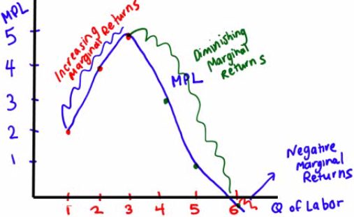
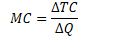
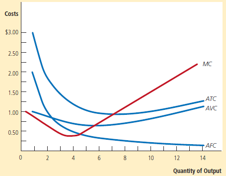

# Long Run vs. Short Run

  -  Production function
    
      -  The **quantity** of **output** a firm produces depends on the
         **quantity** of **inputs**
    
      -  This relationship is known as the firm's **production
         function**

  -  Inputs and outputs
    
      -  **Fixed input** is an input whose quantity is **fixed for a
         period of time** and **cannot be varied** (ie. Land)
    
      -  **Variable** input is an input whose quantity **can vary over
         a short period** of time (ie. Labor)

  -  Long run vs. short run
    
      -  In the **long run**, there are **no fixed inputs**. All costs
         are **variable**
    
      -  In the **short run**, **at least one** input will be **fixed**

 

# Marginal Product of Labor (MPL)

  -  Definition
    
      -  change in **quantity** of output produced by one
         **additional** unit of
         **labor**

  -  Formula
    
      -  

  -  Graph
    
      -  Downward sloping
    
      -  Quantity of Labor on the x-axis
    
      -  MPL of labor on the y-axis

  -  Example 1

 

  -  The table shows the **production function**, the relationship
     between the quantity of the **variable input** (labor, measured in
     number of workers) and the quantity of **output** (wheat, measured
     in bushels) for a given quantity of the fixed input.

  -  It also shows the **marginal product of labor** on George and
     Martha's farm.

  -  The total product curve shows the production function graphically.

  -  It **slopes** upward because **more wheat is produced** as **more
     workers are employed**.

  -  It also becomes **flatter** because the **marginal product of
     labor declines** as more and more workers are employed.

  

  -  The marginal product of labor curve plots each worker's **marginal
     product**, the **increase** in the **quantity** of output
     generated by each **additional worker**.

  -  The **change in the quantity of output** is measured on the
     **vertical** axis and the **number of workers employed** on the
     **horizontal** axis.

  -  The first worker employed generates an increase in output of 19
     bushels, the second worker generates an increase of 17 bushels,
     and so on.

  -  The curve **slopes downward** due to the **diminishing** returns
     to labor

 

# Different Types of Marginal Returns

  -  **Increasing** marginal returns
    
      -  The MPL **increases** as you hire more workers

  -  **Diminishing** marginal returns
    
      -  The MPL **decreases** but the total **output increases**

  -  **Negative** marginal returns
    
      -  The MPL **decreases as well as** the total **output**

  -  Graph

  

#  

# Was Thomas Malthus Correct?

  -  In his book, *An Essay On the Principle of Population*, Thomas
     Malthus predicted that, based on the **principle of diminishing
     marginal returns**, we would have to brace ourselves for a
     **widespread starvation** of the masses.

  -  Thomas Carlyle coined the phrase "dismal science" - the term has
     caught on to describe **economics** as a **gloomy subject**

  -  Was Malthus right?

  -  No, he did not account for the increase in **TECHNOLOGY**\!

 

# Fixed, Variable and Total Cost

  -  Fixed cost
    
      -  cost that does **not depend** on the **quantity of output
         produced** (ie. franchising fee)

  -  Variable cost
    
      -  cost that **depends** on the **quantity of output produced**
         (ie. bread, cheese, part-time workers)

  -  Total cost
    
      -  **Sum** of fixed and variable
         cost
    
      -  

  -  Graph

  

  -  The total cost curve **slopes upward** because the **number of
     workers employed**, and hence total cost, increases as the
     quantity of output increases.

  -  The curve gets **steeper** as output increases due to
     **diminishing** returns to **labor**.

 

# Average Cost

  -  Average total cost
    
      -  total cost **per unit of
         output**
    
      -  

  -  Average fixed cost
    
      -  fixed cost **per unit of
         output**
    
      -  

  -  Average variable cost
    
      -  variable cost **per unit of
         output**
    
      -  

 

# Marginal Cost

  -  Meaning
    
      -  **change** in **total cost** generated by one **additional**
         unit of **output**
    
      -  **change** in **total cost** divided by **change** in quantity
         of
         **output**

  -  Formula
    
      -  

 

# Relationship Between ATC and MC Curves

  -  At the **minimum-cost outpu**t, **average total cost** is equal to
     **marginal cost** - ALWAYS\!

  -  At **output less** than the **minimum**-cost output, **MC** is
     **less** than **ATC** and the ATC is **rising**

  -  At **output greater** than the **minimum**-cost output, **MC** is
     **greater** than **ATC** and ATC is **rising**

  -  Ideal Graph

  

  -  MC: marginal cost

  -  ATC: average total cost

  -  AVC: average variable cost

  -  AFC: average fixed cost

<!-- end list -->

  -  Typical Graph

  

  -  Many firms experience **increasing** marginal product **before
     diminishing** marginal product.

  -  As a result, they have cost curves shaped like those in this
     figure.

 

# True or False Questions

  -  ATC is always greater than AVC by a constant amount
    
      -  Answer: False
    
      -  Reason: The distance between ATC and AVC is AFC

  -  If a firm shuts down in the short run, its profits will equal zero
    
      -  Answer: False
    
      -  Reason: Fixed cost is a cost that you will incur even if you
         shut down
    
      -  Equations:
        
          -  Total cost = Fixed cost + Variable cost
        
          -  Profit = Total revenue - Total cost
    
      -  Price vs. average variable cost
        
          -  If P \> AVC, stay in business
        
          -  If P < AVC, then shutdown