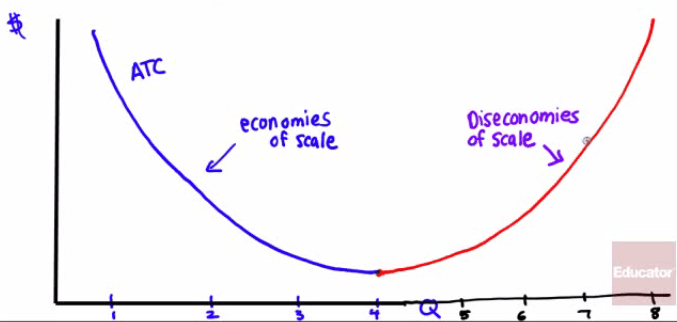

# Short-Run vs. Long-Run Costs

  -  Business must make decisions on whether to spend money **now**
     (**fixed**) or spend money **later** (**variable**)

  -  If a firm plans on producing a **high** amount of output, it might
     make sense to have a **high fixed cost**

  -  Conversely, if a firm plans on producing a **small** amount of
     output, it might make sense to have a **low fixed cost**

  -  Choosing the optimal level of fixed cost requires a lot of
     planning

  ![Cost of case At low output levels, low fixed cost yields lower
  average total cost. 250 200 150 100 50 78.00 75.00 81.60 90.00 99.43
  At high output levels, high fixed cost yields lower average total
  cost. Low fixed cost O 1 2 3 4 - S108) 5 6 High fixed cost 7 8 9 10
  Quantity of salsa (cases) Low fixed cost (FC — High fixed cost (FC =
  216) Quantity of salsa (cases) 1 2 4 5 6 7 8 9 10 High variable cost
  12 48 108 192 300 432 588 768 972 1,200 Total cost 120 156 216 300
  408 540 696 876 1,080 1,308 Average total cost of case ATCI 120.00
  109.50 120.00 130.80 Low variable cost 6 24 54 96 150 216 294 384
  486 600 Total cost 222 240 270 312 366 432 510 600 702 816 Average
  total cost of case 222.00 120.00 90.00 78.00 73.20 72.00 72.86 75.00
  78.00 81.60 ](./media/image109.png)

 

# Long-Run Average Total Cost (LRATC)

  -  Meaning
    
      -  the relationship between **output** and **average total cost**
         when fixed cost has been chosen to **minimize** average total
         cost for **each level of output**
    
      -  If there are **many possible choices** of fixed cost, the
         long-run average total cost curve will have the familiar,
         **smooth** U shape.

  -  Graph

  ![Cost of case Economies of scale Diseconomies ofscale سس سكسر ATC6
  ATCg \]RATC 3 Quantity of salsa (cases) ](./media/image110.png)

  -  **Short-run** and **long-run** average total cost curves
     **differ** because a firm can **choose** its fixed cost in the
     **long run**.

  -  If Selena has chosen the level of fixed cost that minimizes
     short-run average total cost at an output of **6** cases, and
     actually produces 6 cases, then she will be at point **C** on
     LRATC and ATC6.

  -  But if she produces only **3** cases, then she will move to point
     **B**.

  -  If she expects to produce only 3 cases for **a long time**, in the
     long run she will reduce her fixed cost and move to point **A** on
     ATC3.

  -  Likewise, if she produces **9** cases (putting her at point Y) and
     expects to continue this **for a long time**, she will increase
     her fixed cost in the long run and move to point **X**

<!-- end list -->

  -  Example

  

#  

# Returns to Scale

  -  **Economies** of scale
    
      -  when long-run average total cost **declines** as input
         **increases**
    
      -  **ATC decreases** as **Q increases**

  -  **Diseconomies** of scale
    
      -  when long-run average total cost **increases** as output
         **increases**
    
      -  **ATC increases** as **Q increases**

  -  Graph

  

#  

# Sources of Economies of Scale

  -  Increased specialization that larger output levels allow
    
      -  a **larger scale** of operation means that workers are very
         **specialized** individuals

  -  Large initial set-up cost
    
      -  in auto manufacturing, electricity generating or petroleum
         refining, there exist **high fixed costs** to enter the
         industry

  -  Network externalities
    
      -  the effect that **one user** of a good or service has on the
         **value** of that product to **other people**
    
      -  When network effect it present, the value of a product or
         service if dependent on **the number of others using it** (ie.
         Telephone, Facebook, Twitter, eBay)

 

# Sunk Cost

  -  Definition
    
      -  cost that should be **ignored** when making a decision
    
      -  A cost that has **already happened** that **cannot be
         recovered**

  -  As the old saying goes, "There's no use crying over spilled milk"

  -  Example
    
      -  You go to an All You Can Eat Brazilian BBQ Restaurant, pay $40
         after eating a salad and you are full.
    
      -  What's the rational thing to do in order to get your money's
         worth?
    
      -  **WALK OUT\! SUNK COST\!**
    
      -  Marginal Benefit \> Marginal Cost: Keep doing
    
      -  Marginal Cost \> Marginal Benefit: Leave\!

 

# Summary of Costs

![Mathematical term Short run Short run and long run Long run
Measurement fixed cost Average fixed cost Variable cost Average variable
cost Total cost Average total cost (average cost) Marginal cost Long-run
average total cost Definition Cost that does not depend on the quantity
of output produced Fixed cost per unit of output Cost that depends on
the quantity of output produced Variable cost per unit of output The sum
of fixed cost (short run) and variable cost Total cost per unit of
output The change in total cost generated by producing one more unit of
output Average total cost when fixed cost has been chosen to minimize
average total cost for each level of out)L1t FC AFC vc AVC FC/Q VC/Q n
(short run) ATC= TC/Q MC=ATC/AQ RATC](./media/image113.png)