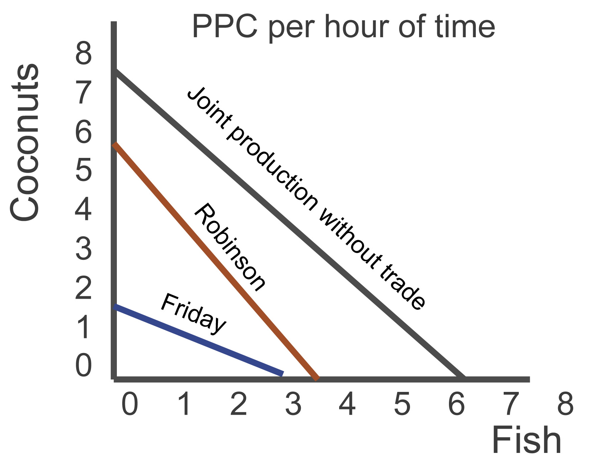

# Question 7

  
  
  

  -  A firm will **always produce** where **MR = MC**, therefore the
     firm will produce Q1 units of output.

  -  The firm will produce the **efficient** level of output since it
     is producing where **P = MC = minimum ATC**.

  -  The firm is achieving both allocative and productive efficiency.

  -  The firm will earn a **normal profit** (**0 economic profit**)
     since **P = ATC**.

  -  This also tells us that total revenue equals total costs when the
     firm produces Q1 units of output.

  -  The firm will not increase production in the long run since it is
     already in equilibrium.

# Question 10

  -  For a monopolist at the profit-maximizing output level, the demand
     curve will not intersect the supply curve

  

# Question 17

  

  -  

  -  **Trade** is one way for a country to **expand** its **PPC** curve
     since specialization through trade allows for greater efficiency.

  -  Other than trade, a country would have to discover a **new supply
     of resources** or **technological advancement** to shift its
     current PPC curve.

# Question 21

  

  -  As the **price** of a good **increases**, consumers are going to
     turn to **substitutes** because the higher price **reduces** the
     consumers’ **purchasing power**.

# Question 25

  -  A firm should always **produce** where **MR = MC**.

  -  In this situation, the firm is currently producing where MR < MC
     since $12 < $16.

  -  The firm should decrease output until its MC = $12 and it should
     keep producing because at that price, **P \> AVC** since $12 \>
     $8.

  

  -  Breakeven vs. Shut down

  
  
  

  -  Long-run (Profitability)

  

  -  Short-run (Production)

  

# Question 29

  -  Economic rent is a surplus payment.

  -  If supply is perfectly elastic, there will never be any economic
     rent.

 

  
  
  ![The supply of land is a vertical line. The quantity of land in a
  particular location is fixed. Suppose, for example, that the price of
  a one-acre parcel of land is zero. At a price of zero, there is still
  one acre of land; quantity is unaffected by price. If the price were
  to rise, there would still be only one acre in the parcel. That means
  that the price of the parcel exceeds the minimum price—zero—at which
  the land would be available. The amount by which any price exceeds the
  minimum price necessary to make a resource available is called
  economic rent. The concept of economic rent can be applied to any
  factor of production that is in fixed supply above a certain price. In
  this sense, much of the salary received by Judge Judy constitutes
  economic rent. At a low enough salary, she might choose to leave the
  television industry. How low would depend on what she could earn in a
  best alternative occupation. If she earns $45 million per year now but
  could earn $200,000 in a best alternative occupation, then $44.8
  million of her salary is economic rent. Most of her current earnings
  are in the form of economic rent, because her salary substantially
  exceeds the minimum price necessary to keep her supplying her
  resources to current purposes. ](./media/image206.png)

  -  Economic Rent and Opportunity Cost

  

# Question 43

  

# Question 44

  

  -  The **profit-maximizing** rule states that the **MRP/P** of each
     resource unit must equal **1**.

  -  In order for that to occur, the price of labor must be $60 and the
     price of capital must be $100 so that each ratio is equal to 1.

# Question 60

  

  -  Remember, one of the main reasons why we have **public goods** is
     due to the **free-rider problem**.

  -  When you can’t exclude everyone from using a good or paying for
     its benefits, less than the efficient level will be provided if a
     **private firm** is producing that good simply because they need
     to **cover** their **costs**.

  -  A privately produced good may provide additional benefits to
     others who aren’t paying for the good, yet since the firm doesn’t
     reap those benefits, they choose to **produce less than** the
     **efficient** amount.