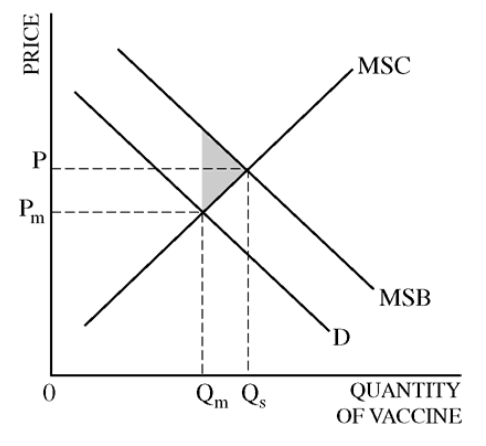

# Question 1 (f)

  -  Just cover opportunity costs --\> Normal profit --\> P = ATC

  ![Definitions: accounting versus normal profit Accounting profit = TR
  — explicit costs Normal profit is the level of profit which is
  sufficient to keep the resources employed (rather than transfer them
  to something else). If you have to calculate it, it is the opportunity
  cost. E.g. running your own business may earn you E20,000 but you may
  have given up a job paying you E25,000. so you have given up 25,000
  for 20,000\! = E25,OOO Normal profit = Opportunity cost
  https://www.youtube.com/watch?v=FqttpKZZz70
  http://openqecko.com/economics/profit/ Video on economic cost,
  economic profit ](./media/image218.png)
  
  

# Question 2 (a)

  -  Deadweight loss should be the area between MSB and MPB, not MSC
     and MPB

  
  
  
  
  

# Question 3 (f)

  -  The increase in the price of hats raises the marginal revenue
     product, hence the demand for labor