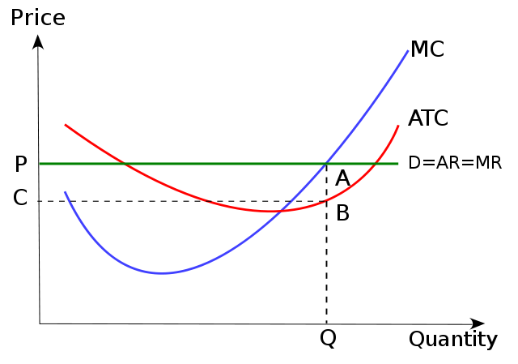

# Question 2

  -  **Command economies** have **no private property** and **no
     individual property rights**.

  ![FREE MARKET ECONOMY VERSUS COMMAND ECONOMY Free market economy is
  controlled by private owners Government has little influence over the
  economic activities Market is based on the division of labors Price of
  goods and services is set by the supply and demand Ownership of land
  and resources are with individuals or firms Demand decides the
  quantity of output Income distribution is not similar Command economy
  is controlled by the government Government has its full control over
  all the economic activities No division of labor is involved Prices
  are determined by the government decision makers Land and other
  resources are owned by the government Government decides the quantity
  of output Fairly equal income distribution practices Pediaa.com
  ](./media/image228.png)

# Question 5

  ![Factors That Shift Supply Changes in input prices If the price of an
  input used to produce A rises, . . . If the price of an input used to
  produce A falls, Changes in the prices of related goods or services If
  A and B are substitutes in production ... If A and B are complements
  in production . . . Changes in technology . and the price of B rises,
  . . . . and the price of B falls, . . and the price of B rises, . . .
  . and the price of B falls, . If the technology used to produce A
  improves, ... Changes in expectations If the price of A is expected to
  rise in the future, .. If the price of A is expected to fall in the
  future, . . . Changes in the number of producers If the number of
  producers of A rises, .. . If the number of producers of A falls, .
  supply of A decreases. supply of A increases. supply of A decreases.
  supply of A increases. supply of A increases. supply of A decreases.
  supply of A increases. supply of A decreases today. supply of A
  increases today. . market supply of A increases. . market supply of A
  decreases. ](./media/image34.png)

# Question 6

  

# Question 12

  -  Long-run (Profitability)

  

  -  Short-run (Production)

  

# Question 19

  

  -  In microeconomics, the **long run** is the conceptual time period
     in which there are no fixed factors of production, so that there
     are no constraints preventing changing the output level by
     changing the capital stock or by entering or leaving an industry.

  -  The long run contrasts with the **short run**, in which some
     factors are variable and **others are fixed**, constraining entry
     or exit from an industry.

  -  In macroeconomics, the long run is the period when the **general
     price level, contractual wage rates, and expectations** adjust
     fully to the state of the economy, in contrast to the short run
     when these variables may not fully adjust.

# Question 26

  ![Introduction to Game Theory Game theory is the branch of decision
  theory concerned with interdependent decisions. The problems of
  interest involve multiple participants, each of whom has individual
  objectives related to a common system or shared resources. Because
  game theory arose from the analysis of competitive scenarios, the
  problems are called games and the participants are called players. But
  these techniques apply to more than just sport, and are not even
  limited to competitive situations. In short, game theory deals with
  any problem in which each player's strategy depends on what the other
  players do. Situations arise frequently, in all walks of life. A few
  examples in which game theory could come in handy include: Friends
  choosing where to go have dinner Parents trying to get children to
  behave Commuters deciding how to go to work Businesses competing in a
  market Diplomats negotiating a treaty Gamblers betting in a card game
  ](./media/image230.png)

# Question 27

  ![Monopolistic Competition Long-Run Equilibrium 1 MR = MC
  thismatter.com Quantity 2 Capacity 3 Note that where MC rises above MR
  , the firm would incur greater costs than it would receive in
  additional revenue, which is why the firm maximizes its profit by
  producing only that quantity where MR = MC , and charging the price at
  f. 2 Market Price = Marginal Cost = Allocative Efficiency 3 Productive
  Efficiency = Minimum ATC Excess Capacity = Quantity Produced at
  Minimum profit (MR = MC . ATC - Quantity that yields the greatest
  ](./media/image231.png)
  
  

# Question 40

  
  
  
  
  

# Question 44

  

# Question 47

  

  -  The bow-out shape occurs because economic resources are **not
     perfectly adaptable** to the production of different goods and,
     thus, the opportunity cost of producing a good will increase as
     more and more resources are allocated to the production of that
     good.

# Question 50

  -  If the monopolist decreases its price, both total revenue and
     profits will decrease

  ![6-5 FIGURE Price $10 9 8 7 6 5 4 3 2 1 o Total revenue $25 24 21 16
  9 The Price Elasticity of Demand Elastic Unit-elastic Changes Along
  the Demand Curve Demand Schedule and Total Revenue for a Linear Demand
  Curve 1 Price $0 1 2 3 4 5 6 7 8 9 10 Quantity demanded 10 9 8 7 6 5 4
  3 2 Total revenue $0 9 16 21 24 25 24 21 16 9 2 2 3 3 4 4 5 6 6 7 7 8
  8 Inelastic 9 10 Quantity 9 10 Quantity The upper panel shows a demand
  curve corre- sponding to the demand schedule in the table. The lower
  panel shows how total revenue changes along that demand curve: at each
  price and quantity combination, the height of the bar rep- resents the
  total revenue generated. You can see that at a low price, raising the
  price increases total revenue. So demand is inelastic at low prices.
  At a high price, however, a rise in price reduces total revenue. So
  demand is elastic at high prices. Demand is elastic: a higher price
  reduces total revenue. Demand is inelastic: a higher phce increases
  total revenue. ](./media/image61.png)
  
  

# Question 53

  ![How does Monopolistic Competition differ from Perfect Competition?
  Number of producers (sellers in the market) Types of goods and
  services available for consumers Does the firm have control over their
  own prices? Is branding / marketing important? Are entry barriers
  zero, low or high? Perfect Competition Many Homogeneous NO — price
  takers NO Zero barriers Does this market structure lead to allocative
  yes: Price = MC efficiency in the long run? Does this market structure
  lead to yes - min LRAC productive efficiency in the long run?
  Monopolistic Competition Many Differentiated Yes — some pricing power
  Yes — key non-price competition Low barriers Not quite (P\>MC) No —
  higher LRAC ](./media/image238.png)

# Question 59

  
