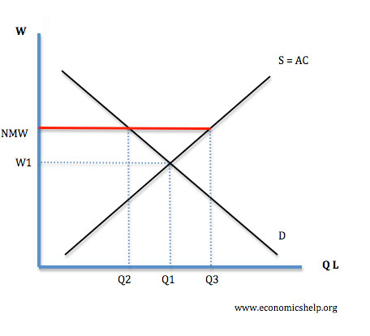

# Question 1 (a)

  -  Graph for the market and a typical firm

  

  -  Graph for a typical firm should include
    
      -  Marginal Cost
    
      -  Marginal Revenue
    
      -  Demand (Price)
    
      -  Average Total Cost

# Question 1 (d)

  -  Long-Run Average Total Cost
    
      -  **Short-run** and **long-run** average total cost curves
         **differ** because a firm can **choose** its fixed cost in the
         **long run**.
    
      -  If a firm plans on producing a **high** amount of output, it
         might make sense to have a **high fixed cost**
    
      -  Conversely, if a firm plans on producing a **small** amount of
         output, it might make sense to have a **low fixed cost**

  ![Cost of case Economies of scale Diseconomies ofscale سس سكسر ATC6
  ATCg \]RATC 3 Quantity of salsa (cases) ](./media/image110.png)

# Question 2 (a)

  -  Positive Social Externality

  

# Question 2 (b)

  -  The price ceiling will increase the deadweight loss, because
     providers will decrease the quantity.

# Question 3 (c)

  -  the MFC curve (or the supply curve for labor) becomes horizontal
     at the minimum wage up to the quantity of minimum wage

  