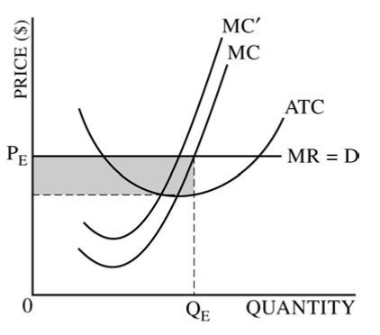
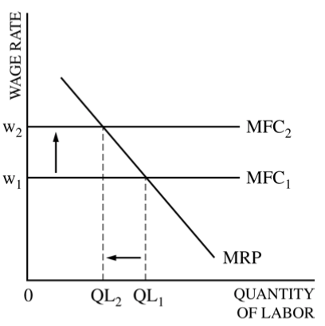

# Question 1 (a)

  -  Profit per unit = Demand(Price) - ATC

# Question 1 (d)

  

  -  Formula

  

  -  How to remember
    
      -  **Queen** is greater than the **Princess**

  ![The price elasticity of demand determines whether the demand curve
  is steep or flat. Note that all percentage changes are calculated
  using the midpoint method 2.... 2.. 2.. 1 FIGURE The Price Elasticity
  of Demand (a) Perfectly Inelastic Demand: Elasticity Equals 0 (b)
  Inelastic Demand: Elasticity Is Less Than 1 Price $5 4 1. An Increase
  n price . 0 Price $5 4 Increase •n price 0 Demand IOO Price $5 4
  Increase In pnce . Quantity 90 IOO Demand Quantity leaves the quantity
  demanded unchanged. .. leads to an 11% decrease in quantity demanded.
  (c) Unit Elastic Demand: Elasticity Equals 1 Price $5 4 Increase In
  price 0 IOO Demand Quantity .. leads to a 22% decrease in quantity
  demanded. 2.. (d) Elastic Demand: Elasticity Is Greater Than 1 50 IOO
  Demand Quantity Price $4 0 (e) Perfectly Elastic Demand: Elasticity
  Equals Infinity . At any price above $4, quantity manded is zero.
  Demand . At exactly $4, consumers will buy any quantity. Quantity ..
  leads to a 67% decrease in quantity demanded. 3. At a price below $4,
  quantity demanded is infinite. ](./media/image54.png)

# Question 1 (e)

  -  Accounting Profit ≥ Economic Profit

  
  
  
  
  

# Question 1 (f)

  -  Profit = Revenue - Cost

# Question 2 (a)

  -  Graph for a typical firm should include
    
      -  Marginal Cost
    
      -  Marginal Revenue
    
      -  Demand(Price)
    
      -  Average Total Cost

  -  Profit = (Price - ATC)\* Quantity

  

# Question 2 (c)

  -  A typical labor supply and demand graph should include
    
      -  Marginal Factor Cost: Horizontal
    
      -  Marginal Revenue Product (Marginal Product of Labor): Downward
         sloping
    
      -  x-axis: Quantity of Labor
    
      -  y-axis: Wage Rate

  

# Question 3 (a)

  -  Negative Social Externality

  

  -  Positive Social Externality

  

# Question 3 (b)

  -  A lump-sum tax will not change the deadweight loss, since the MC
     will not change