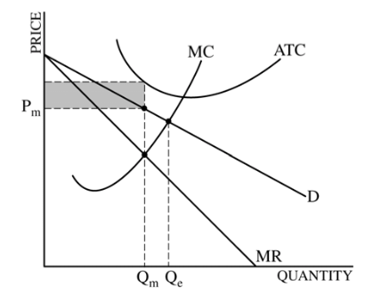

# Question 1 (a)

  

  -  Profit-maximizing point: MC = MR

  -  Allocatively efficient point: MC = D (Price)

# Question 1 (b)

  

# Question 1 (d)

  -  Graph for monopoly

  

  -  Deadweight loss depends on MC and D

  -  Lump-sum subsidy will not change the deadweight loss, because the
     profit-maximizing is still the same

# Question 2 (d)

  
  
  

# Question 3 (c)

  -  Graph for tariff

  

  -  In order to maximizes the sum of consumer and producer surplus,
     per-unit tariff should be 0.