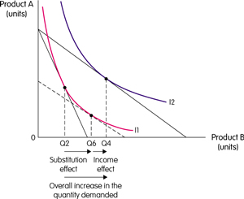
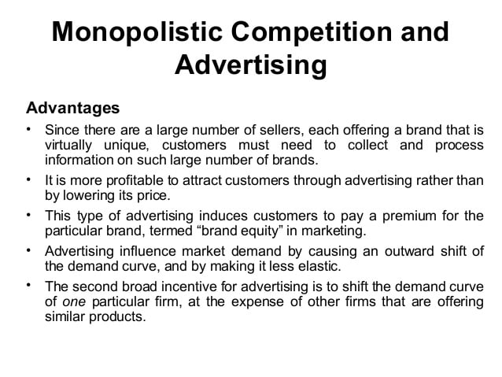

# Question 2

  

  -  Concave-to-the-origin production possibilities frontiers are due
     to the law of increasing costs

# Question 8

  -  Economic profits = (Demand - ATC) \* Quantity

  
  
  

# Question 10

  ![(a) Existing Firm Response to Price, cost $18 14 Price (b) Short-Run
  and Long-Run Market Response to Increase in Demand Long-run industry
  supply curve, LRS (c) Existing Firm Response to Increase in Demand An
  increase in demand rmses pnce and profit. x Price, cost New Entrants
  Higher industry output from new entrants dhves price and profit back
  down. MC ATC Quantity MKT MKT QxQr •ZMkT D Qz Quantity MC ATC Quantity
  Increase in output from new entrants Panel (b) shows how an industry
  adjusts in the short and long run to an increase in demand; panels (a)
  and (c) show the corresponding adjustments by an existing firm.
  Initially the market is at point XMKT in panel (b), a short-run and
  long-run equilibrium at a price of $14 and industry output of Qx. An
  existing firm makes zero economic profit, operating at point X in
  panel (a) at minimum average total cost. Demand increases as DI shifts
  rightward to D2 in panel (b), raising the market price to $18.
  Existing firms increase their output, and industry output moves along
  the short-run industry supply curve Sl to a short-run equilibrium at
  YMKT. Correspondingly, the existing firm in panel (a) moves from point
  X to point Y. But at a price of $18 existing firms are profitable. As
  shown in panel (b), in the long run new entrants arrive and the
  short-run industry supply curve shifts rightward, from Sl to S2. There
  is a new equilibrium at point ZMKT, at a lower price of $14 and higher
  industry output of Qz. An existing firm responds by moving from Y to Z
  in panel (c), returning to its initial output level and zero economic
  profit. Production by new entrants accounts for the total increase in
  industry output, Qz— Qx. Like XMKT, ZMKTis also a short-run and
  long-run equilibrium: with existing firms earning zero economic
  profit, there is no incentive for any firms to enter or exit the
  industry. The horizontal line passing through XMKT and ZMKT, LRS, is
  the long-run industry supply curve: at the break-even price of $14,
  producers will produce any amount that consumers demand in the long
  run. ](./media/image119.png)

  -  An increase in demand will cause no change in the long-run
     equilibrium price for a constant-cost perfectly competitive
     industry.

# Question 21

  

  -  With the conditions of a natural monopoly, long-run average total
     cost decreases as output increases

# Question 25

  -  If the average variable cost of producing 5 units of a good is
     $100 and the average variable cost of producing 6 units is $150,
     then the marginal cost of increasing output from 5 to 6 units is
     \_\_\_\_\_.

  -  6 \* 150 - 5 \* 100 = 400

# Question 28

  -  economic profit
    
      -  The difference between the total revenue received by the firm
         from its sales and the total opportunity costs of all the
         resources used by the firm.

  -  accounting profit
    
      -  The total revenue minus costs, properly chargeable against
         goods sold.

# Question 34

  
  
  ![The price elasticity of demand determines whether the demand curve
  is steep or flat. Note that all percentage changes are calculated
  using the midpoint method 2.... 2.. 2.. 1 FIGURE The Price Elasticity
  of Demand (a) Perfectly Inelastic Demand: Elasticity Equals 0 (b)
  Inelastic Demand: Elasticity Is Less Than 1 Price $5 4 1. An Increase
  n price . 0 Price $5 4 Increase •n price 0 Demand IOO Price $5 4
  Increase In pnce . Quantity 90 IOO Demand Quantity leaves the quantity
  demanded unchanged. .. leads to an 11% decrease in quantity demanded.
  (c) Unit Elastic Demand: Elasticity Equals 1 Price $5 4 Increase In
  price 0 IOO Demand Quantity .. leads to a 22% decrease in quantity
  demanded. 2.. (d) Elastic Demand: Elasticity Is Greater Than 1 50 IOO
  Demand Quantity Price $4 0 (e) Perfectly Elastic Demand: Elasticity
  Equals Infinity . At any price above $4, quantity manded is zero.
  Demand . At exactly $4, consumers will buy any quantity. Quantity ..
  leads to a 67% decrease in quantity demanded. 3. At a price below $4,
  quantity demanded is infinite. ](./media/image54.png)

# Question 38

  -  MR = P = AR = D is above the ATC curve

  -  Make sure the ATC and MC intersect at the minimum ATC

  -  The market is always right\!

  -  Economic Profit shaded in green

  -  P \> minimum ATC, Firm profitable.

  -  Entry into industry in the long
  run.

  

# Question 42

  -  If the demand for labor is relatively inelastic, an increase in
     the effective minimum wage will have less of an impact on
     employment

# Question 43

  ![Machine generated alternative text: Cost minimization or least COSt
  combination Of resources for a give n I eve 1 Of output The basic
  concept here is that the firm will find the least cost com- bination
  of 0 resources when the marginal physical product (MPPL) of one
  resource, labor, per its marginal factor (MFCL) is equal to the
  marginal phys- ical product (MPPK) of another resource, capital （ K)
  per marginal factor cost (MFCK) MPPL MPPK MFCL MFCK or where PL an d
  PK a re constant factor COStS in perfectly competitive resource
  marketso MPPL MPPK You may find a few questions on this cost
  minimization on the exam 。 The important thing to note is that the 仍
  are equal, not necessarily the mar- ginal physical products, In Other
  WO rds ， cost minimization is ach i eve d for a give n output when the
  extra product produced by labor per its cost is equal to the ext r a
  product produced by capital per its cost. NO Other combination Of
  inputs, labor and capital, Will produce any improvement in resource
  efficiency. ](./media/image258.png)

# Question 46

  -  The opportunity cost of …
    
      -  … going to college for a year is not just the tuition, books,
         and fees, but also the foregone wages
    
      -  … seeing a movie is not just the price of the ticket, but the
         value of time you spend in the theater

# Question 47

  -  Scarcity exists when the amount of the good or resources offered
     is less than what users would want if it were given away free.

  -  Free or nonscare goods such as natural resources: oxygen and sun's
     rays are available in
  abundance

# Question 51

  

  -  The demand curve for a normal good is downward sloping because the
     income and substitution effects move the quantity demanded in the
     same direction.

  -  Income effect:
    
      -  The money saved can be used for buying another commodities.
         This can be termed as Additional Income
    
      -  E.g. when the income increases, individuals buy expensive
         products instead of inferior products

  -  Substitution effect:
    
      -  It's an effect which is caused by rise in prices that induces
         a consumer to buy a relatively lower-priced good and less of a
         higher-prices one.
    
      -  This is forced to occur due to fall in income or rise in
         prices

# Question 54

  ![Product Market Characteristics 1. Numbers of Sellers 2. Availability
  of Substitutes 3. Degree of Elasticity 4. Similarity of Products 5.
  Pricing Policy/ Strategy High value 6. Barriers to Entry/Exit 7.
  Efficiency/\* Rent-Seeking 8. Eco. Profits\* 9. P, MC\* 10. p MR Many
  (they are pricetakers from the market). One product type available
  (fully substitutable) available from atl sellers. Perfectly elastic.
  Homogeneous products from all sellers. No pricing policy or strategy.
  Price at market price, price- takers. No barriers to entry/exit.
  Efficient. Each seller prices at cost. No rents. Only transfer
  earnings. Zero economic profits. Price = Minimum AC. Ideal sociai
  pricing P = MC p = MR Fewer than perfect competition, more than
  oligopoly/ monopoly (some price-makers). Imperfect substitutions.
  Imperfect elasticity. Depends on degree of innovation. Heterogeneous.
  Mostly non-price competition; some independent pricing. Weak barriers
  to entry/exit. Inefficiency, excess capacity since P = AC (but not at
  minimum). p = AC; tendency for LR zero economic profits. P \> MC
  idop\&ly Few sellers who have some control of market share;
  interdependence. Fewer substitutes available = market pricing power.
  Varies. Greater elasticity at high prices. Lower elasticity at lower
  prices. Some markets— homogeneous for specialty products. Other
  markets heterogeneous products. Much interdepen- dence in pricing.
  Some evidence of monopoly pricing • poli Formidable barriers to
  entry/exit. Monopoly pricing power leads to waste/inefficiency. Some
  economies of scale. Tendency for existence of LR economic profits, p
  \> MC One seller for whom there are no close substitutes. No close
  substitutes available. Generally inelastic but still elastic at higher
  prices. FolEows from \#1—3 above. Heterogeneous since there are no
  close substitutes. Monopoly pricing power. High value to ratio: P-MC
  Complete barriers to entry by definition. Dead-weight loss of monop-
  oly (loss to society beyond monopoly profits and reduced consumer
  surplus). Empirical evi- dence of LR economic profits. P \> MC Long
  run tendencies at equilibrium. ](./media/image195.png)
  
  

# Question 57

  -  Advertising is frequently used by monopolistic competition to
    
      -  Increase demand
    
      -  Reduce demand
  elasticity

  