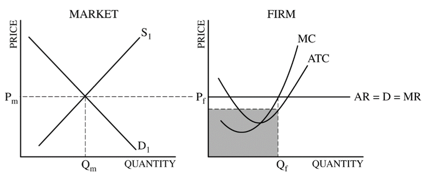

# Question 1 (b)

  -  Graph for a profit-maximizing firm in a perfectly competitive
     constant-cost industry earning positive economic profit
    
      -  Label Market and Firm above each graph

  

  -  AR = Price

  

# Question 1 (c)

  -  For a company in a perfectly competitive market
    
      -  Raising the price --\> Quantity falls to 0 --\> Total Revenue
         falls to 0
    
      -  Because the firm is a price taker / is facing a perfectly
         elastic demand / losses all of its customers / has no market
         power

# Question 1 (d)

  -  Lump sum subsidy has no effect on marginal revenue or marginal
     cost

  -  Only fixed costs will be affected.

  -  Positive profits lead to entry of new firms that will increase the
     industry supply.

# Question 3 (e)

  
  
  ![The price elasticity of demand determines whether the demand curve
  is steep or flat. Note that all percentage changes are calculated
  using the midpoint method 2.... 2.. 2.. 1 FIGURE The Price Elasticity
  of Demand (a) Perfectly Inelastic Demand: Elasticity Equals 0 (b)
  Inelastic Demand: Elasticity Is Less Than 1 Price $5 4 1. An Increase
  n price . 0 Price $5 4 Increase •n price 0 Demand IOO Price $5 4
  Increase In pnce . Quantity 90 IOO Demand Quantity leaves the quantity
  demanded unchanged. .. leads to an 11% decrease in quantity demanded.
  (c) Unit Elastic Demand: Elasticity Equals 1 Price $5 4 Increase In
  price 0 IOO Demand Quantity .. leads to a 22% decrease in quantity
  demanded. 2.. (d) Elastic Demand: Elasticity Is Greater Than 1 50 IOO
  Demand Quantity Price $4 0 (e) Perfectly Elastic Demand: Elasticity
  Equals Infinity . At any price above $4, quantity manded is zero.
  Demand . At exactly $4, consumers will buy any quantity. Quantity ..
  leads to a 67% decrease in quantity demanded. 3. At a price below $4,
  quantity demanded is infinite. ](./media/image54.png)