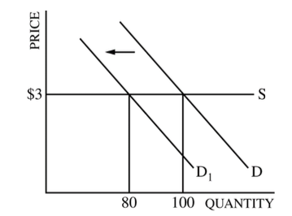

# Question 1 (a)

  -  Elastic Supply: **Percentage** change in quantity supplied exceeds
     the **percentage** change in price

  -  Elastic Supply: Price elasticity of supply is greater than one

# Question 1 (c)

  -  Perfectly elastic supply --\> horizontal supply curve

  

# Question 3 (a)

  -  Monopolistic Competitive Market
    
      -  downward sloping demand curve
    
      -  MR curve below the demand curve
    
      -  LRATC **tangent** to the demand curve

  
  
  