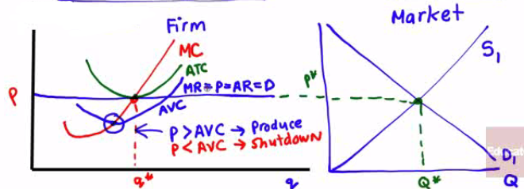
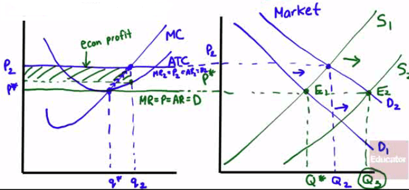
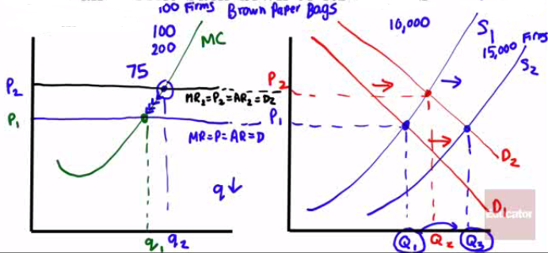
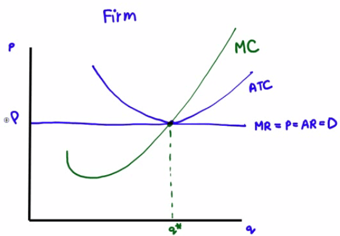
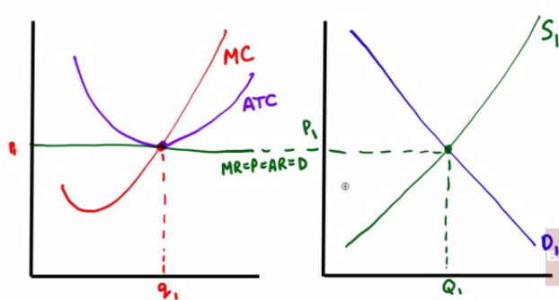
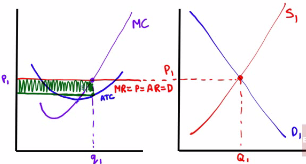
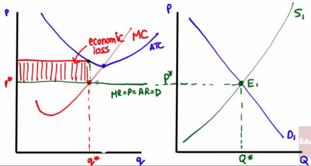

# Types of Market Structure

  -  Perfect Competition
    
      -  **many firms** each sell an **identical** product

  -  Monopoly
    
      -  a **single** firm sells a **single**, **undifferentiated**
         product

  -  Oligopoly
    
      -  a **few** firms (usually 2-4) selling either **identical** or
         an **undifferentiated** product (ie. steel or cigarettes)

  -  Monopolistic Competition
    
      -  **many** firms each sell **differentiated** products

 

# Short-run industry supply curve

  -  Definition
    
      -  relationship between the **price** of a good and the **total
         output of the industry** as a whole

  -  When the market price equals or exceed the **shut-down price**,
     firms will continue to **produce** at the point which the **price
     equals marginal cost**

  -  At any price above the **AVC**, the short-run individual supply
     curve is the firm's **marginal cost (MC)** curve

  -  The short-run industry supply curve, S, is the industry curve.

  -  **Below** the **shut-down price** of $10, **no** producer wants to
     **produce** in the short run.

  -  **Above** $10, the short-run industry supply curve **slopes
     upward**, as each producer **increases output** as **price
     increases**.

  -  It interescts the demand curve, D, at point **EMKT**,
     the point of short-run **market equilibrium**, correspongding to a
     market price of $18 and a quantity of 5000 trees.

#  

# Long-run industry supply curve

  -  Meaning
    
      -  shows how the **quantity supplied** responds to the **price**
         once producers **enter** or **exit** the industry

  -  **Profits** cause more firms to **enter**, which **shifts** the
     supply curve to the right, resulting in **lower prices** and
     **higher industry output**.

  -  However, **individual output** by firms **decreases** as does
     **profit until** there is **no economic profit**.

![FIGURE 12-6 Price of tree $18 16 14 The Long-Run Market Equilibrium
(a) Market (b) Individual Firm MKT 5,000 7,500 MKT' 10,000 Quantity of
trees Price, cost of tree $18 16 14.40 Break- 14 pnce o 30 c 40 45 MC z
50 ATC 60 Point EMKT0f panel (a) shows the initial short-run market
equilibrium. Each of the 100 existing producers makes an economic
profit, illustrated in panel (b) by the green rectangle labeled A, the
profit of an existing firm. Profits induce entry by additional
producers, shifting the short-run industry supply curve outward from Sl
to S2 in panel (a), resulting in a new short-run equilibrium at point
DMKT, at a lower market price of $16 and higher industry output.
Existing firms reduce output Quantity of trees and profit falls to the
area given by the striped rectangle labeled B in panel (b). Entry
continues to shift out the short- run industry supply curve, as price
falls and industry output increases yet again. Entry of new firms ceases
at point CMKT on supply curve Sa in panel (a). Here market price is
equal to the break-even price; existing producers make zero economic
profits, and there is no incentive for entry or exit. So CMKTis also a
long-run market equilibrium. ](./media/image117.png)

  -  Profit = Total Revenue - Total Cost = Price \* Quantity - Average
     Total Cost \* Quantity

 

# The Effect of an Increase in Demand

  -  An **increase** in the **demand** for a product causes the
     **equilibrium price** and **quantity** to **increase** in the
     market.

  -  An **increase** in **demand** raises **price** and **profit**,
     which causes **more suppliers** to enter the market

  -  Higher industry output from new entrants drives **price** and
     **profit** back **down** to its **original** equilibrium

![(a) Existing Firm Response to Price, cost $18 14 Price (b) Short-Run
and Long-Run Market Response to Increase in Demand Long-run industry
supply curve, LRS (c) Existing Firm Response to Increase in Demand An
increase in demand rmses pnce and profit. x Price, cost New Entrants
Higher industry output from new entrants dhves price and profit back
down. MC ATC Quantity MKT MKT QxQr •ZMkT D Qz Quantity MC ATC Quantity
Increase in output from new entrants Panel (b) shows how an industry
adjusts in the short and long run to an increase in demand; panels (a)
and (c) show the corresponding adjustments by an existing firm.
Initially the market is at point XMKT in panel (b), a short-run and
long-run equilibrium at a price of $14 and industry output of Qx. An
existing firm makes zero economic profit, operating at point X in panel
(a) at minimum average total cost. Demand increases as DI shifts
rightward to D2 in panel (b), raising the market price to $18. Existing
firms increase their output, and industry output moves along the
short-run industry supply curve Sl to a short-run equilibrium at YMKT.
Correspondingly, the existing firm in panel (a) moves from point X to
point Y. But at a price of $18 existing firms are profitable. As shown
in panel (b), in the long run new entrants arrive and the short-run
industry supply curve shifts rightward, from Sl to S2. There is a new
equilibrium at point ZMKT, at a lower price of $14 and higher industry
output of Qz. An existing firm responds by moving from Y to Z in panel
(c), returning to its initial output level and zero economic profit.
Production by new entrants accounts for the total increase in industry
output, Qz— Qx. Like XMKT, ZMKTis also a short-run and long-run
equilibrium: with existing firms earning zero economic profit, there is
no incentive for any firms to enter or exit the industry. The horizontal
line passing through XMKT and ZMKT, LRS, is the long-run industry supply
curve: at the break-even price of $14, producers will produce any amount
that consumers demand in the long run. ](./media/image119.png)

   

#  

# Perfect Competition

  -  Price-taking firm
    
      -  the actions of the **firm** has **no impact** on the **market
         price** of the product

  -  Price-taking consumer
    
      -  what **consumers** do have **no bearing** on the **price** of
         the product that is purchased

  -  Perfectly competitive market
    
      -  all participants are referred to as **price takers**, taking
         whatever the markets gives them

  -  Three characteristics of perfect competition
    
      -  Many firms. **No** individual firm can have a
         disproportionately **large market share**
    
      -  Item sold is a **commodity**, or a product that is the
         **same** no matter who sells or buys it
    
      -  Free entry and exit. If there's **profit**, firms **enter**.
         If there's **loss**, firms **exit**.

  -  Optimal output rule
    
      -  **producing** the quantity of output at which the **market
         price** is **equal** to the **marginal cost** of the last unit
         produced

  -  Equation
    
      -  Marginal Cost = Marginal Revenue = Price = Average Revenue =
         Demand
    
      -  How to remember: Mc= Mr. Pard

  -  small q for quantity of a firm

#  

# Perfect Competition in Long-Run Equilibrium

  -  Long-run competitive equilibrium
    
      -  All firms in an industry are maximizing profit, no firm has an
         incentive to enter or exit, and price is such that quantity
         supplied equals quantity demanded

  -  Conditions
    
      -  There is **no economic profit**
    
      -  **No** firms **enter** or **leave**

  -  The **market** is always **right**

  -  **Label all points correctly\!**

 

# Perfect Competition and Short-Run Market Price

  -  Making Short-Run Profit
    
      -  MR = P = AR = D is **above** the ATC curve
    
      -  Make sure the **ATC** and **MC intersect** at the **minimum
         ATC**
    
      -  The **market** is always **right**\!
    
      -  Economic Profit shaded in
  green

  

  -  Incurring Short-Run Loss
    
      -  MR = P = AR = D is **below** the ATC curve
    
      -  Make sure the **ATC** and **MC intersect** at the **minimum
         ATC**
    
      -  The **market** is always **right\!**
    
      -  Economic Loss shaded in
  red

  

  -  Summary

  
  
   

# Summary of Profitability and Production

  -  Long-run (Profitability)

  -  Short-run (Production)

