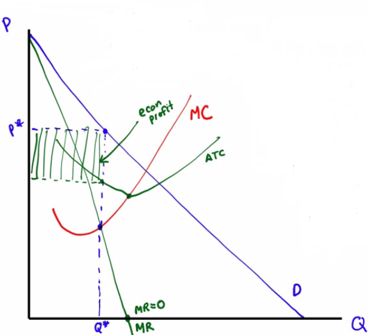
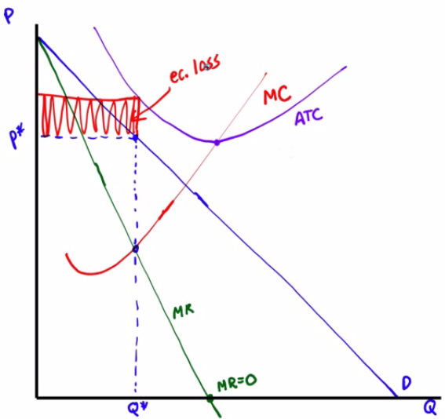

# Characteristics of Monopoly

  -  Meaning
    
      -  Monopolists is the **only producer** of a good with **no**
         close **substitutes**

  -  Tens to have at least one of these four barriers to entry
    
      -  Control of a **scare** resource of **input**
        
          -  Cecil Rhodes made De Beers what it is by controlling most
             of the world's diamond mines.
    
      -  Economies of **scale**
        
          -  large firms tend to have **cost advantages** in markets
             characterized by economies of scale, or a **natural
             monopoly**
    
      -  **Technological** superiority
        
          -  short-term advantage for companies although **network
             externalities** are very crucial as well
    
      -  Government monopolies
        
          -  **patent** (monopoly of invention)
        
          -  **copyright** (monopoly of literary or artwork)

 

# Monopoly and Price Discrimination 

  -  Price discrimination (3rd degree)
    
      -  policy of charging **different prices** to different consumers
         for the **same good**
    
      -  ie. movie tickets, rebates, airline flights

  -  Perfect price discrimination (1st degree)
    
      -  takes place when a monopolist charges each consumer his or her
         willingness to pay the **maximum** that the consumer is
         **willing** to **pay**
    
      -  **No consumer surplus**

![Machine generated alternative text: (a) Price Discrimination with Two
Different Prices (b) Price Discrimination with Three Different Prices
price, cost S 忆 ConsumerS 饷 a high 历 怖 ng 捍 g55 pay 0 pnces 5 Consumers
饷 a 怖 ng 捍 g55 pay D Quantity price, cost Sales \[ 0 捍 5u07g 巧 饷 a
high Il g55 pay Sa 5 饷 a medium W 0 捍 pay Profit 饷 three prices \[ OllSU
捍 JUS 饷 a 亿 “ 伍 ngn 5 pay D Quantity （ 0 Perfect Price Discrimination
price, cost e with 咖 pH 酌 5 \[ rim 了 na D Quantity Panel (a) shows a
monopolist that charges two different prices; its profit is shown by the
shaded area. Panel (b) shows a monopolist that charges three different
prices; its profit ， too, is shown by the shaded area. It is able
capture more 耐 the consumer surplus and increase its profit. That is, by
increasing the number 耐 different prices charged, the monopolist
captures more 耐 the consumer surplus and makes a larger profit. Panel
(c) shows the case 耐 perfect price discrmination ， where a monopolist
charges each consumer his or her willingness 10 pay; the monopolist ， s
profit is given by the shaded triangle. ](./media/image129.png)

 

# Decreasing Marginal Revenue

  -  The increase in production by a monopolist has two **opposing**
     effects on revenue
    
      -  Quantity effect
        
          -  One more unit is sold, **increasing total revenue** by the
             price at which the unit is sold
    
      -  Price effect
        
          -  In order to sell the last unit, the monopolist must cut
             market price on **all** unites sold. This **decreases
             total revenue**

  -  What is the relationship between Demand curve and MR curve in a
     monopoly?
    
      -  MR curve is **below** the Demand curve and **steeper** than
         the Demand curve.
    
      -  Because the **price** on all units sold must **fall** if the
         monopoly **increases production**

  -  Example

  
  
  

 

# Monopoly and Profit

  -  Profit = TR - TC = (P \* Q) - (ATC \* Q)

  -  Monopoly Making a Profit

  ![Machine generated alternative text: price, cost, marginal reve n u e
  Monopo ， profit 丆 CM MC D Quantity In this case ， the marginal cost
  curve has a "swoosh" shape and the average total cost curve is
  U-shaped. The monopolist maximizes profit by producing the level Of ou
  ut at which MR= MC ， given point generating quantity Q". It finds its
  monopo price ， PM, from the point on fre demand curve directly above
  point point B here The æerage total cost Of QM is shown 卸 point C.
  Profit is given by the area of the shaded rectangle
  ](./media/image132.png)
  
  

  -  Monopoly Incurring a Loss

  

 

# Monopoly vs. Perfect Competition

  -  **P = MR = MC** at the **perfectly competitive** firm's
     profit-maximizing quantity of output

  -  **P \> MR = MC** at the **monopolist's** profit-maximizing
     quantity of output

  -  Monopoly charges a **higher price**, produces a **lower quantity**
     and earns a **profit**

  -  **Not Allocatively Efficient**
    
      -  profit
    
      -  deadweight loss
    
      -  There does not exist maximum consumer and producer surplus

  

# Reading a Monopoly Graph

  -  There is **one** stadium in Parkville. The stadium's demand and
     cost curves are shown below. The stadium currently relies on an
     **admission charge** for its revenue.

  

  -  Using the labeling of the graph above, identify the **price** and
     **quantity** that **maximize profit**
    
      -  Price: P5
    
      -  Quantity: Q2

  -  Using the labeling of the graph above, identify the **price** and
     **quantity** that **maximized** total **revenue**
    
      -  When MR intersects the x-axis
    
      -  Price: P3
    
      -  Quantity: Q4

  -  Using the labeling of the graph above, identify the **price** and
     **quantity** that **maximizes attendance** while still **breaking
     even**
    
      -  When demand curve intersects ATC curve
    
      -  Price: P2
    
      -  Quantity: Q5

  -  Assuming the existence of an **opportunity cost**, at P2, indicate
     whether stadium's **accounting profits** would be **positive**,
     **negative**, or **zero**. Explain why.
    
      -  **Economic Profit = Total Revenue - Total Cost** = 0
    
      -  **Economic Profit = Accounting Profit - Opportunity Cost** = 0
    
      -  Accounting Profit = Opportunity Cost
    
      -  Answer: positive

  -  When the attendance is Q1, is the **demand inelastic**,
     **elastic** or **unitary elastic**? Explain
    
      -  Answer: Elastic
    
      -  Explanation: **Marginal Cost** is **positive** or the price is
         on the **left side** of the demand curve
    
      -  A monopolist will always **produce** on the **elastic**
         portion of the **demand curve**

  

![6-5 FIGURE Price $10 9 8 7 6 5 4 3 2 1 o Total revenue $25 24 21 16 9
The Price Elasticity of Demand Elastic Unit-elastic Changes Along the
Demand Curve Demand Schedule and Total Revenue for a Linear Demand Curve
1 Price $0 1 2 3 4 5 6 7 8 9 10 Quantity demanded 10 9 8 7 6 5 4 3 2
Total revenue $0 9 16 21 24 25 24 21 16 9 2 2 3 3 4 4 5 6 6 7 7 8 8
Inelastic 9 10 Quantity 9 10 Quantity The upper panel shows a demand
curve corre- sponding to the demand schedule in the table. The lower
panel shows how total revenue changes along that demand curve: at each
price and quantity combination, the height of the bar rep- resents the
total revenue generated. You can see that at a low price, raising the
price increases total revenue. So demand is inelastic at low prices. At
a high price, however, a rise in price reduces total revenue. So demand
is elastic at high prices. Demand is elastic: a higher price reduces
total revenue. Demand is inelastic: a higher phce increases total
revenue. ](./media/image61.png)