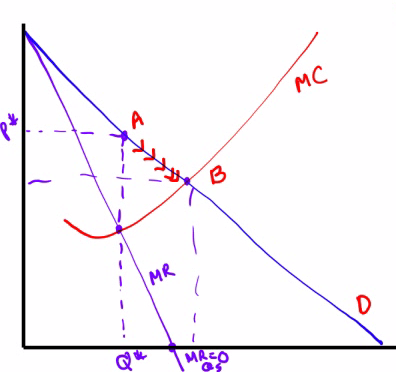

# Welfare Effects of Monopoly

  -  Monopoly vs. Perfect Competition (Surplus)
    
      -  Assume a **downward** sloping demand curve for both monopoly
         and prefect competition with a **constant MC** as well as
         **ATC**
    
      -  In a monopoly, the **marginal revenue** will be **below** the
         **demand curve**.
    
      -  Consumer **surplus** is **reduced** and **deadweight** loss
         (DWL) is **created**
    
      -  Graph

  

  -  Summary
    
      -  By holding output level **below** the level at which
         **marginal cost** is **equal** to the **market price**, a
         monopolist **increases profits** but **decreases consumer
         surplus**
    
      -  Mutually beneficial transactions do not occur, but a
         monopolist is (**naturally**) looking out for its own
         interests.
    
      -  **Perfectly competitive** firms also profit-maximize, but they
         produce where **P = MC**, which is also **MR = MC**
    
      -  Monopolists produce at **MR = MC**, but **P \> MC**
    
      -  This creates **deadweight loss** or DWL

 

# Public Ownership of Monopolies

  -  Many countries opt for **public ownership** of **natural
     monopolies** (economies of scale)

  -  In theory, the government can set prices based on **efficiency (P
     = MC)** rather than **profit maximization (MR = MC)**

  -  In practice, publicly owned firms have **less incentives** to
     **keep costs down** or **offer high quality**

  -  Electricity, local phone service, water and gas are examples of
     regulated monopolies

  -  Should the government regulate cable TV?

 

# Unregulated vs. Regulated Natural Monopoly

  -  Assume a demand curve for both situations with a demand
     intersecting ATC on downward-sloping portion

  -  **Unregulated** monopoly charges **MR = MC** (econ profit)

  -  **Regulated** monopoly charges (normal profit)

![Machine generated alternative text: FIGURE 13 ． 9 Unregulated and
Regulated Natural Monopoly (a) Total Surplus with a n Unregu lated (b)
Total Surplus with a Regulated Natural Monopolist Price, cost, marginal
revenue Natural Monopolist Consumer su 5 MR Price, cost, marginal
revenue MC D Quantity Consumer surplus MR D Quantity This figure shows
the case Of a natural monopolist 、 In panel (a), if the monopolist is
allowed to charge PM, it makes a profit, shown by the green area;
consumer surplus IS shown by the blue area. If it is regulated and must
charge the lower price PR, output increases from QM to QR and consumer
surplus increases. Panel (b) shows what happens when the monopolist must
charge a price equal 10 average total cost, the price PR. Output expands
to QR and consumer surplus IS now the entire blL 」 e area. The
monopolist makes ze ro profit. This is the greatest total surpli 」 s
possible when the monopolist is allowed to at least break even, making
PR the best regulated price 、 ](./media/image139.png)

#  

# Monopoly Practice Problem

  

  -  Assume an **unregulated** monopoly.
    
      -  The monopolist's quantity produced
        
          -  where MR = MC, at point c
        
          -  Answer: Q1
    
      -  The monopolist's price
        
          -  above point c, at point a
        
          -  Answer: P3
    
      -  The economic profit of the monopolist
        
          -  between ac and the y-axis
        
          -  Answer: acP1P3
    
      -  The area of deadweight loss
        
          -  between ac and demand
        
          -  Answer: acf

  -  Assume the monopolist can **perfectly price discriminate**
    
      -  The quantity produced
        
          -  where MR = MC = D, at point f
        
          -  Answer: Q3
    
      -  The total **revenue** of the monopolist
        
          -  asking for revenue, not profit
        
          -  Answer: P4fQ3O

  -  Assume a monopolist is **regulated** to maximize total surplus
    
      -  The socially efficient quantity
        
          -  **socially efficient** = **allocatively efficient** = when
             **P equals MC** = maximum of consumer surplus and producer
             surplus
        
          -  Answer: Q3
    
      -  The consumer surplus at the socially efficient quantity
        
          -  Answer: P4P1f
    
      -  Is the monopolist facing **regulation** earning a **positive**
         economic profit, earning **zero** economic profit, or
         incurring a **loss**? Explain your answer.
        
          -  at point f, where price = marginal cost = average total
             cost
        
          -  Accounting profit = TR - TC = Q\* (P - ATC) = 0
    
      -  Is point f in the **elastic**, **inelastic**, or **unit
         elastic** portion of the demand curve? Explain.
        
          -  **MR \> 0, elastic**
        
          -  **MR < 0, inelastic**
        
          -  **MR = 0 , unit elastic**

#  

# More Monopoly Practice Problem

  -  Zachrail, the only provider of train services between two cities,
     is currently incuring economic losses
    
      -  Show Zachrail's loss-minimizing price and quantity
        
          -  **loss-minimizing = profit-maximizing **
        
          -  the point on demand curve above the point where MR = MC
    
      -  Show the area of economic loss
        
          -  the point on ATC curve above the point where MR = MC
    
      -  Identify the allocatively efficient quantity
        
          -  the point where D = MC

  

  -  If Zachrail raised the **price** above the profit-maximizing
     price, would total **revenue increase**, **decrease** or **not
     change**? Explain.
    
      -  **If elastic, P↑, TR↓**
    
      -  **If elastic, P↓, TR↑**
    
      -  **If inelastic, P↑, TR↑**
    
      -  **If inelastic, P↓, TR↓**

  -  Would a per-unit **tax** or per-unit **subsidy** be advisable in
     this situation if the goal is to produce at the **allocatively
     efficient** point? Explain why.
    
      -  Answer: Per-unit subsidy
    
      -  Explanation: lead towards allocatively efficient
  point

  

  -  Assume instead that a lump-sum subsidy is provided to Zachrail. In
     the short run, will **deadweight loss** increase, decrease of not
     change? Will Zachrail's **economic losses** increase, decrease or
     not change?
    
      -  **Lump-sum subsidy** lowers FC, which **lowers** the **ATC**
    
      -  Answer: the deadweight loss will not be changed, the losses
         will decrease

  