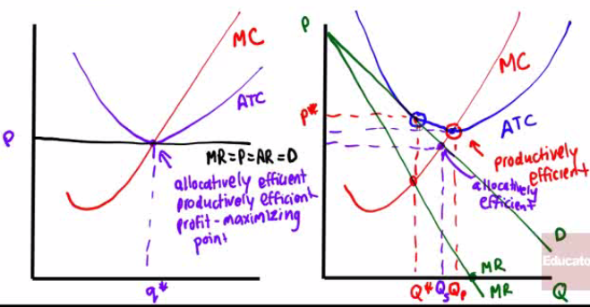

# Characteristics of Monopolistic Competition

  -  **Large number** of **competing** firms
    
      -  Vendors in a big food court at the mall
    
      -  Gas stations along a major highway

  -  Differentiated Products
    
      -  **Similar** but **not identical** products
    
      -  Various types of chocolate candy: Twix, Snickers, M\&Ms…

  -  Free entry and exit in the long run
    
      -  If there are opportunities for **profit**, firms can **enter**
    
      -  Similarly, if there **is** loss companies will **exist**
    
      -  Unlike perfect competition, there's **pricing power**
    
      -  Unlike monopoly, there's **competition**
    
      -  Unlike oligopoly, there are **many firms**

 

# Graph

  -  Profitable firm in monopolistic competition
    
      -  Graph **similar** to a **monopoly** earning economic profit
    
      -  **Demand** curve is slightly **more elastic** in monopolistic
         competition than in monopoly

  

  -  Unprofitable firm in monopolistic competition
    
      -  Graph **similar** to a **monopoly** incurring economic loss
    
      -  **Demand** curve is slightly **more elastic** in monopolistic
         competition than in monopoly

  

 

# Long-Run Zero-Profit Equilibrium

  -  If **profitable**, firm **entry** will occur and individual firm
     **demand** will shift **left**

  

  -  If **unprofitable**, firm **exit** will occur and individual firm
     **demand** will shift **right**

  

  -  In long-run, demand curve will be tangent to its ATC at its
     profit-maximizing point

  

 

# Comparing Perfect & Monopolistic Competition

  -  Both make **zero economic profit**

  -  Perfect competition operates at both **minimum ATC** and where **P
     = MC**.

  -  Both **productively** and **allocatively efficient**

  -  Monopolistic competition operates to the **left** of minimum-cost
     output and has **excess
  capacity**

  
  
  
  
  
  
   

# Product Differentiation & Advertising

  -  How firms differentiate their products
    
      -  Differentiation by **style** or **type**
    
      -  Differentiation by **location**
    
      -  Differentiation by **quality**

  -  Ford vs. General Motors
    
      -  Henry Ford famously quipped that customers could the Model T
         in "any color, so long as it's black"
    
      -  Alfred Sloan challenged this perfectly competitive view of
         automobiles
    
      -  **Even** though **more expensive**, consumers **preferred**
         the range of **styles** and GM became the dominant car brand
         during the 20th century

 

# Monopolistic Competition Example

  -  Assume a city **eliminates** the license fee (**fixed cost**) for
     all firms in a monopolistically competitive industry.
    
      -  How is **output** affected?
        
          -  Not affected
        
          -  Because marginal cost stays the same.
    
      -  How is **economic profit** affected?
        
          -  FC↓, TC↓, ATC↓
        
          -  can make economic profit
        
          -  Firms enter, demand increases, and drives out profit
