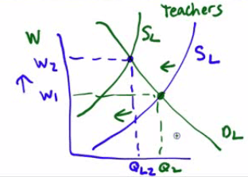
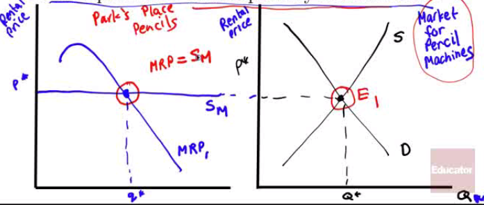

# Work vs. Leisure

  -  In the labor market, the roles of firms and households are
     reversed
    
      -  Labor is **supplies** by **households** and **demanded** by
         **firms**

  -  Assume that an individual is capable of working as little or as
     many hours as possible

  -  Individual Labor Supply Curve
    
      -  the relationship between the **wage rate** and the **number of
         labor supplied** by the worker
    
      -  If the **substitution effect** dominates, the curve slopes
         upward

  

  -  If the **income effect** dominates, the quantity of labor supplies
     goes down

  
  
   

# Backward-Bending Labor Supply Curve

  -  Is a backward-bending labor supply curve possible?

  -  At **high wage rates**, yes\!

  -  At the end of the 19th century, the average work week was 70 hours
     and few people retired at age 65

  -  Today the typical workweek is between 35-40 hours as people
     substitute income for leisure

  
  
   

# Shift of the Labor Supply Curve

  -  Changes in **Preferences** and **Social Norms**
    
      -  In the US since the 1960s a large number of women entered the
         workforce

  -  Changes in **Population**

  -  Changes in **Opportunities**
    
      -  In the 1960s, as opportunities for women increased, the supply
         of teachers decreased, raising the equilibrium wage of all
         reaming
  teachers

  

  -  Changes in **Wealth**
    
      -  In 1979, 71% of the American teenagers (16-19) were in the
         summer workforce. In 1989, it dropped to 63%. By 2009 the drop
         was down to 33%
    
      -  As household wealth increases, teenagers tend to consume more
         leisure (ie. additional study, games)

 

# Determining the Optimal Input Mix

  -  **Substitutes** and **Complements** in Factor Markets
    
      -  **Capital** and **Labor** can be **substitutes** in banking
    
      -  You can substitute ATM machines for tellers
    
      -  Office workers and computers can be complements

  -  **Cost Minimization**
    
      -  Optimal Input Mix is where MPL/Wage = MPK/Rental Rate
    
      -  I**f MPL/Wage \> MPK/Rental Rate**, then hire the **human**
         worker
    
      -  If **MPK/Rental Rate \> MPL/Wage**, then the **machines**
         win\! use more capital

  -  Situation is very similar to the Utility Maximization rule of
     MUA/PA=MUB/PB, except
     in the context of factor market rather than consumer behavior

 

# Capital vs. Labor

  

  -  What is the MPL of the 4th worker?
    
      -  140 - 120 = 20

  -  What is the MPL per dollar of the 5th worker if the wage rate per
     hour is $5
    
      -  (155 - 140) / 5 = 3

  -  How many workers would the business hire if it hired every worker
     for whom the marginal product per dollar is greater than or equal
     to 1 expo maker per dollar?

| QL | Q   | MPL | MPL/W |
| ------------- | --- | --- | ----- |
| 0             | 0   |     |       |
| 1             | 40  | 40  | 8     |
| 2             | 90  | 50  | 10    |
| 3             | 120 | 30  | 6     |
| 4             | 140 | 20  | 4     |
| 5             | 155 | 15  | 3     |
| 6             | 160 | 5   | 1     |
| 7             | 162 | 2   | 0.4   |

  -  6 workers, 160 expo markers

<!-- end list -->

  -  If the marginal product per dollar spent on labor is 1 expo marker
     per dollar, the marginal product of the last capital hired is 100
     expo markers per dollar and the rental rate is $50 per day, is the
     firm minimizing its cost?
    
      -  No, employ more capital and less
         labor
    
      -  

 

# Theories of Income Distribution

  -  Marginal Productivity and Wage Inequality
    
      -  **Compensating differentials**
        
          -  Across different jobs, wages are often higher or lower
             depending on a jobs "pleasant" factor
    
      -  **Differences in talent**
        
          -  Lebron James is paid higher than most basketball players
             because he has a higher level of ability than they do
    
      -  **Quantity of human capital**
        
          -  Those who invest in education tend to have higher wages
             than those that do not

  -  Market Power
    
      -  Unions, or organizations that try to raise wages and working
         conditions, tend to **increase the equilibrium** price of
         labor via "**collective bargaining**"

  -  Efficiency wage
    
      -  Type of incentive scheme used by workers to **encourage hard
         work** and **reduce turnover**
    
      -  Employers will pay **above** the **equilibrium wage** or a
         **premium** above the "normal" wage rate in order to encourage
         **staying** with a company

  -  Discrimination
    
      -  Racial or Gender discrimination is **NOT** a **natural**
         consequence of market competition
    
      -  In fact, companies can **benefit** by exploiting
         **discrimination**
    
      -  Branch Rickey, in signing Jackie Robinson to play for Dodgers,
         got a huge bargain economically because no other
         African-American baseball players were playing in the major
         leagues

 

# Factor Market Example

  -  Assume Park's Place Pencils employs a fixed number of employees
     and rents a machine for a variable number of hours from a
     perfectly competitive market.

  -  Using correctly labeled **side-by-side** graphs of the factor
     market of machines and the Park's Place Pencils, find the
     **equilibrium** rental **price** of machines in the factor market,
     and Park's Place **equilibrium** rental **quantity** of machines

  

  -  Assume that the popularity of pencils increases, **increasing**
     the **demand** for **pencils**

  -  What will happen to each of the following?
    
      -  Marginal product curve for machine-hours
        
          -  stays the same
        
          -  MRP = P \* MPL
        
          -  P↑, MRP↑, MPL -
    
      -  Marginal revenue product curve for machine-hours
        
          -  Increases because price increases
        
          -  MRP = P \* MPL

  -  J. Daniel Park, CEO of Park's Place Pencils is employing the
     cost-minimizing combination of inputs. The marginal product of
     labor is 60 pencils per worker hour and the wage rate is $15 per
     hour. The marginal product of the machine is 100 widgets per
     machine-hour. What is the hourly rental price of a machine
    
      -  
    
      -  
    
      -  