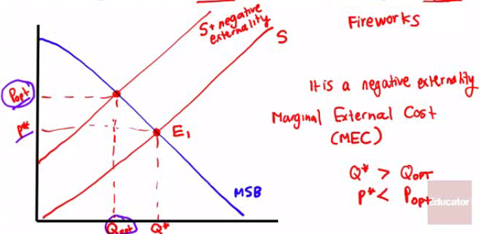
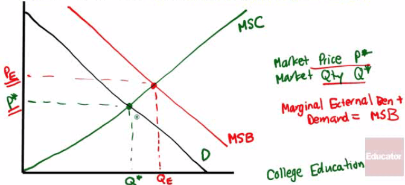
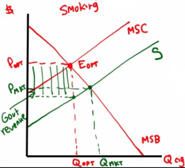
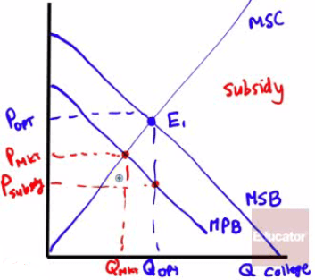
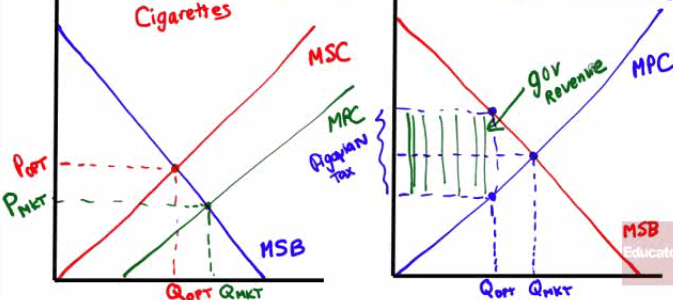
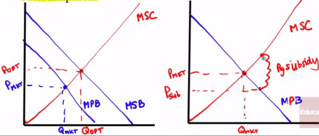
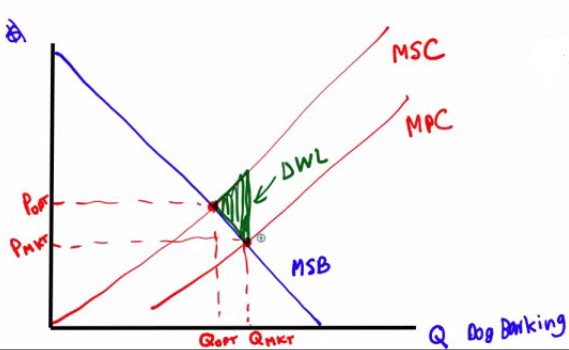
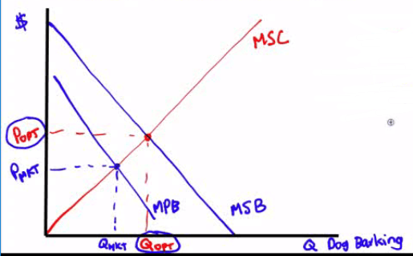
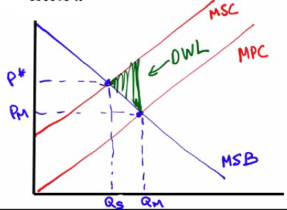

# The Economics of Pollution

  -  Is it a **legitimate goal** to have **zero pollution** in society?
    
      -  Pollution, just like most things in economics, is a "**how
         much**" question that requires **benefit**/**cost** analysis

  -  Marginal social cost of pollution
    
      -  **additional cost** imposed on society created by **a unit of
         pollution**
    
      -  ie. acid rain harms crops and forests

  -  Marginal social benefit of pollution
    
      -  **additional benefit** to society from **a unit of pollution**
    
      -  ie. pollution avoidance incurs an opportunity cost and is
         expensive

  -  Socially optimal quantity of pollution
    
      -  point at which marginal social cost (MSC) equals the marginal
         social benefit (MSB)
    
      -  **MSB = MSC**

 

# Socially Optimal Quantity of Pollution

  -  **Upward**-sloping **MSC** curve

  -  **Downward**-sloping **MSB** curve

  -  **Intersection** of MSC and MSB is socially **optimal** point

  -  Market-determined quantity of pollution is where MSB is x-axis

  -  Not allocatively efficient: Q too high, Price too low

  

  -  In the **absence** of **government intervention**, the quantity of
     pollution will be **QMKT**, the level at which the
     marginal social benefit of pollution is zero.

  -  This is an inefficiently high quantity of pollution: the marginal
     social cost, $400, greatly exceeds the marginal social benefit $0.

  -  An optimal Pigouvian **tax** of $200, the value of the marginal
     social cost of pollution when it equals the marginal social
     benefit of pollution, can move the market to the socially
     **optimal** quantity of pollution, **QOPT**

 

# Negative Externality vs. Positive Externality

  -  Negative externality
    
      -  a decision that a firm or **individual** makes that imposes a
         **cost** to "**society**" as a whole (ie. the decision to
         pollute)
    
      -  Impact is **similar** to that of a **supply** shift to the
         **left** on a supply and demand graph
    
      -  Market price too low, Market Quantity too high

  
  
  

  -  Positive externality
    
      -  a decision that an **individual** or firm makes that yields
         **positive benefits** to **society** (ie. the decision to
         attend college and become a productive citizen)
    
      -  Impact is **similar** to that of a **demand** shift to the
         **right** on a supply and demand graph
    
      -  Market price too low, market quantity too low

  
  
  

 

# Government Solution

  -  By what means would the government be able to **correct a nagative
     externality**?
    
      -  Tax

  

  -  By what means would the government be able to **encourage a
     positive externality**?
    
      -  Subsidy

  

 

# Private (or Coase) Solution

  -  Coase Theorem
    
      -  Even in the presence of externalities, an economy can be
         **efficient** (assuming low transaction costs) by
         **internalizing** the **externalities**

  -  Example
    
      -  Let's say that Jeff and Chris are neighbors in Chino Hills and
         that Jeff enjoys throwing loud parties wile Chris does not
    
      -  Chris does not enjoy the music but Jeff has a legal right to
         play loud music, so Chris can play Jeff a payment **equal to
         the external cost he imposes on him**
    
      -  Or, if Jeff does not have a legal right to play loud music,
         Jeff can pay Chris an amount **equal to the cost the music
         imposes on Chris**

  -  Pigouvian taxes
    
      -  named after economist A.C. Pigou, these taxes were designed to
         **reduce external costs**

  -  Negative Externality Example
    
      -  Formula
        
          -  **MSC = MPC + MEC**
        
          -  MSC: Marginal Social Cost
        
          -  MPC: Marginal Private Cost
        
          -  MEC: Marginal External Cost
    
      -  Smoking cigarettes is considered a **negative externality**
    
      -  An optimal Pigouvian tax charges where **MSC = D**, so that
         **less quantity** is consumed at a higher price

  

  -  Positive Externality Example
    
      -  Formula
        
          -  **MSB = MPB + MEB**
        
          -  MSB: Marginal Social Benefit
        
          -  MPB: Marginal Private Benefit
        
          -  MEB: Marginal External Benefit
    
      -  Getting a flu shot not only benefits you but also reduces the
         number the number of others getting the flu by as much as 1.5
    
      -  Getting a flu shot is considered a **positive externality**
    
      -  An optimal Pigouvian subsidy intersects where **MSB = S**.
         Lower prices **encourages consumption**

  
  
   

# Practice Question

  -  Draw a correctly labeled graph of the market for dog barking
     contests that is **perfectly competitive**. If neighbors are
     disturbed by dog barking, draw the marginal social cost curve,
     labeled **MSC**. Label the marginal social benefit curve, labeled
     **MSB**, and shade in the deadweight loss or **DWL**, if any.

  

  -  Draw a correctly labeled graph of the market for dog barking
     contests that is **perfectly competitive**. If neighbors now
     **enjoy** dog barking, is the market **equilibrium greater**,
     **less** than or **equal** to the socially optimal quantity? If
     the government **bans** dog barking, will the **deadweight loss
     increase**, **decrease**, or remain **unchanged**?
    
      -  Market equilibrium is less than optimal
    
      -  Deadweight loss will
  increase

  

  -  Assume that the market for paper bags is **perfectly competitive**
     and that they create a **negative externality**. Draw a graph that
     includes the **MPC** and **MSC**, as well as the **market
     quantity**, Qm. Label the **allocatively efficient
     quantity** as Qs and shade the area of **deadweight
     loss** and label as DWL. If a **lump-sum tax** is imposed, what
     happens to DWL?
    
      -  Allocatively efficient: MSC = MSB

  

  -  The DWL stays the same
