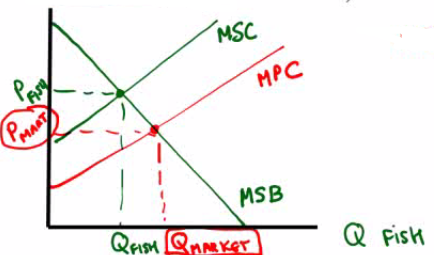

# Characteristics of Goods

  -  Rival (in consumption)
    
      -  good that **cannot** be consumed by **more than one person**
         at a time
    
      -  ie. hamburger

  -  Nonrival (in consumption)
    
      -  good that can be **consumed jointly** by groups of people
    
      -  ie. lecture

  -  Excludable
    
      -  suppliers can **prevent non-payers from consuming** the good

  -  Nonexcludable
    
      -  suppliers **cannot prevent** those who did **not pay** for an
         item **from enjoying** the **benefits** of the good

 

# Four Types of Goods

 

# Private Goods

  -  **Rival and excludable**

  -  **Excludability** is **crucial** because if a supplier could not
     discriminate who gets their particular item or not, he or she
     would have **no incentive to produce**

  -  There would exist a **free-rider** problem in which no rational
     consumer would choose to pay for a good or service if provided (or
     nonexcludable)

  -  If items are nonrival, then an **inefficiently low quantity** of
     items are **consumed**

  -  Most items (cars, food, phones, pencils, jeans, stapler, markers,
     etc) are private goods in which the market functions properly

 

# Public Goods

  -  **Nonrival and nonexcludable**

  -  Suffer from the **free-rider problem** because private firms
     generally produce **inefficiently low quantities**

  -  Public radio, for example, or scientific research sometimes rely
     on **private donations**

  -  In the UK, a license fee (~$230 in 2010) is charged to television
     owners but is made excludable by using "television detection vans"

  -  Most people agree that the government should provide national
     defense, the legal system, fire protection, etc.

 

# Common Resources

  -  **Rival and nonexcludable**

  -  Since you can't stop me from consuming the good and more by me
     means less of the good for you, there's an **incentive to
     overuse**

  -  Tragedy of the commons -- depletion of a shared resource by
     individuals acting rationally according to each one's **self
     interest**, though **contrary** to the **group's long-term best
     interest** -- Negative externality

  -  Example: Fish in
  river

  
  
   

# Artificially Scare Resources

  -  **Nonrival and excludable**

  -  **Marginal cost** to society watching pay-per-view is **zero**

  -  Yet cable companies prevent those who haven't paid from watching

  -  Computer software and audio files share this same characteristic

  -  This is **allocatively inefficient** since the P is greater than
     the MC, but producers will have **no incentive to produc**e a
     product **unless profit** is generated

 

# Healthcare and Government 

  -  Should the **government** get involved in **healthcare**?

  -  This is a **normative question**, but it is useful for both
     proponents and opponents of nationalized healthcare to consider
     the following two questions
    
      -  Is it rival or nonrival?
        
          -  Rival
    
      -  Is it excludable or nonexcludable?
        
          -  Nonexcludable
    
      -  So healthcare is **common resource**