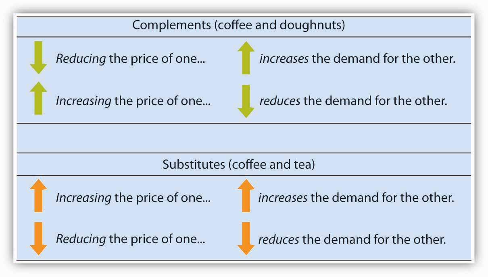
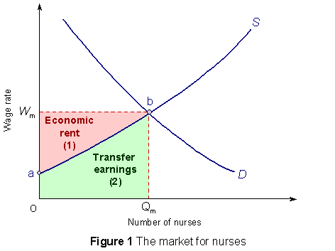
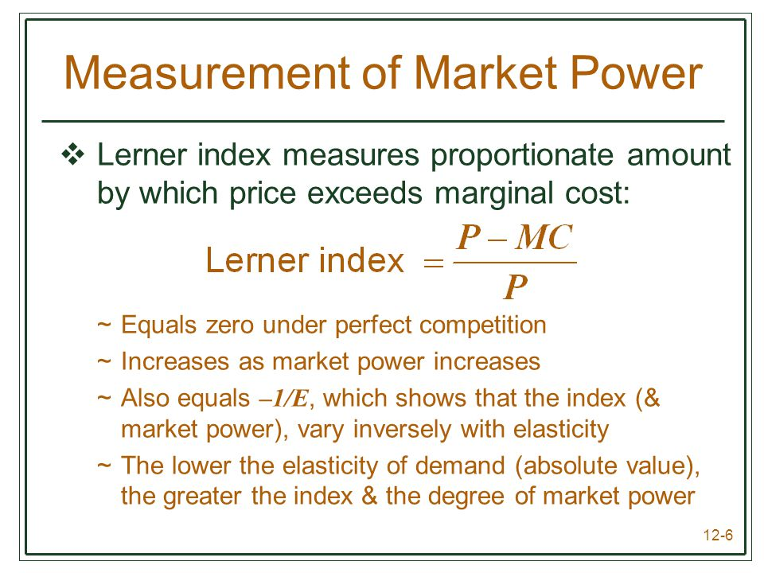

# Question 1

  ![Natural gas sellers and natural gas buyers constitute a market a
  group of producers and consumers who exchange a good or service for
  payment. In this chapter, we'll focus on a particular type of market
  known as a competitive market. A competitive market is a market in
  which there are many buyers and sellers of the same good or service.
  More precisely, the key feature of a competitive market is that no
  individual's actions have a noticeable effect on the price at which
  the good or service is sold. It's important to understand, however,
  that this is not an accurate description of every market.
  ](./media/image304.png)

<table>
<thead>
<tr class="header">
<th>Market Type</th>
<th>Perfect Competition</th>
<th>Monopolistic Competition</th>
<th>Oligopoly</th>
<th>Monopoly</th>
</tr>
</thead>
<tbody>
<tr class="odd">
<td>Number of Firms</td>
<td>Numerous</td>
<td>Many</td>
<td>Few</td>
<td>One</td>
</tr>
<tr class="even">
<td>Nature of Product</td>
<td>
Same, or very similar products

Example: Produce
</td>
<td>
Different products (Might seem the same but are still different)

Example: Fast food restaurants
</td>
<td>
Can be similar or different

Example: Washing machines
</td>
<td>Unique in nature 
Example: Electricity</td>
</tr>
<tr class="odd">
<td>Implications for demand curve</td>
<td>
Horizontal:

This firm is a price taker and the demand curve is perfectly elastic
</td>
<td>
Downward Sloping:

Relatively Elastic
</td>
<td>
Downward Sloping:

Price curve is price-elastic.

Demand curve is directly affected by competition
</td>
<td>Downward sloping: 
Firms in this market have the most control over price</td>
</tr>
<tr class="even">
<td>Average size</td>
<td>Small</td>
<td>Small - Medium</td>
<td>Large</td>
<td>Very Large</td>
</tr>
<tr class="odd">
<td>Possible consumer demand</td>
<td>Demand is potentially unlimited. Demand will rely on what is available through supply</td>
<td>Demand will depend on what differentiation the competition provides</td>
<td>Consumers are in control of what and how to buy</td>
<td>Firms only produce when demand is elastic. If the product is not desirable demand will be low</td>
</tr>
<tr class="even">
<td>Profit making possibility</td>
<td>
In the short run, it's possible to make an economic profit.

In the long run it's impossible for this market type to earn an economic profit
</td>
<td>In the short run it is possible to make a profit however in the long run there will be zero economic profit</td>
<td>There is potential for moderate economic profit, however how much will depend on the competition and competitive advantage over these firms.</td>
<td>Because firms in this industry are usually a one-of, the profit making possibility is large</td>
</tr>
<tr class="odd">
<td>Government intervention</td>
<td>Very little limitations</td>
<td>Very little, regulations depend on industry (eg. Food permits)</td>
<td>Government will monitor to ensure that Cartels and Collusions aren't manipulating the market</td>
<td>The government can/will impose taxes specific to the industry or profits being made. If a monopoly refuses to pay these fee's they can be shut down by the government</td>
</tr>
<tr class="even">
<td>Specific trait to market</td>
<td>Buyers can easily switch between sellers with little to no difference in product and price</td>
<td>Brand loyalty aids the firm when prices are raised to increase revenue</td>
<td>Firms often form a collusion to stabilize markets and reduce risks. This can be highly illegal and is monitored by the government</td>
<td>Firms who operate as a Monopoly are one-of in their area. They have control of their market</td>
</tr>
</tbody>
</table>

# Question 10

  -  The MC curve intersects the ATC curve at the minimum point of the
     ATC curve

  

# Question 11

  -  When a new computerized system for a firm increases the marginal
     productivity of its workers, the marginal revenue product curve
     will shift to the right, causing the wage rate to increase.

  

# Question 14

  -  A consumer surplus is established as the difference between the
     total utility (satisfaction) received and the price paid by the
     consumer.

# Question 19

  -  Profits of an unregulated monopolist: difference between ATC (NOT
     MC) and D times the Quantity

  ![Machine generated alternative text: price, cost, marginal reve n u e
  Monopo ， profit 丆 CM MC D Quantity In this case ， the marginal cost
  curve has a "swoosh" shape and the average total cost curve is
  U-shaped. The monopolist maximizes profit by producing the level Of ou
  ut at which MR= MC ， given point generating quantity Q". It finds its
  monopo price ， PM, from the point on fre demand curve directly above
  point point B here The æerage total cost Of QM is shown 卸 point C.
  Profit is given by the area of the shaded rectangle
  ](./media/image132.png)

# Question 23

  -  If price < ATC, this would result in a loss

  

# Question 24

  -  The government announcement would result in an increase in demand
     for red grape juice. But the change will not be a change along a
     demand curve or a change in quantity demanded.

# Question 29

  -  Source of wage differentials
    
      -  Marginal Productivity and Wage Inequality
        
          -  Compensating differentials
        
          -  Differences in talent
        
          -  Quantity of human capital
    
      -  Market Power
    
      -  Efficiency wage
    
      -  Discrimination

# Question 38

  -  Monopolistic competition is characterized by lower output, higher
     price than competitive industries. Price is greater than MR and
     greater than
  MC

# Question 43

  

# Question 49

  

  -  If we pay these costs including the value of what could be earned
     elsewhere with the same resources, we would be paying a transfer
     earning (the value of alternative use of the resources of
     suppliers).

  -  The transfer earning is the minimum price we must pay, as
     consumers, in order to assure a continuing supply of goods and
     services.

  -  Rents are those payments that suppliers receive that are in excess
     of transfer earning or are in excess of what those suppliers could
     earn elsewhere.

  -  These rents cause a reallocation resources away from more
     productive use of resources.

# Question 54

  -  This refers to the interdependence characteristic of oligopoly.

  -  Price decreases are matched in the hope of maintaining or
     increasing market share.

  -  Price increases are not matched for fear of losing market share or
     having the possibility of gaining market share over the
     price-increasing rival

# Question 55

  -  collusive
    
      -  adj. acting together in secret toward a fraudulent or illegal
         end

  -  kinked demand curve
    
      -  This curve illustrates the interdependence of rivals under
         non-collusive oligopoly in which rivals match price decreases
         but do not match price increase of an oligopolist

  

  -  The major feature of the kinked demand curve is that it consists
     of two segments (one that indicates "following" and the other that
     "does not follow" the price changes of rivals)

# Question 56

  -  Elasticity tends to be greater in the long run since the firm will
     be able to adjust to changes in demand.

  -  The firm will have more options in availability of resources in
     order to substitute less expensive resources (inputs) for more
     expensive resources in the long
  run

# Question 58

  