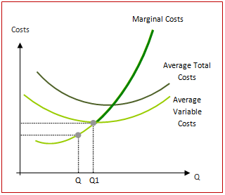

# Question 5

  

# Question 7

  -  MC = W/MPL

  
  
  

# Question 8

  -  Operate if Loss < Fixed Cost

  

  -  As demonstrated in the table, if the price is below average total
     cost but above average variable cost, losses are minimized by
     producing 50 units and incurring a loss of $3.50.

  -  If the firm shut down, it would still have to pay fixed cost of
     five.

  -  Since average variable costs at 50 units is 42 cents and the price
     is 45 cents, it covers the variable costs and contributes three
     cents on each unit toward the paying the fixed costs.

  -  Three cents times 50 units is $1.50 which is the amount the firm
     has **reduced** their **loss** by **producing instead of shutting
     down**.

# Question 9 

  -  In the long-run the profit for a monopolistically competitive frim
     is 0

  

# Question 11

  -  The Marginal Revenue of a firm in a perfectly competitive industry
     is constant

  

# Question 12

  -  **Cost Minimization**
    
      -  Optimal Input Mix is where MPL/Wage = MPK/Rental Rate
    
      -  I**f MPL/Wage \> MPK/Rental Rate**, then hire the **human**
         worker
    
      -  If **MPK/Rental Rate \> MPL/Wage**, then the **machines**
         win\! use more capital

# Question 15

  

# Question 18

  -  Price elasticity and tax share

  

# Question 19

  

# Question 24

  -  P = MC --\> Must be Perfectly Competitive

  ![Product Market Characteristics 1. Numbers of Sellers 2. Availability
  of Substitutes 3. Degree of Elasticity 4. Similarity of Products 5.
  Pricing Policy/ Strategy High value 6. Barriers to Entry/Exit 7.
  Efficiency/\* Rent-Seeking 8. Eco. Profits\* 9. P, MC\* 10. p MR Many
  (they are pricetakers from the market). One product type available
  (fully substitutable) available from atl sellers. Perfectly elastic.
  Homogeneous products from all sellers. No pricing policy or strategy.
  Price at market price, price- takers. No barriers to entry/exit.
  Efficient. Each seller prices at cost. No rents. Only transfer
  earnings. Zero economic profits. Price = Minimum AC. Ideal sociai
  pricing P = MC p = MR Fewer than perfect competition, more than
  oligopoly/ monopoly (some price-makers). Imperfect substitutions.
  Imperfect elasticity. Depends on degree of innovation. Heterogeneous.
  Mostly non-price competition; some independent pricing. Weak barriers
  to entry/exit. Inefficiency, excess capacity since P = AC (but not at
  minimum). p = AC; tendency for LR zero economic profits. P \> MC
  idop\&ly Few sellers who have some control of market share;
  interdependence. Fewer substitutes available = market pricing power.
  Varies. Greater elasticity at high prices. Lower elasticity at lower
  prices. Some markets— homogeneous for specialty products. Other
  markets heterogeneous products. Much interdepen- dence in pricing.
  Some evidence of monopoly pricing • poli Formidable barriers to
  entry/exit. Monopoly pricing power leads to waste/inefficiency. Some
  economies of scale. Tendency for existence of LR economic profits, p
  \> MC One seller for whom there are no close substitutes. No close
  substitutes available. Generally inelastic but still elastic at higher
  prices. FolEows from \#1—3 above. Heterogeneous since there are no
  close substitutes. Monopoly pricing power. High value to ratio: P-MC
  Complete barriers to entry by definition. Dead-weight loss of monop-
  oly (loss to society beyond monopoly profits and reduced consumer
  surplus). Empirical evi- dence of LR economic profits. P \> MC Long
  run tendencies at equilibrium. ](./media/image195.png)

# Question 26

  -  The Effect of an Increase in Demand
    
      -  An **increase** in the **demand** for a product causes the
         **equilibrium price** and **quantity** to **increase** in the
         market.
    
      -  An **increase** in **demand** raises **price** and **profit**,
         which causes **more suppliers** to enter the market
    
      -  Higher industry output from new entrants drives **price** and
         **profit** back **down** to its **original** equilibrium

  ![(a) Existing Firm Response to Price, cost $18 14 Price (b) Short-Run
  and Long-Run Market Response to Increase in Demand Long-run industry
  supply curve, LRS (c) Existing Firm Response to Increase in Demand An
  increase in demand rmses pnce and profit. x Price, cost New Entrants
  Higher industry output from new entrants dhves price and profit back
  down. MC ATC Quantity MKT MKT QxQr •ZMkT D Qz Quantity MC ATC Quantity
  Increase in output from new entrants Panel (b) shows how an industry
  adjusts in the short and long run to an increase in demand; panels (a)
  and (c) show the corresponding adjustments by an existing firm.
  Initially the market is at point XMKT in panel (b), a short-run and
  long-run equilibrium at a price of $14 and industry output of Qx. An
  existing firm makes zero economic profit, operating at point X in
  panel (a) at minimum average total cost. Demand increases as DI shifts
  rightward to D2 in panel (b), raising the market price to $18.
  Existing firms increase their output, and industry output moves along
  the short-run industry supply curve Sl to a short-run equilibrium at
  YMKT. Correspondingly, the existing firm in panel (a) moves from point
  X to point Y. But at a price of $18 existing firms are profitable. As
  shown in panel (b), in the long run new entrants arrive and the
  short-run industry supply curve shifts rightward, from Sl to S2. There
  is a new equilibrium at point ZMKT, at a lower price of $14 and higher
  industry output of Qz. An existing firm responds by moving from Y to Z
  in panel (c), returning to its initial output level and zero economic
  profit. Production by new entrants accounts for the total increase in
  industry output, Qz— Qx. Like XMKT, ZMKTis also a short-run and
  long-run equilibrium: with existing firms earning zero economic
  profit, there is no incentive for any firms to enter or exit the
  industry. The horizontal line passing through XMKT and ZMKT, LRS, is
  the long-run industry supply curve: at the break-even price of $14,
  producers will produce any amount that consumers demand in the long
  run. ](./media/image119.png)

# Question 28

  

# Question 37

  -  For a monopolistically competitive profit-maximizing firm, AR = P

  

# Question 38

  -  The short-run supply curve for a firm in a perfectly competitive
     industry is its marginal cost curve above the minimum point of its
     **average variable cost** curve

  -  In the short run the firm needs only to cover its **variable
     costs** (at Q1 below) – this is largely because covering variable
     cost ensures than an output can be produced in the future - if
     variable costs cannot be covered then no further output can be
     made.

  -  In addition, fixed costs have already been paid for prior to any
     marginal decision to supply, so do not enter into the firm’s short
     run calculations.

  

# Question 44

  

# Question 49

  
  
  

# Question 51

  -  A profit-maximizing **monopolist** selects its output level in the
     **elastic** region of its demand curve.

  

# Question 56

  
