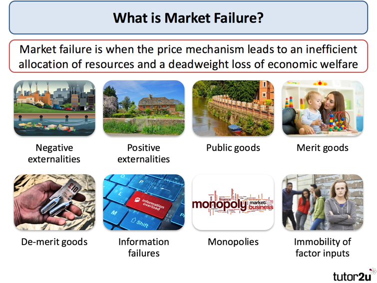
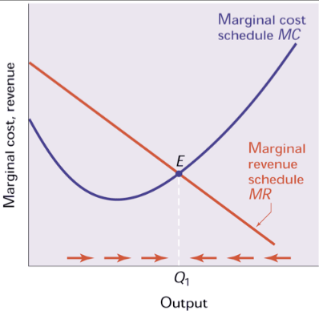
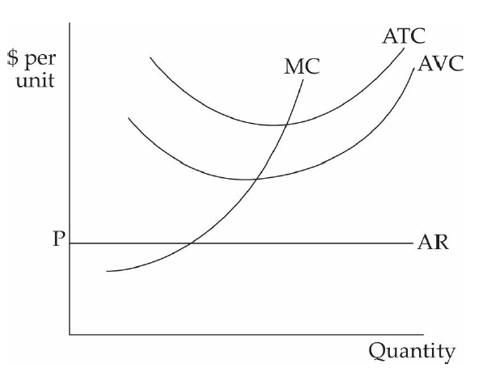
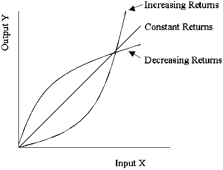

# Question 3

  

# Question 4

  -  The law of diminishing marginal utility states that as you consume
     more and more of the same good during a given period, your
     enjoyment gained from each additional unit of the good decreases.
     This is why more unites of a good will be purchased if the price
     decreases and vice versa - the law of demand

  

# Question 6

  -  If economic profits = 0, then
    
      -  owners receive a payment equal to their opportunity costs
    
      -  no incentive for firms to either enter or leave this industry
    
      -  owners are earning the most that could be made elsewhere

  -  Zero economic profits are also called normal profits

  -  They are what all firms earn in the long run in a competitive
     industry

  -  They do not indicate any resource allocation errors.

# Question 8

  -  Because there are far more substitutes available for Sprite than
     there are for all types of soda pop, the demand for Sprite will be
     more elastic than the demand for all soda pop.

# Question 12

  -  In the absence of intervention, imperfect competition,
     externalities, public goods, and imperfect information all result
     in market
  failure.

  

# Question 14

  -  Firms with every type of market structure maximize profits by
     producing where MC=MR, if at all.

  -  Producing more will increase costs more than revenues

  -  Producing less will fail to take advantage of opportunities to
     sell additional unites when the additional revenue exceeds the
     additional
  cost

  

# Question 16

  -  The Sherman Act (1890)
    
      -  declared attempts to monopolize commerce or restrain trade
         among the states illegal

  -  The Clayton Act (1914)
    
      -  strengthened the Sherman Act by specifying that monopolistic
         behavior such as price discrimination, tying contracts, and
         unlimited mergers are illegal

  -  The Robinson-Patman Act (1936)
    
      -  prohibits price discrimination except when it is based on
         differences in cost, difference in marketability of product,
         or a good faith effort to meet competition

  -  The Celler-Kefauver Act (1950)
    
      -  authorized the government to ban vertical mergers (mergers of
         firms at various steps in the production process from raw
         materials to finished products) and conglomerate mergers
         (combinations of firms from unrelated industries) in addition
         to horizontal mergers (mergers of direct competitors)

# Question 20

  -  By adding supply curves horizontally, the quantities each firm
     will provide at each price are combined into a total quantity
     supplied y the market at each price.

  

# Question 21

  

  -  A competitive firm facing the demand and cost curve in the figure
     above should shut down immediately.

  -  The firm is not covering its average variable costs. Not only is
     it losing money, it is not earning enough to help pay for any of
     its fixed costs

# Question 27

  -  tuba n. the lowest brass wind instrument

  -  Because the demand for tuba makers is derived from the demand for
     tubas, when tuba demand goes down, tuba maker demand goes down and
     thus wages go down.

# Question 32

  

  -  The curvature of PPFs results from increasing opportunity costs
     arising from the use of resources that are less and less
     specialized for the production of a particular good.

  -  If the resources used to make the two goods are not specialized,
     opportunity costs are constant and the PPF is a straight line

# Question 37

  ![Namc Pricc clasticity of demand Perfectly inelastic demand Inelastic
  demand Unit-elastic demand Elastic demand Perfectly elastic demand
  Possiblc values Significance % change in quantity demanded (dropping
  thc minus sign) % change in price Betvveen 0 and 1 Exactly 1 Greater
  than 1 , less than Price has no effect on quantity demanded (vertical
  demand curve). A rise in price increases total revenue. Changes in
  price have no effect on total revenue. A rise in price redires total
  revenue. A rise in price causes quantity demanded to fall too. A fall
  in price leads to an infinite quantity demanded (horizontal demand
  curve). Cross-price clasticity of demand Complements Substitutes %
  change in quantib' of one good dcmandcd % change in price of another
  good Negative Positive Quantity demanded of one good falls when the
  price of another rises. Quantity demanded of one good rises when the
  price of another rises. Income elasticity of demand Inferior good
  Normal good, income-inelastic Normal good, income-elastic % change in
  quantib' dcmandcd % change in income Negative Positive, less than 1
  Greater than 1 Quantity demanded falls when income rises. Quantity
  demanded rises when income rises, but not as rapidly as income.
  Quantity demanded rises when income rises, and more rapidly than
  income. % change in quantib' supplied Pricc clasticity of supply
  Perfectly inelastic supply Perfectly elastic supply % change in price
  Greater than 0, less than Price has no effect on quantity supplied
  (vertical supply curve). Ordinary upward-sloping supply curve. Any
  fall in price causes quantity supplied to fall to 0. Any rise in price
  elicits an infinite quantity supplied (horizontal supply curve).
  ](./media/image76.png)

# Question 38

  -  Constant returns to scale
    
      -  output increases in proportion to the amounts of each of the
         inputs

  

# Question 39

  -  Dominant Strategies Equilibrium vs. Nash Equilibrium
    
      -  Dominant strategies are stable and self-enforcing
    
      -  However, in many games one or more players do not have a
         dominant strategy
    
      -  Nash equilibrium is a more general concept
    
      -  A Nash equilibrium is a set of strategies such that each
         player is doing the best it can, given the actions of its
         opponents.
    
      -  A dominant strategy equilibrium is a special case of a Nash
         equilibrium

# Question 42

  -  The demand for labor is determined by the marginal revenue product
     of labor, which is the product of the marginal product of labor
     and the marginal revenue from the output produced by the labor.
     Thus, if the mariginal product of labor decreases, so does the
     demand for labor.

  

# Question 45

  -  Because a monopoly holds 100 percent of the market share, the
     concentration ratio is 100.

# Question 50

  -  monopsony: (economics) a market in which goods or services are
     offered by several sellers but there is only one buyer

# Question 51

  -  A free rider problem arises when people try to benefit from a
     public good without paying for it.

  -  The government can avoid this by taxing everyone and providing the
     public good itself.

# Question 52

  

  -  Because monopolies lower the price in order to sell one more unit,
     the marginal revenue is not the price as indicated on the demand
     curve, but that price minus the lost earning on all of the
     previous units that are now selling at a lower price
