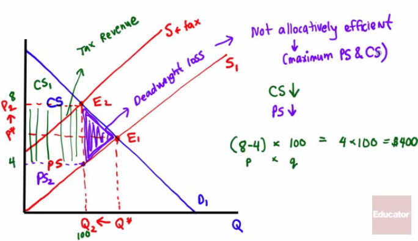

# Question 5

  ![6-5 FIGURE Price $10 9 8 7 6 5 4 3 2 1 o Total revenue $25 24 21 16
  9 The Price Elasticity of Demand Elastic Unit-elastic Changes Along
  the Demand Curve Demand Schedule and Total Revenue for a Linear Demand
  Curve 1 Price $0 1 2 3 4 5 6 7 8 9 10 Quantity demanded 10 9 8 7 6 5 4
  3 2 Total revenue $0 9 16 21 24 25 24 21 16 9 2 2 3 3 4 4 5 6 6 7 7 8
  8 Inelastic 9 10 Quantity 9 10 Quantity The upper panel shows a demand
  curve corre- sponding to the demand schedule in the table. The lower
  panel shows how total revenue changes along that demand curve: at each
  price and quantity combination, the height of the bar rep- resents the
  total revenue generated. You can see that at a low price, raising the
  price increases total revenue. So demand is inelastic at low prices.
  At a high price, however, a rise in price reduces total revenue. So
  demand is elastic at high prices. Demand is elastic: a higher price
  reduces total revenue. Demand is inelastic: a higher phce increases
  total revenue. ](./media/image61.png)

  -  The **total revenue** (total cost) remains the **same** when
     **demand** is **unit-elastic**

# Question 8

  -  Average variable costs are increasing when marginal costs are
     higher than average variable costs

  

# Question 10

  -  If **price** falls **less** than **AVC**, then you should **shut
     down** the company.

  -  Long-run (Profitability)

  

  -  Short-run (Production)

  

# Question 14

  

# Question 15

  -  Both **consumers** and **producers bear** a part of the total tax
     **burden**.

# Question 17

  -  Economic Profit = Accounting Profit - Opportunity Cost

  -  In a perfectly competitive industry, the Economic Profit = 0.

  -  So, Account Profit = Opportunity Cost